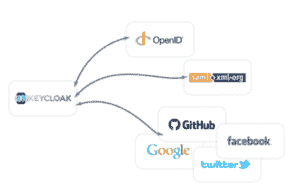
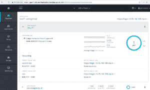
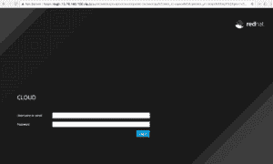

# Openshift 3.6 参考架构现在包括 SSO

> 原文：<https://developers.redhat.com/blog/2017/09/27/openshift-3-6-reference-architecture-now-includes-sso>

Azure Openshift 3.6 参考架构现在可以自动部署和集成 SSO。该参考架构在可扩展的完全高可用性配置和单个虚拟机中试用，是[open shift-ansi ble-contrib git repo](https://github.com/openshift/openshift-ansible-contrib/tree/master/reference-architecture/azure-ansible)的一部分。

Red Hat 单点登录(RH-SSO)基于 Keycloak 项目，通过提供基于 SAML 2.0、OpenID Connect 和 OAuth 2.0 等流行标准的 web 单点登录(SSO)功能来实现 Web 应用程序。这使得为 OpenShift 以及 OpenShift 应用程序配置一个或多个身份验证源变得很容易。

SSO 作为两个 OpenShift Pods 运行。所有密钥、证书和客户端都是在安装过程中自动创建的。

当您登录到 OpenShift 控制台时，您将看到一个略有不同的页面，其中集成了 SSO。

这是 SSO/Keycloak 登录。在参考体系结构的部署过程中，会要求提供用户名和密码，并且会自动创建该用户。

如果您已经有了一个 OpenShift 部署，并且想要添加一个 SSO/Keycloak，您可以在这里查看 [sso4ocp](https://github.com/glennswest/sso4ocp) 脚本。在以后的文章中，我将介绍这个 ansible 脚本中有趣的技巧和技术。

欲了解完整的参考架构文档，请点击查看[。](https://access.redhat.com/documentation/en-us/reference_architectures/2017/html-single/deploying_red_hat_openshift_container_platform_3.6_on_microsoft_azure/)

*Last updated: September 3, 2019*