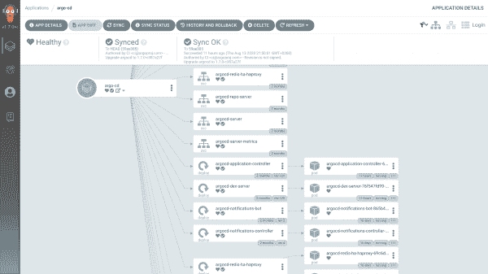

# OpenShift 加入 Argo CD 社区(KubeCon Europe 2020)

> 原文：<https://developers.redhat.com/blog/2020/08/17/openshift-joins-the-argo-cd-community-kubecon-europe-2020>

随着 [Kubernetes](https://developers.redhat.com/topics/kubernetes/) 和 [Red Hat OpenShift](https://developers.redhat.com/openshift) 平台采用率的增长，以及组织将其大部分基础架构迁移到这些平台，组织越来越多地面临管理跨公共云和内部基础架构的混合多集群环境的挑战。虽然这种方法为管理应用程序带来了灵活性和可伸缩性，但确保这些集群之间配置一致性的能力，以及以一致的方式将应用程序部署到多个集群的能力变得必不可少。进入 [Argo CD](https://argoproj.github.io/argo-cd/) GitOps Kubernetes 操作器。

## GitOps、Kubernetes 和配置一致性

GitOps 是一套越来越受欢迎的实践，用于管理运行混合[多集群 Kubernetes](https://developers.redhat.com/courses/foundations) 基础设施的复杂性。GitOps 的核心是将 Git 存储库视为事实的单一来源，并将一直用于应用程序开发的 Git 工作流应用于基础设施和应用程序操作人员。

声明性配置和 [GitOps](https://developers.redhat.com/devnation/tech-talks/gitops) 原则是 [OpenShift 容器平台](https://developers.redhat.com/products/openshift/getting-started)价值观的核心，这些价值观让我们将 OpenShift 打造为世界上最具声明性的 Kubernetes 平台之一。事实上，OpenShift 的所有方面都可以通过声明的方式进行配置，利用 Kubernetes 自定义资源，允许 GitOps 实践者将 OpenShift 配置资源存储在 Git repo 中。使用[从业者选择的工具](https://www.openshift.com/blog/introduction-to-gitops-with-openshift)，这确保了所有 OpenShift 集群配置与 Git 中的真实来源同步。

## Argo CD 和 OpenShift

Argo CD 是一个流行的云本地计算基金会(CNCF)开源 GitOps [Kubernetes 操作符](https://developers.redhat.com/topics/kubernetes/operators/)，用于在 Kubernetes 集群上进行声明性配置。Argo CD 拥有一个活跃的用户社区，OpenShift 客户中的用户群不断增长。事实上，它是 OpenShift 平台上最受欢迎的[社区 Kubernetes 运营商之一。](https://operatorhub.io)

Red Hat 参与解决企业需求的社区项目有着悠久的历史。继续这一旅程，我们现在与 Intuit 合作，并作为 bootstrap 指导委员会的成员加入 Argo 社区。这样做使我们能够积极地为 Argo 社区做出贡献，并帮助 OpenShift 客户利用 Argo CD，使用 GitOps 原则管理他们在多集群 OpenShift 和 Kubernetes 基础设施中的应用程序。

如图 1 所示，Argo CD 基于 GitOps 模式工作，使用 Git 存储库作为定义所需应用程序状态的真实来源。Kubernetes 清单可以用几种方式指定，比如 [Helm](https://developers.redhat.com/blog/2020/07/20/advanced-helm-support-in-the-openshift-4-5-web-console/) 、 [kustomize](https://github.com/kubernetes-sigs/kustomize) ，以及 plain JSON 或 YAML 等等。Argo CD 通过将 Kubernetes 清单同步到目标集群并确保集群处于所需状态，自动将应用程序部署到多个客户。此外，它监视 Kubernetes 集群上部署的应用程序的状态，并不断地将它们与 Git 中存储的清单进行比较，以检测任何偏离期望状态的情况；例如，在手动改变的情况下。当检测到漂移时，可以通知管理员，或者可以将 Argo CD 配置为根据 Git 存储库自动更正集群上应用程序的状态。

Figure 1: Viewing application state in Argo CD.Figure 1: Viewing application state in Argo CD.">

Red Hat 的 OpenShift 和开发人员工程高级总监 Adi Sakala 表示:

> *“open shift 继续帮助企业完成云原生之旅，实现数据中心和开发团队的现代化。基础设施&应用的持续部署和交付在组织重新思考和重组交付流程以适应容器化开发的过程中扮演着关键角色。*
> 
> *“Argo 项目在 Kubernetes 生态系统中得到了广泛认可和采用，提供了连续交付工具。作为开源和混合云平台的领导者，Red Hat 很高兴与 Intuit 和 Argo 社区的其他成员携手合作，进一步推动该项目。我们相信，当社区因开放的治理和活跃的用户而繁荣时，它为项目的持续增长奠定了基础。将 Argo 作为 OpenShift 用户的选择将使企业能够使用 GitOps 在 OpenShift 上声明性地构建和运行云原生应用。我们很高兴为 OpenShift 用户提供这一选项。”*

## 下一步是什么

Argo CD 现在作为 Argo 社区拥有的 Kubernetes 操作者在 OperatorHub 上提供，可通过 OpenShift 控制台管理透视图访问。在接下来的几个月中，随着我们在 Argo 社区上游的参与和贡献的增加，我们将同时推动 OpenShift 开发人员工具组合的更紧密集成，这些工具跨越了一项变更在进入生产之前所经历的三个不同阶段(参见图 2):

*   使用 [`odo`](https://developers.redhat.com/products/odo/overview) 和 [CodeReady 容器](https://developers.redhat.com/products/codeready-containers/overview)在开发人员的工作站上进行**本地开发**，或者使用 [CodeReady 工作区](https://developers.redhat.com/products/codeready-workspaces/overview)在基于 web 的工作区中进行开发。
*   [**【CI】**](https://developers.redhat.com/topics/ci-cd)与 [Tekton 管道](https://developers.redhat.com/blog/2020/04/30/creating-pipelines-with-openshift-4-4s-new-pipeline-builder-and-tekton-pipelines/)持续集成，在每次 Git 变更时构建和测试应用。
*   **连续交付(CD)** 使用 Argo CD 向多集群暂存和生产集群交付应用。

Figure 2: The three phases a change goes through in a CI/CD pipeline.">

随着 Argo CD 加入 OpenShift 开发人员工具组合，我们对未来的道路感到兴奋。请在接下来的几个月里关注更多激动人心的消息，了解这对 OpenShift 上的应用程序开发工作流意味着什么。

*Last updated: August 18, 2020*