# 持久存储在行动:了解 Red Hat OpenShift 的持久卷框架

> 原文：<https://developers.redhat.com/blog/2020/10/22/persistent-storage-in-action-understanding-red-hat-openshifts-persistent-volume-framework>

[Red Hat OpenShift](https://developers.redhat.com/products/openshift/overview) 是一个企业就绪的 [Kubernetes](https://developers.redhat.com/topics/kubernetes) 平台，它提供了许多不同的模型，您可以使用这些模型来部署应用程序。 [OpenShift 4.x](https://www.redhat.com/en/openshift-4/) 使用[操作符](https://developers.redhat.com/topics/kubernetes/operators)来部署 [Kubernetes-native](https://developers.redhat.com/topics/serverless-architecture) 应用。它还支持 [Helm](https://docs.openshift.com/container-platform/4.5/applications/application_life_cycle_management/odc-working-with-helm-charts-using-developer-perspective.html) 和传统的基于模板的部署。无论您选择哪种部署方法，它都将被部署为一个或多个现有 OpenShift 资源的包装器。示例包括 [BuildConfig](https://docs.openshift.com/container-platform/3.11/rest_api/build_openshift_io/buildconfig-build-openshift-io-v1.html) 、 [DeploymentConfig](https://docs.openshift.com/container-platform/3.11/rest_api/apps_openshift_io/deploymentconfig-apps-openshift-io-v1.html) 和 [ImageStream](https://docs.openshift.com/container-platform/3.11/rest_api/image_openshift_io/imagestream-image-openshift-io-v1.html) 。

在本文中，我将向您介绍 OpenShift 的基于 Kubernetes 的持久集群存储的持久卷框架。您将了解如何使用 OpenShift 的 [PersistentVolume](https://docs.openshift.com/container-platform/3.11/rest_api/core/persistentvolume-core-v1.html) (PV)和[persistent volume claim](https://docs.openshift.com/container-platform/3.11/rest_api/core/persistentvolumeclaim-core-v1.html)(PVC)对象来供应和请求存储资源。

## 定义持久性

在计算机编程中，*变量*是一个存储地址(由内存地址标识),它与一个相关的符号名成对出现。每个变量包含代表一个值的已知或未知数量的信息。变量可以临时保存数据值，但是变量通常只在运行时存储在内存中，所以当应用程序终止时，数据将会丢失。

*持续*发生在当一个数据值[持续稳定地处于某种状态](https://dictionary.englishtest.info/browse/persist)(定义来自 Dictionary.com)时。与持久的值相反，一些应用程序以编程方式访问临时变量值，这些值优先考虑速度而不是寿命。当数据仅持续很短时间时，这些临时值被认为是短暂的*。*

比如想象一下你最喜欢的游戏，比如《愤怒的小鸟》。如果你想保存某些游戏数据以便每次游戏时重新加载，你需要使用永久存储器。你可以使用短暂的记忆来存储代表你当前任务分数的程序值。

## 了解存储架构

现在，让我们讨论 OpenShift 集群中持久存储和暂时存储的概念。首先要理解的是持久存储与短暂存储有什么不同。OpenShift 将`PersistentVolume`和`PersistentVolumeClaim`对象视为资源:像 OpenShift APIs 一样，您可以使用 YAML 或 JSON 配置文件来管理它们。

在图 1 中，图表的左侧展示了一个部署到 OpenShift 项目名称空间的应用程序，它没有定义持久存储。在此示例中，数据使用临时存储临时存储在 Pod 1 和 Pod 2 中。删除 pod 后，存储的数据将会丢失。右侧展示了部署到具有持久数据存储的 OpenShift 名称空间的应用程序。在这种情况下，管理员在集群中提供了持久存储，开发人员发出了一个`PersistentVolumeClaim`请求该存储。

PVC 给 Pod 1 和 Pod 2 每个一个到永久存储器的*卷引用*。当您使用`DeploymentConfig`或`Deployment`对象部署应用程序时，数据存储将被引用，并且即使在一个或两个 pod 被销毁后，数据也将持续存在。

[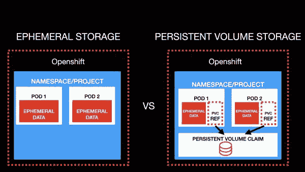](/sites/default/files/blog/2020/07/1.jpeg)Ephemeral Storage vs Persisten StorageFigure 1: Comparing persistent storage and ephemeral storage.">

## 持久存储类型

作为 OpenShift 架构师，您决定向应用程序开发人员提供什么类型的持久存储。三种流行的存储类型是文件存储、块存储和对象存储。

### 网络文件系统

持久卷框架中最常用的存储类型是[网络文件系统](https://docs.openshift.com/container-platform/3.11/install_config/persistent_storage/persistent_storage_nfs.html) (NFS)，或者简称为*文件存储*。NFS 是一种传统的网络存储类型，提供通过标准以太网连接的存储路径。它相对便宜，并且能够存储兼容的数据类型。例如，您可以存储 JPEG 和 MP3 等媒体文件，以及 MySQL 或 MySQL 数据。如图 2 所示，NFS 最适合小而简单的文件存储或数据库。

但是，NFS 速度相对较慢，对于需要快速操作的复杂应用程序来说不是最佳选择。此外，NFS 只能通过横向扩展来扩展；它不能纵向扩展，这进一步限制了它的性能。 [GlusterFS](https://www.gluster.org/) 、 [Ceph](https://ceph.io/) 和[亚马逊网络服务弹性文件系统](https://docs.openshift.com/container-platform/3.11/install_config/provisioners.html#deploying-the-aws-efs-provisioner) (AWS EFS)都是 NFS 的例子。

[](/sites/default/files/blog/2020/07/2.jpeg)Figure 2: Network File System's strengths and weaknesses.">

### 块存储器

块存储使用存储区域网络(SAN)来部署和操作跨网络分布的存储块。与 NFS 相比，支持 SAN 的数据块存储提供了更快的检索和操作时间以及更高效的操作。它是 MySQL 和 PostgreSQL 等数据库的生产质量、结构化数据的理想选择。

不利的一面是，块存储比 NFS 稍贵，而且它处理元数据的能力有限。块存储的例子有 [Ceph](https://ceph.io/) 和 [AWS 弹性块存储](https://docs.openshift.com/container-platform/3.11/install_config/persistent_storage/persistent_storage_aws.html) (AWS EBS)，如图 3 所示。

[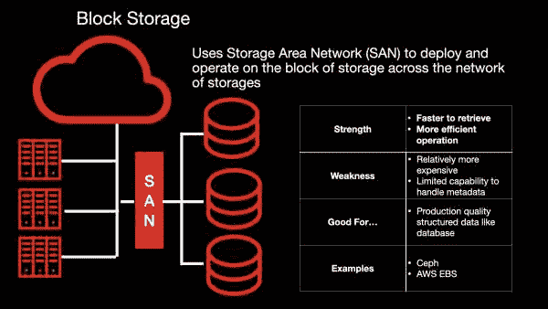](/sites/default/files/blog/2020/07/3.jpeg)Figure 3: Block storage's strengths and weaknesses.">

### 对象存储

由于对非结构化文件(如照片和视频)的高效处理的需求，对象存储的受欢迎程度呈指数级增长。它采用扁平结构设计，文件被分成几部分，分布在硬件上。对象存储使用 HTTP 来操作和检索数据。它对于非结构化文件(如媒体文件和静态文件)非常高效，并且它使用随用随付的成本模型，这使得它经济实惠且具有成本效益。

不利的一面是，不能对读写多的数据使用对象存储，所以它不适合数据库。如图 4 所示， [Ceph](https://ceph.io/) 和[亚马逊简单存储服务](https://docs.openshift.com/container-platform/3.11/install_config/configuring_aws.html) (AWS S3)就是对象存储的例子。

[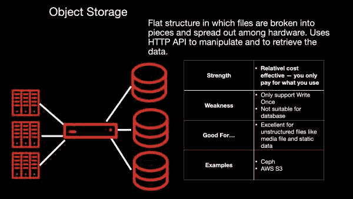](/sites/default/files/blog/2020/07/4.jpeg)Figure 4: Object storage's strengths and weaknesses.">

**注**:参见“[文件存储，块存储，还是对象存储？](https://www.redhat.com/en/topics/data-storage/file-block-object-storage)”了解这些存储类型的完整介绍。

## 演示:MySQL 数据库中的持久卷存储

有了这些概念，现在是演示的时候了。在接下来的小节中，我将通过部署一个 MySQL 数据库来展示 OpenShift 的持久卷框架的有用性，首先是没有持久卷存储，然后是有持久卷存储。

对于本演示，我假设您的开发环境如下:

*   您至少拥有对标准 OpenShift 3 或更高版本集群的开发人员访问权限。理想情况下，您应该有管理员权限。如果您没有管理员权限，那么您可以跳过步骤 1，使用您自己的名称空间。
*   您的`ImageStream`正确配置了标准 MySQL 容器映像。
*   你已经安装了 [OpenShift 命令行界面](https://docs.openshift.com/container-platform/3.11/welcome/index.html) ( `oc`)，并且你知道如何使用它。

## 步骤 1:设置演示

我们要做的第一件事是在它自己的名称空间下创建一个新的 OpenShift 项目。如果您被分配到默认命名空间，则可以跳过此步骤。您将能够使用分配给您的名称空间，但是您不能为这个演示创建一个特殊的项目。

### 创建 OpenShift 项目

使用 OpenShift CLI ( `oc`)登录到您的 OpenShift 集群，并使用`oc new-project`命令创建一个新项目。如图 5 所示，我推荐使用名称“`pvc-demo`”

[](/sites/default/files/blog/2020/07/1.png)Create a new projectFigure 5: Create a new OpenShift project named pvc-demo.">

### 验证您的项目默认值

默认情况下，您的 OpenShift 项目在`openshift`名称空间中使用`mysql` `ImageStream`。运行以下命令来验证默认值(也如图 6 所示):

```
oc get is -n openshift | grep mysql
```

然后运行以下命令:

```
oc get -o yaml is/mysql -n openshift
```

[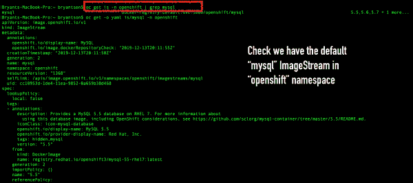](/sites/default/files/blog/2020/07/2.png)Check MySQL Image StreamFigure 6: Verify your OpenShift project defaults.">

### 使用 ImageStream 部署新的 MySQL 应用程序

使用 OpenShift `oc new-app`命令用`ImageStream`部署新的 MySQL 应用程序。请注意，在演示的这个阶段，我们将 MySQL 配置为使用临时存储。

至少，您需要使用以下三个[环境变量](https://docs.openshift.com/container-platform/3.11/using_images/db_images/mysql.html#mysql-environment-variables/)来配置 MySQL 用户名、密码和数据库名称:

```
oc new-app -i mysql -e MYSQL_USER=tester -e MYSQL_PASSWORD=Pass1234 -e MYSQL_DATABASE=testdb
```

您可以为自己的项目更改这些值，但是请注意，当安装 MySQL 时，它最初会将`MYSQL_DATABASE`设置为默认数据库。如果缺少这些环境变量中的任何一个，MySQL 应用程序部署都将失败。

当 MySQL 应用程序部署完成时，在每个 pod 中加载环境变量。图 7 显示了带有`ImageStream`和`MYSQL_USER`、`MYSQL_PASSWORD`和`MYSQL_DATABASE`变量的 MySQL 应用程序部署。

[](/sites/default/files/blog/2020/07/3.png)Deploy a MySQL as a new applicationFigure 7: Deploy a new MySQL application with ImageStream.">

### 验证 MySQL pod 正在运行

在我们继续之前，让我们检查一下我们的 MySQL 应用程序是否运行成功。首先，运行`oc get all`来验证 pod 的状态是`Running`，如图 8 所示。

[](/sites/default/files/blog/2020/07/4.png)Verify that MySQL app gets deployed successfullyFigure 8: Verify that the MySQL application pod is successfully running.">

另一种选择是使用 OpenShift web 控制台来检查 pod 的状态。图 9 中显示的 pod 看起来很健康。

[](/sites/default/files/blog/2020/07/5.png)Check MySQL status in web consoleFigure 9: Use the OpenShift web console to check the MySQL pod's health status.">

如果您在 web 控制台中打开终端，您可以单击 pod 的名称来检查它的状态，如图 10 所示。

[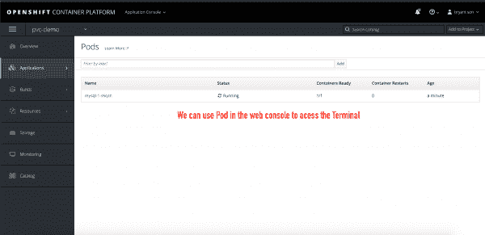](/sites/default/files/blog/2020/07/6.png)Pod is running fineFigure 10: Use the web terminal to inspect the status of the pod.">

从 pod 内部，您可以点击**终端**直接与 pod 交互，如图 11 所示:

[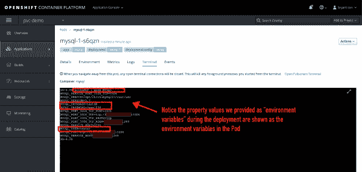](/sites/default/files/blog/2020/07/7.png)Terminal inside MySQL PodFigure 11: Use the OpenShift terminal to interact directly with the MySQL pod.">

**注意**:在这个演示中，我们将使用`oc` CLI 来验证和检查 pod。您可以运行`oc printenv | grep MYSQL`命令来验证我们在创建 pod 时指定的环境变量是否显示出来。

## 步骤 2:用临时存储创建 MySQL 数据

使用`oc get pods`查看 pod，然后在 pod 中运行 shell 命令。接下来，输入`oc rsh pod`并用您想要与之交互的 pod 的名称替换`POD_NAME`变量:

```
oc rsh pod/POD_NAME

```

一旦进入 pod，使用`printenv | grep`验证环境变量值是否被正确填充，如图 12 所示。

[](/sites/default/files/blog/2020/07/8.png)oc rsh to interact with Pod through OC CLIFigure 12: Run `oc rsh` to interact with the pod, and verify the environment variables.">

### 创建示例 MySQL 查询

接下来，我们将创建一个包含示例 MySQL 查询的文件，该文件将为演示填充 MySQL 数据。如图 13 所示，我创建了一个名为`sample_query.sql`的示例 SQL 查询文件，并将其保存在我的 VI 文本编辑器中。

[](/sites/default/files/blog/2020/07/8.png)oc rsh to interact with Pod through OC CLIFigure 13: Create a file with sample MySQL queries to populate the data.">

图 14 显示了我将在这个演示中使用的示例 SQL 查询。如果您已经熟悉 MySQL，请随意更改查询；请注意，您的数据库名称必须与您用`MYSQL_DATABASE`变量定义的名称相匹配。

[](/sites/default/files/blog/2020/07/10.png)Sample SQL queriesFigure 14: Using sample SQL queries saved in `/var/lib/mysql`.">

请确保将此内容保存到单独的文本编辑器中；在本文后面，当您重复删除 pod 和重新创建 MySQL 数据的步骤时，您将需要它。另外，请注意，默认情况下，MySQL 将数据保存到一个名为`/var/lib/mysql`的路径中。当我们稍后重新部署应用程序时，我们将使用这个路径作为我们的`PersistentVolumeClaim`的参考。

### 运行 MySQL 查询

使用以下命令登录 MySQL:

```
mysql -u$MYSQL_USER -p$MYSQL_PASSWORD -h$HOSTNAME $MYSQL_DATABASE

```

除了`$HOSTNAME`之外，以`$`符号开头的属性指的是您在使用 OpenShift CLI `oc new-app`命令部署示例应用程序时指定的环境变量。`$HOSTNAME`环境变量指的是 MySQL 主机名。

如图 15 所示，执行 MySQL `source`命令，从刚刚创建的示例 SQL 文件运行 MySQL 查询:

```
source sample_queries.sql
```

[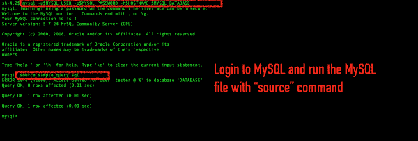](/sites/default/files/blog/2020/07/11.png)Login to MYSQL and create the data with source commandFigure 15: Execute the MySQL `source` command to run MySQL queries from the sample file.">

最后，运行 MySQL `show databases`命令来验证每个 MySQL 数据库都已成功创建。使用`use testdb`命令检查数据是否存在，然后验证它，如图 16 所示。

[](/sites/default/files/blog/2020/07/12.png)Check MySQL data get created successfullyFigure 16: Check that your MySQL databases were successfully created.">

### 删除窗格

现在，我们将删除 pod，看看使用临时数据存储存储的数据会发生什么情况。要退出 pod，请键入两次`exit`。然后，重新进入 pod 并使用 OpenShift CLI `oc delete pod POD_NAME`命令，如图 17 所示。

[](/sites/default/files/blog/2020/07/13.png)Kill the Pod with ephemeral storageFigure 17: Use the `oc delete pod POD_NAME` command to delete the pod.">

我们在`ReplicaSet`中使用了一个`DeploymentConfig`，所以一个新的实例会出现来替换我们刚刚删除的那个。稍等片刻，然后执行 OpenShift `oc get pods`命令。您应该会看到一个新的 pod 正在运行。用`oc rsh`命令连接到新的 pod。对于我的例子，命令是`oc rsh pod/mysql pnpq4`。当您登录到 MySQL 时，检查创建的数据库表。不幸的是，这个表是空的，如图 18 所示。

[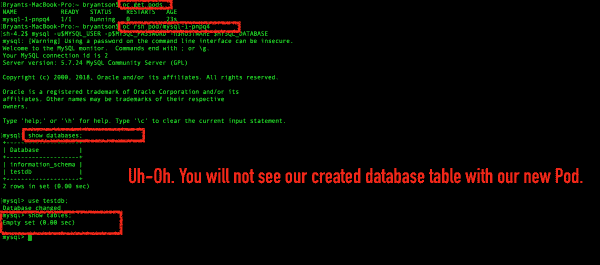](/sites/default/files/blog/2020/07/14.png)Mayday! We lost the MySQL data.Figure 18: Check for the created database table, which is empty.">

因为我们将 pod 配置为使用临时存储，所以我们丢失了所有数据。

接下来，我们将使用永久卷声明(PVC)来部署应用程序。

## 步骤 3:创建一个带有持久卷存储的 MySQL 应用程序

正如我在本文开头解释的那样，我们可以使用 YAML 文件为 MySQL 应用程序定义一个`PersistentVolumeClaim` (PVC)。首先，创建一个名为`sample-pvc.yaml`的新文件，如图 19 所示。(您可以随意命名文件，只要文件扩展名相同。)

[](/sites/default/files/blog/2020/07/15.png)PVC defined in YAMLFigure 19: Create a YAML file to define the PVC for the MySQL application.">

然后，运行以下命令创建 PVC:

```
oc apply -f sample-pvc.yaml

```

输入`oc get pvc`命令来验证您刚刚创建了一个 PVC 定义，如图 20 所示。

[](/sites/default/files/blog/2020/07/16.png)Apply PVC YAML to create a new PVCFigure 20: Execute the `oc get pvc` command to verify that you created a PVC definition.">

我们将很快使用这个新的持久卷声明来修改 MySQL 应用程序的`DeploymentConfig`。但是首先，让我们对应用程序做一点小小的改进。

### 创建一个 OpenShift 秘密

您可能还记得，当我们创建 MySQL 应用程序时，我们在一个纯文本文件中定义了核心环境变量(`MYSQL_USER`、`MYSQL_PASSWORD`和`MYSQL_DATABASE`)。将机密或敏感数据存储为纯文本值存在安全风险，所以现在让我们来解决这个问题。

作为纯文本的替代，我们可以使用 [OpenShift secrets](https://docs.openshift.com/container-platform/3.11/dev_guide/secrets.html) 来存储我们的 MySQL 环境值。秘密使用 [Base64](https://www.base64decode.org/) ，它提供了一个基本的加密。

**注意**:另一个选择是使用一个最优的安全解决方案来存储 MySQL 值，例如[库](https://www.vaultproject.io/)。我不会在本文中描述这个选项。

将 MySQL 环境值存储在 secret 中的第一步是创建一个包含键值对的新文件。然后，使用以下命令创建一个 OpenShift secret，将 MySQL 凭证数据存储在包含键值对的文件中:

```
oc create secret generic mysql-sec --from-env-file=mysql-cred.env

```

注意，在我的例子中，`mysql-sec`是 OpenShift 秘密名称，`mysql-cred.env`是包含 MySQL 键值对的文件。

运行`oc get secret`和`oc get -o yaml secret/mysql-sec`命令来验证 OpenShift 秘密已经成功创建，如图 21 所示。

[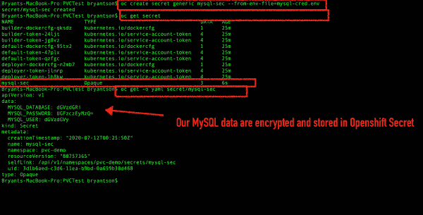](/sites/default/files/blog/2020/07/18.png)Create an Openshift Secret from environment fileFigure 21: Store encrypted environment values in an OpenShift secret and ensure that it is created.">

### 修改部署配置

现在我们已经添加了一个秘密，我们准备重新部署带有持久卷存储的 MySQL 应用程序。重新部署 MySQL 应用程序的一种方法是修改应用程序的`DeploymentConfig`文件。但是，请注意，`DeploymentConfig`文件需要特定的格式。一个更简单的选择是使用 OpenShift CLI 的 [oc patch](https://docs.openshift.com/container-platform/3.11/cli_reference/basic_cli_operations.html#patch) 命令。

首先运行`oc get dc`和`oc edit dc/mysql`命令，如图 22 所示。

[](/sites/default/files/blog/2020/07/19.png)Edit DeploymentConfigFigure 22: Use the `oc get dc` and `oc edit dc/mysql` commands to redeploy the `DeploymentConfig` file.">

接下来，用新的 secret 替换对 MySQL 环境变量值的直接引用(在`spec.template.spec.containers.env`下)。将值更新为`valueFrom`并使用新的`secretKeyRef`，如图 23 所示。(更多参考见 [OpenShift secrets](https://docs.openshift.com/container-platform/3.11/dev_guide/secrets.html) 文档。)

[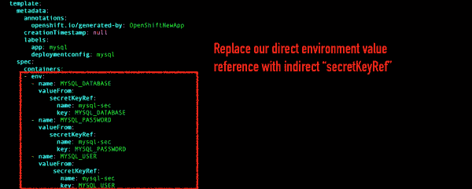](/sites/default/files/blog/2020/07/20.png)Modify our direct reference to MYSQL environment variable to Openshift SecretFigure 23: Replace the reference to MySQL environment variables with the new OpenShift secret.">

### 实现持久卷声明

最后，我们到了辉煌的时刻:我们将进行两项更改来实现我们坚持的量声明。

首先在`spec.template.spec.containers`下，在`terminationGracePeriodSeconds`后增加一个新行。输入`volumes:`和对持久卷声明的引用，例如`mysql-volume`。

接下来，在`terminationMessagePolicy`之后引入新的一行。输入`volumeMounts:`并添加一个值设置为`/var/lib/mysql`的`mountPath`。输入`mysql-volume`，这是您在上一步中创建的卷名。

图 24 显示了这些更新。注意`/var/lib/mysql`是 MySQL 用来存储 SQL 数据的默认路径。

[](/sites/default/files/blog/2020/07/21.png)Introduce volumes and volumeMountsFigure 24: Implement the PVC by configuring volumes for the PVC and volume mounts.">

### 测试吊舱

新 pod 运行后，运行`get pods`查看新 pod 的运行状态。

再次使用`rsh pod/POD_NAME`命令将`ssh`放入 pod，然后输入`printenv | grep MYSQL`。如图 25 所示，您应该看到环境变量被成功地从秘密中提取出来。

[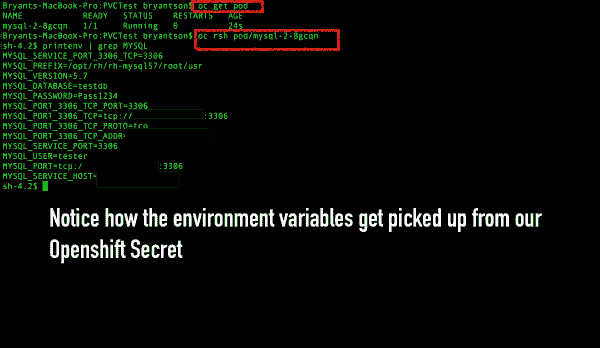](/sites/default/files/blog/2020/07/22.png)Figure 25: On the new pod, check that the environment values from the OpenShift secret are successfully stored.">

### 创建并填充一个示例 MySQL 文件

现在，重复从步骤 2 开始的序列，再次创建示例 MySQL 文件，如图 26 所示。

[](/sites/default/files/blog/2020/07/23.png)Let's create our SQL file againFigure 26: Create and populate a new sample MySQL file.">

登录 MySQL 应用程序，使用`source`命令重复重新创建 MySQL 数据的过程。这一次，因为我们有持久的数据存储，我们不会丢失数据。

[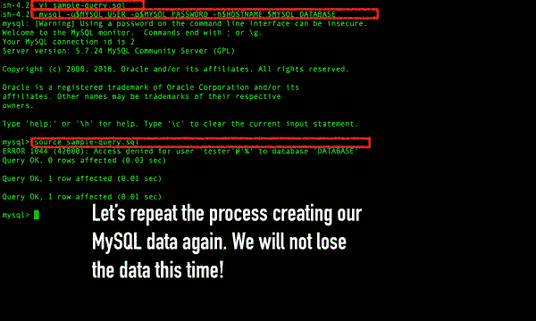](/sites/default/files/blog/2020/07/24.png)Recreate our SQL data againFigure 27: On the MySQL application, recreate the MySQL data with persistent data storage.">

### 验证 MySQL 查询

在 MySQL shell 中，使用`show databases`、`show tables`和`SELECT`命令来验证 MySQL 查询是否有效。如图 28 所示，您应该看到 MySQL 数据被成功地重新创建了。

[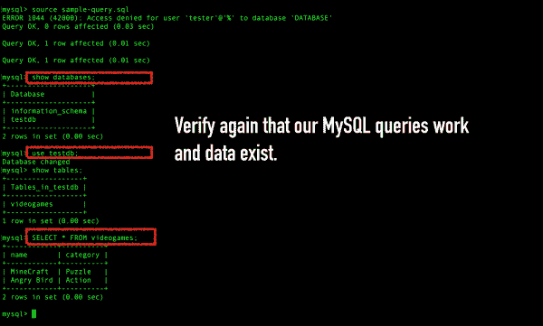](/sites/default/files/blog/2020/07/25.png)Verify that our MySQL data created successfullyFigure 28: Verify that the MySQL queries work, and the data exists.">

## 步骤 4:测试应用程序的数据持久性

有了持久存储卷，我们应该可以确保我们的数据是安全的。为了测试应用程序的数据持久性，退出 pod 并删除它，如图 29 所示。

[](/sites/default/files/blog/2020/07/26.png)Kill the Pod againFigure 29: Exit the pod and delete it.">

当您重新连接到新的 pod 并检查 MySQL 数据库时，请验证数据仍然存在。如图 30 所示，您应该看到 MySQL 数据仍然存在，甚至在我们删除 pod 之后。

[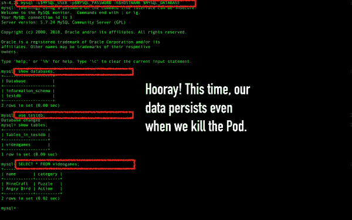](/sites/default/files/blog/2020/07/27.png)We now see our MySQL persists!Figure 30: Verify that the MySQL data persists, even after the pod was deleted.">

## 结论

在本文中，您了解了持久存储的基础知识以及可以使用的不同存储类型。您还看到了 OpenShift 持久性卷存储的运行演示。

我希望这篇文章已经帮助您理解了 OpenShift 的持久卷存储框架，以及如何在您的 OpenShift 集群中使用`PersistentVolumeClaim`对象进行持久存储。如果您对本文中的演示有任何疑问，请留下您的评论。

*Last updated: November 4, 2020*