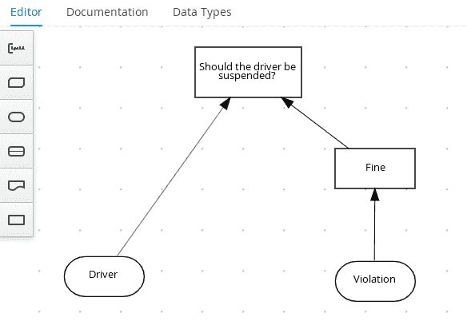

# 玩 Kogito 示例

> 原文：<https://developers.redhat.com/blog/2020/05/14/play-with-kogito-examples>

Kogito 0.9.1 [已经发布](https://docs.jboss.org/kogito/release/latest/html_single/)，带来了完善的业务自动化文档和示例。现在还不是 1.0，但 0.9.1 是一个准备充分的里程碑版本。在这篇文章中，我介绍`kogito-examples`来帮助你体验一下 Kogito 是什么样的。首先，克隆回购:

```
$ git clone https://github.com/kiegroup/kogito-examples.git
$ cd kogito-examples
```

**注意:**默认分支为“稳定”，是最新的稳定版本(所以现在可能高于 0.9.1)。

里面有很多样品。每个样本都有一个`README.md`，包含执行命令和测试用的`curl`命令。这里有一些关于[夸尔库斯](https://developers.redhat.com/products/quarkus/getting-started)的例子，但你也会在回购协议中找到 [Spring Boot](https://developers.redhat.com/topics/spring-boot/) 的例子。这些例子几乎是相同的；只有启动命令不同。

## 规则单元-quar kus-示例

[ruleunit-quarkus-example](https://github.com/kiegroup/kogito-examples/tree/stable/ruleunit-quarkus-example) 是一个基本的规则执行服务。当您发布贷款申请事实(`LoanApplication`)时，您将收到已批准的申请:

```
$ cd ruleunit-quarkus-example
$ mvn clean compile quarkus:dev
```

一旦启动，您可以用下面的`curl`命令测试它:

```
$ curl -X POST -H 'Accept: application/json' -H 'Content-Type: application/json' -d '{"maxAmount":5000,"loanApplications":[{"id":"ABC10001","amount":2000,"deposit":100,"applicant":{"age":45,"name":"John"}}, {"id":"ABC10002","amount":5000,"deposit":100,"applicant":{"age":25,"name":"Paul"}}, {"id":"ABC10015","amount":1000,"deposit":100,"applicant":{"age":12,"name":"George"}}]}' http://localhost:8080/find-approved
```

### 该示例的源代码

让我们检查一下源代码，从`RuleUnitQuery.drl`开始，它是描述规则的 DRL。重点是声明`unit LoanUnit;`，如下图:

```
unit LoanUnit;
```

这段代码允许您将规则与`LoanUnit`类结合起来生成一个完整的服务。

本规则中的符号`/loanApplications[]`:

```
$l: /loanApplications[ applicant.age >= 20, deposit < 1000, amount <= 2000 ]
```

表示评估来自`LoanUnit`类的`DataStore loanApplications`的事实(包含在`LoanApplication.java`中):

```
public DataStore<LoanApplication> getLoanApplications() {
    return loanApplications;
}
```

这可以被认为与常规 DRL 中的`LoanApplication()`模式相同。

申请人信息来自`Applicant.java`，这只是`LoanApplication`的一个属性。

DRL 也有一个`query`。这将生成上述测试中使用的 REST 端点:

```
query FindApproved
    $l: /loanApplications[ approved ]
end

query FindNotApprovedIdAndAmount
    /loanApplications[ !approved, $id: id, $amount : amount ]
end
```

`LoanUnit.java`实现`RuleUnitData`。这是一个以前在 Drools 中不常用的规则单元机制。其机制是将规则与事实联系起来，并将事实包装在一个名为`DataStore`的类中。除了编写这个 Java 类，您还可以在 DRL 中使用一个`declare`符号，它将自动生成`RuleUnitData`类。

### 这个例子是 Quarkus 生成的代码

其余必要的代码由`quarkus:dev`生成。在`target/`目录下看很有意思。

`README.md`还描述了使用 GraalVM 的非开发执行和本机构建。

你可以在文档中找到更多关于在[Red Hat open shift](https://developers.redhat.com/OpenShift)/[Red Hat code ready Containers](https://developers.redhat.com/products/codeready-containers/overview)上运行 Kogito 的细节。我还在这里写了[快速指令](https://tkobayas.wordpress.com/2020/03/23/simple-steps-to-run-kogito-on-red-hat-codeready-containers/)。

## DMN-quar kus-示例

这是一项使用 DMN 而不是 DRL 的服务。如果您发布交通违章信息，我们会通知您是否被罚款或吊销执照:

```
$ cd dmn-quarkus-example
$ mvn clean compile quarkus:dev
```

激活后，您可以使用以下工具对其进行测试:

```
$ curl -X POST -H 'Accept: application/json' -H 'Content-Type: application/json' -d '{"Driver":{"Points":2},"Violation":{"Type":"speed","Actual Speed":120,"Speed Limit":100}}' http://localhost:8080/Traffic%20Violation
```

源代码只是一个 DMN 文件:`Traffic Violation.dmn`。这个 DMN 可以在编辑器中查看和编辑:[推荐使用 VS 代码扩展](https://docs.jboss.org/kogito/release/latest/html_single/#con-kogito-modelers_kogito-creating-running)。还有[一个方便的在线编辑器](https://kiegroup.github.io/kogito-online/#/)。当你打开它，很容易看到决策的结构。不需要其他类的原因是 DMN 本身已经定义了类型信息，并且输入/输出是基于映射的，所以不需要定制 Java 类(使用定制 Java 类的输入/输出也在开发中)，如图 1 所示。

[](/sites/default/files/blog/2020/05/dmn.png)Figure 1: Edit the decisions.">

## 流程-脚本-夸库

仅包含脚本任务的简单流程服务。您可能已经注意到，Drools 和 jBPM 之类的名称并不在前台(尽管它们确实出现在依赖库名称中)。这是 Kogito 的想法，它包括规则和流程两个整体:

```
$ cd process-scripts-quarkus
$ mvn clean compile quarkus:dev
```

激活后，您可以使用以下工具对其进行测试:

```
$ curl -X POST -H 'Content-Type:application/json' -H 'Accept:application/json' -d '{"name" : "john"}' http://localhost:8080/scripts
```

很简单，不是吗？您可能希望在此基础上扩展该过程。这里，源文件也是一个 BPMN 文件:`scripts.bpmn`。还可以使用 VS 代码扩展和在线编辑器来查看和编辑 BPMNs，如图 2 所示。

[](/sites/default/files/blog/2020/05/bpmn.png)

Figure 2: Edit and extend the process.

## 其他示例

还有很多其他的例子，比如`decisiontable-quarkus-example`用于决策表，`process-business-rules-quarkus`结合规则和流程，`process-optaplanner-springboot`用于计划等。最严重的例子是`kogito-travel-agency`，在这里可以体验到 Infinispan 持久性、Kafka 消息集成、GraphQL 数据检索等等。参见[这部分文档将其部署到 OpenShift](https://docs.jboss.org/kogito/release/latest/html_single/#con-kogito-travel-agency_kogito-deploying-on-openshift) 。

我们以快速的周期持续发布(0.10.1 已经发布)。如果你已经等了一段时间，为什么不现在就试一试呢？

*Last updated: June 26, 2020*