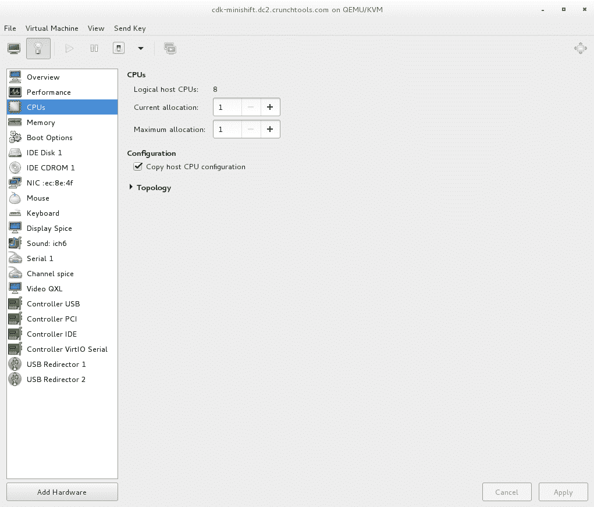
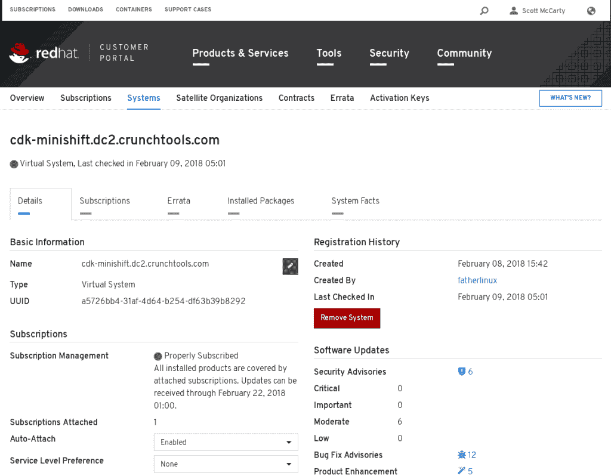

# 带有嵌套 KVM 的 Red Hat 容器开发套件(CDK)

> 原文：<https://developers.redhat.com/blog/2018/02/13/red-hat-cdk-nested-kvm>

## 为什么

如果你像我一样，你可能更喜欢在新的虚拟机(VM)或容器中安装新的和探索性的软件，以使你的笔记本电脑/台式机免受软件污染(TM)。[红帽容器开发套件](https://developers.redhat.com/products/cdk/overview/) (CDK)依靠虚拟化创建红帽企业 Linux (RHEL)虚拟机运行 OpenShift(基于 Kubernetes)。红帽特别支持在 [Windows](https://developers.redhat.com/products/cdk/hello-world/#fndtn-windows) 、 [macOS](https://developers.redhat.com/products/cdk/hello-world/#fndtn-macos) 、 [RHEL 服务器](https://developers.redhat.com/products/cdk/hello-world/#fndtn-rhel)上安装 CDK，但是如果你运行的是 Fedora、RHEL 工作站，甚至 CentOS，你就会遇到麻烦。如果您运行的不是受支持的桌面，您可以随时使用 RHEL 服务器虚拟机，本教程就是为您准备的。

本教程专门针对在 RHEL 工作站上将 RHEL 服务器作为虚拟机运行，但这些说明应该适用于 Fedora 和 CentOS。通过修改第一步——创建一个支持嵌套虚拟化的虚拟机( [vmware](https://communities.vmware.com/docs/DOC-8970) ，[hyper-v](https://docs.microsoft.com/en-us/virtualization/hyper-v-on-windows/user-guide/nested-virtualization))——您应该能够让这些指令在 Windows 和 macOS 上也能工作。(注意:VirtualBox 不支持嵌套虚拟化，因此这在 VirtualBox 上不起作用。)

## 怎么

### 创建虚拟机

首先，创建一个新的虚拟机并安装 RHEL 服务器。就我个人而言，我使用 virt-manager 是因为它使得创建用于测试的短暂虚拟机变得容易。我给了我的虚拟机 8192 MB 的内存和 1 个 vCPU。创建虚拟机时，请记住配置 CPU 以复制主机配置。这将启用嵌套 KVM，允许您在新的虚拟机中运行虚拟机——记住....喘气的....

[](https://developers.redhat.com/blog/wp-content/uploads/2018/02/Screenshot-from-2018-02-09-08-56-19.png)

### 安装 RHEL

[下载](https://access.redhat.com/downloads/content/69/ver=/rhel---7/7.5%20Beta/x86_64/product-software)，[安装](https://access.redhat.com/documentation/en-us/red_hat_enterprise_linux/7/html/installation_guide/index) RHEL 服务器，因为那是 CDK 支持的[平台之一。我不会重写这方面的说明，因为大多数人可以在没有文档的情况下做到这一点。](https://developers.redhat.com/products/cdk/hello-world/#fndtn-rhel)

在新的 RHEL 安装中，安装和配置虚拟化和一些其他工具来使事情变得更简单:

yum install-y QEMU-KVM QEMU-img lib virt virt-manager xauth Firefox

### 安装 CDK

在新创建的虚拟机[中启用、下载](https://developers.redhat.com/products/cdk/hello-world/#fndtn-rhel)、[安装](https://access.redhat.com/documentation/en-us/red_hat_container_development_kit/3.2/html-single/getting_started_guide/index#quickstart-overview) CDK。请记住:

```
subscription-manager repos --enable rhel-7-server-devtools-rpms
subscription-manager repos --enable rhel-server-rhscl-7-rpms
cd /etc/pki/rpm-gpg
wget -O RPM-GPG-KEY-redhat-devel https://www.redhat.com/security/data/a5787476.txt
rpm --import RPM-GPG-KEY-redhat-devel
yum install cdk-minishift docker-machine-kvm
```

现在，设置 CDK。这将为您完成所有工作，包括将 OC 二进制文件放在需要的地方。

```
ln -s /root/.minishift/cache/oc/v3.7.14/linux/oc /usr/bin/oc
minishift setup-cdk
minishift start
```

### 运行正常的

这些是教程通常会遗漏的说明。注意，oc 命令被自动配置为连接到虚拟机中的 Kubernetes/OpenShift 环境(位于您创建的虚拟机中——mic drop)

```
oc get pods
oc get pv
oc get node
```

您还可以使用以下命令直接进入 CDK 虚拟虚拟机。从这里，您可以运行 docker 命令，查看底层存储，等等:

```
minishift ssh
docker ps
docker images
```

或者，使用以下命令进入浏览器控制台。这将在浏览器中显示 OpenShift web 控制台，通过 X11 显示到您的笔记本电脑上(这就是我们安装 xauth 的原因)。警告，您必须禁用 SELinux:

```
setenforce 0
minishift console
```

现在，您已经有了一个全功能的 OpenShift 环境，并且您已经准备好探索互联网上的任何 Kubernetes 或 OpenShift 教程。您甚至为存储测试设置了永久卷。

### 提示和技巧

提示:如果微型轮班设置失败，您可以随时删除并重新开始:

```
minishift delete
minishift cdk-setup
```

提示:有时您必须手动删除 Red Hat Portal 上的订阅，以便再次运行 CDK 设置。只需使用删除系统按钮:

[](https://developers.redhat.com/blog/wp-content/uploads/2018/02/Screenshot-from-2018-02-09-10-35-16.png)

提示:因为我们在做嵌套虚拟化，所以时不时你会遇到一些奇怪的网络问题或其他问题。只需删除 CDK 并重启虚拟机:

```
minishift delete
reboot
```

*Last updated: September 3, 2019*