# OpenShift 上的红帽决策管理器

> 原文：<https://developers.redhat.com/articles/red-hat-decision-manager-on-openshift>

### 介绍

本指南向您展示了如何在您的 Red Hat OpenShift 环境中安装决策管理器来创作、部署和执行决策服务。这个 Hello World 将向您展示从安装决策管理器到在决策管理器环境中部署它，再到在云环境中测试它的一步一步的旅程(参见图 1.0)。

[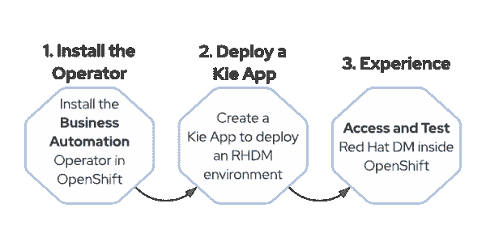](/sites/default/files/RHD%20-%20Hello%20World.png)Figure 1.0: Install, deploy, and experience

我们将在 OpenShift 上安装决策管理器，它将运行在 Red Hat JBoss EAP (WildFly)之上。一旦我们启动并运行了决策管理器，我们将导入一个现有的应用程序来查看它的一些功能。最后，我们将通过部署项目并测试它来结束我们的 Hello World！

## 1.设置您的环境

### 先决条件

*   为了测试这个演示，您应该安装并运行 [Red Hat OpenShift](https://developers.redhat.com/products/openshift/download) 4.7。你可以在[Red Hat open shift Getting Started](https://developers.redhat.com/products/openshift/getting-started)找到如何安装你的 OCP 环境的详细信息。
    *   或者，如果您愿意，您可以在本地[安装 Red Hat 代码就绪容器](https://developers.redhat.com/products/codeready-containers/overview) (CRC)。
*   在 OpenShift 安装中，您还应该有一个**集群管理员角色**。

### 安装业务自动化操作员

业务自动化操作符是在 OpenShift 环境中部署决策管理器的最有效方式。当使用 Business Automation 操作符时，我们可以委托所有的应用程序管理及其所有组件。

首先，我们需要订阅 OperatorHub 中的 Business Automation Operator。一旦我们这样做了，我们将能够创建一个新的 **KieApp** ，它是一个自定义资源，代表运行我们的应用程序所需的一组资源，例如，批量声明、路由、服务和部署配置。

当我们部署 KieApp 时，我们可以在一组推荐的设置中进行选择，以部署我们的决策管理器环境。在本指南中，我们将使用临时模板 **rhdm-trial，**来部署决策管理器和 Kie 服务器。

**注意:**如果您想了解更多关于可用模板选项的信息，我们建议您查看一下[官方的 Red Hat Decision Manager 文档](https://access.redhat.com/documentation/en-us/red_hat_decision_manager/7.9/html/deploying_red_hat_decision_manager_on_red_hat_openshift_container_platform/operator-con_openshift-operator#operator-deploy-basic-proc_openshift-operator)。

现在我们已经了解了将要部署的内容，让我们开始吧。

### 订阅运营商

让我们通过三个简单的步骤来安装业务自动化操作器。

1.  登录到您的 OpenShift 环境。
2.  创建一个新的 OpenShift 项目(参见图 1)。在左侧菜单中，选择**项目**。接下来，点击**创建项目**。
3.  插入项目的**名称**、**显示名称**和**描述**，然后点击**创建**(见图 2)。

[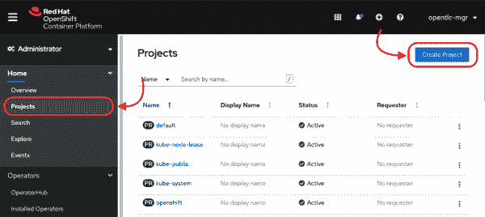](/sites/default/files/rhdm-hw-ocp-01.png)Figure 1: Select Projects, then Create Project

| 名字 | 你好-rhdm |
| 显示名称 | RHDM 入门 |
| 描述 | 这是一个与红帽决策管理器入门项目 |

[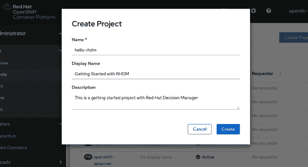](/sites/default/files/rhdm-hw-ocp-02.png)Figure 2: Create Project screen

这个操作符是由名称空间安装的，并且只影响它所安装到的项目。让我们在我们的 **hello-rhdm** 项目中安装业务自动化操作员。

在左边，展开**操作员**菜单，点击**操作员中枢**。在 **OperatorHub** (见图 3)，搜索**业务自动化**。

[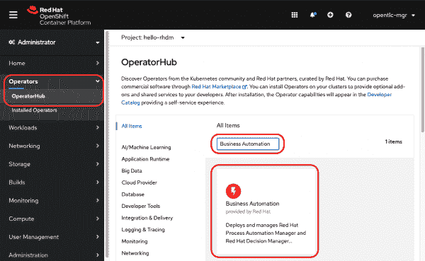](/sites/default/files/rhdm-hw-ocp-03.png)Figure 3: OperatorHub dashboard

选择**业务自动化**。您应该看到，如图 4 所示，操作符的描述及其版本和当前功能。点击**安装**。

[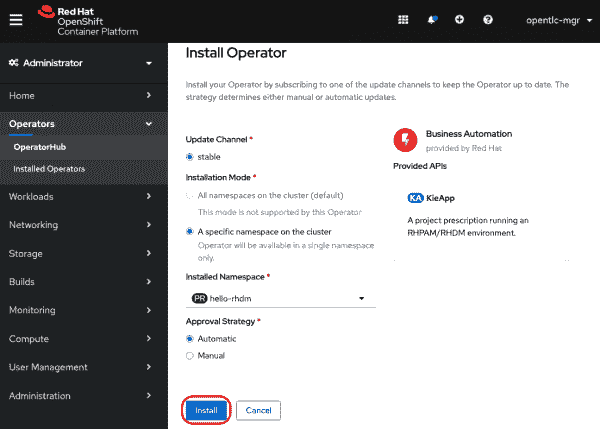](/sites/default/files/rhdm-hw-ocp-04.png)Figure 4: Click Install on the Install Operator screen

您应该被重定向到**已安装的操作符**列表(参见图 5)。点击**业务自动化操作员**查看更多详情。

[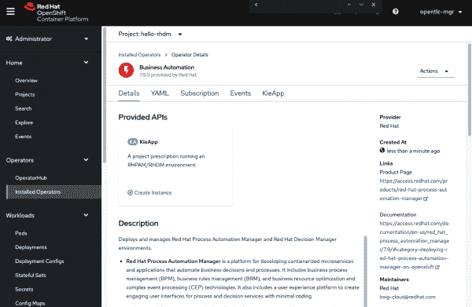](/sites/default/files/rhdm-hw-ocp-05.png)Figure 5: Installed Operators. Select the Business Automation operator.

恭喜，您已经在集群中安装了 Business Automation operator。您现在可以在您的云中安装决策管理器了！

## 2.部署新的 KieApp

现在是时候使用操作符在这个环境中安装决策管理器了。**提示:**记住，我们使用的是 rhdm-trial 模板，这是一个允许我们快速测试决策管理器的模板。这个模板是短暂的，它的数据不会持久。

在**操作员详细信息**界面(见图 6)，找到 **KieApp** 并点击**创建实例**。

[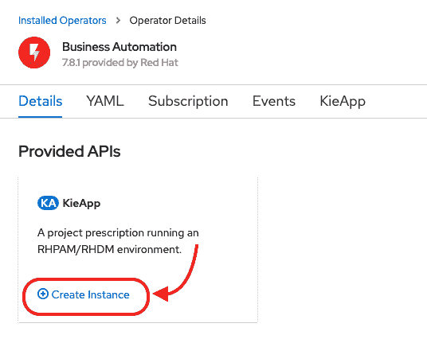](/sites/default/files/rhdm-hw-ocp-06.png)Figure 6: Operator Details. Locate KieApp and click Create Instance.

切换到 YAML 视图，并填写模板选项。将其从**rhpam-试验**更改为**rhdm-试验。**结果应该如图 7 所示。

[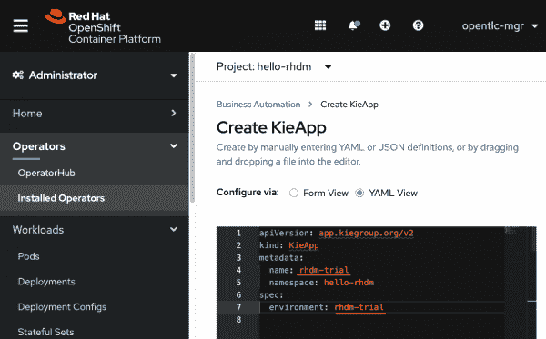](/sites/default/files/rhdm-hw-ocp-07.png)Figure 7: YAML View. Change template options.

点击**创建**。

您应该会看到一个新的 KieApp， **rhdm-trial，**正在配置。在这个 RHDM 环境中，我们现在有了一个**决策中心**，我们可以在那里创作、构建和部署我们的决策应用，还有一个 **KIE 服务器**，它可以执行我们的规则和决策，并公开 API 以与客户端应用集成。**提示:**除了这两个主要组件，您还可以找到秘密、部署配置、路由、服务、服务帐户、角色和角色绑定。所有这些资源都是由运营商为基本配置创建的，包括向外部网络公开服务，并保证密码的安全性**。**

参见图 8。在左侧菜单中，展开**联网**并点击**路线。**

[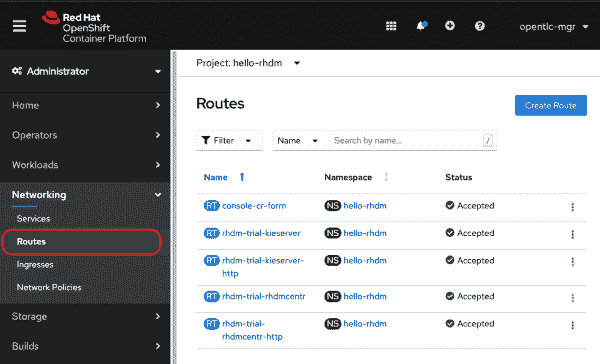](/sites/default/files/rhdm-hw-ocp-08.png)Figure 8: From the left menu, expand Networking and click Routes.

这些路线向外界公开了我们的服务。让我们尝试进入决策中心路线。

在一个新的选项卡中打开**rhdm-trial-rhdmcentr-http**route 链接(参见图 9)。

[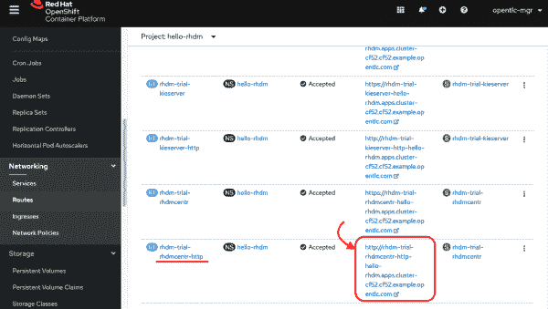](/sites/default/files/rhdm-hw-ocp-09.png)Figure 9: The trial route link in a new tab

如果一切顺利，您的浏览器中应该会打开一个新的选项卡，您可以使用决策中心！以下是决策中心的凭据:

*   用户:管理员用户
*   密码:RedHat

**提示:**无法访问决策中心？看一下 pod 日志，检查它是否还在引导。一旦完成，再试一次。如果你运行的是 MacOS，并且在 Chrome 中遇到了任何证书问题，请尝试在 Firefox 中访问你的 MacOS。

恭喜您，您已经在 OpenShift 中成功安装了决策管理器。现在，让我们导入贷款项目，构建并运行它！

### 3.探索

在 OpenShift 中部署了两个关键组件:**决策中心**和 **KIE 服务器。** Decision Central 是一个允许您开发业务规则和决策、管理项目以及构建和打包项目的组件。最后，你可以把它部署在 **KIE 服务器**，规则和决策引擎。KIE 服务器是一个能够执行规则和决策的轻量级组件。它可以很容易地与您的服务集成，例如通过 REST 或 JMS。

#### 使用决策管理器创作

让我们从访问**决策中心**开始(参见图 10)。点击**设计、创建和修改项目**，选择 **MySpace** 。

[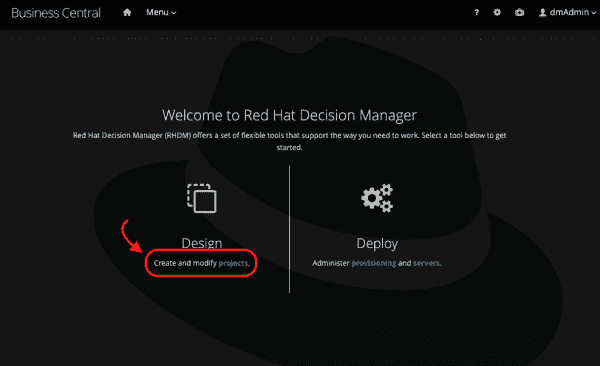](/sites/default/files/rhdm-hw-10.png)Figure 10: Decision Manager Business Central dashboard

点击**导入项目**(见图 11)。

[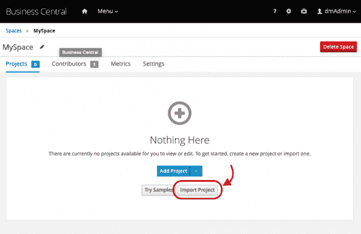](/sites/default/files/rhdm-hw-11.png)Figure 11: Import Project

插入下面的库 URL[https://github . com/JBoss demo central/rhdm 7-loan-demo-repo . git](https://github.com/jbossdemocentral/rhdm7-loan-demo-repo.git)，点击**导入**。选择**贷款申请**(见图 12)，点击**确定**。

[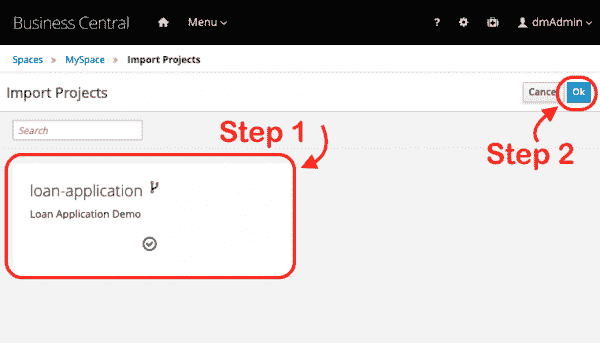](/sites/default/files/rhdm-hw-12.png)Figure 12: Business Central. Select Import Projects.

项目导入后，您应该在资产列表中看到四个资产。

*   三种数据模型(推荐、贷款和申请人)
*   使用 DMN 实施的简单决策(建议)
*   和传统的指导决策表(贷款批准)

打开**贷款审批** **决策表**(见图 13)，检查表中定义的四个规则。

[](/sites/default/files/rhdm-hw-13.png)Figure 13: Decision Table

这些规则根据贷款金额和申请的信用评分来控制“贷款”是否获得批准。更具体地说，当申请获得批准时，“贷款”的**批准**字段将被设置为**真**。

关闭该文件，选择**推荐** **决策建模符号(DMN)文件**(参见图 14)。DMN 规范是一个被对象管理组织(OMG)认可的成熟模式，它是平台无关的。DMN 文件是专门创建的，以便业务团队能够以更直观的方式设计决策。

[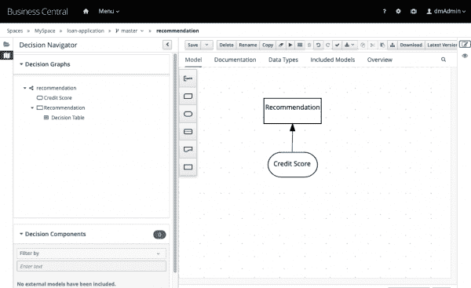](/sites/default/files/rhdm-hw-14.png)Figure 14: Recommendation Decision Modeling Notation (DMN) file

这个 DMN 文件有一个输入:**信用评分**。基于这个信用评分，输出将是一个关于贷款金额的**建议**。如图 15 所示，点击**推荐**决策节点，选择**编辑**。

[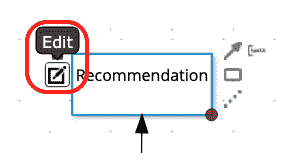](/sites/default/files/rhdm-hw-15.png)Figure 15: Select the Recommendation decision node, then Edit.

您将看到**决策表**(见图 16)负责根据提供的信用分数确定输出。

[](/sites/default/files/rhdm-hw-16.png)Figure 16: Decision Table that determines output

关闭打开的文件。既然我们已经探索了我们的项目规则和决策，让我们构建和部署项目。

#### 部署规则

我们现在正在进行一个传统的 Maven 项目。我们需要将它构建并打包到 Knowledge Java Archive (Kjar)中，Kjar 是包含模型和规则的决策部署单元。打包后，该应用程序可以部署到引擎中。幸运的是，如图 17 所示的**决策中心**可以帮助我们完成这项任务。

单击 **Deploy** 在另一个 OpenShift pod 中运行的执行服务器上构建和部署项目:

[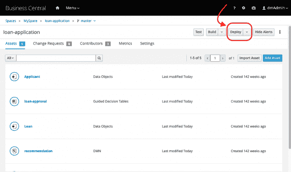](/sites/default/files/rhdm-hw-17.png)Figure 17: Loan application deployment

一旦构建和部署完成，您将看到如图 18 所示的成功部署消息。点击**查看部署详情**。

[](/sites/default/files/rhdm-hw-18.png)Figure 18: A successful deployment message

该页面将显示一个正在运行的“default-kie-server ”,其中部署了“loan_application_1.2.0”容器(参见图 19)。


我们的项目现在可供客户端应用程序使用！让我们来看看如何使用这个决策服务。

### 3.探索

**KIE 服务器**带有一个大摇大摆的用户界面(UI ),允许我们测试引擎的 RESTful 端点并使用部署在其上的规则。让我们使用这个 UI 来测试我们的规则。

让我们从检查这个 **KIE 服务器的部署项目开始:**在你的 OpenShift 控制台中，打开**联网**下的**路由**选项。找到**rhdm-trial-kieserver-http**路由，在新的选项卡中打开 URL。

**通过在您的 URL 中添加“/docs”来访问 KIE 服务器 Swagger UI** 。您的证书是:

*   网址:[http://youropenshift.url.com/docs](http://localhost:8080/kie-server/docs)
*   用户:管理员用户
*   密码:RedHat

通过导航到“KIE 服务器和 KIE 容器”并定位“GET”“/Server/containers”选项，验证规则已经被正确地部署在了 **KIE 服务器**上(参见图 21)。

点击**尝试一下**。

[](/sites/default/files/rhdm-hw-21.png)Figure 21: Navigate to KIE Server and KIE containers. locate the right option, and select Try it out

将参数留空，选择**执行**。如果被询问，请使用这些凭据:

*   用户:管理员用户
*   密码:RedHat

类似于图 22 的页面将显示一个成功代码为“200”的响应，以及一个列出容器 id“loan-application _ 1 . 2 . 0”容器的响应正文。

[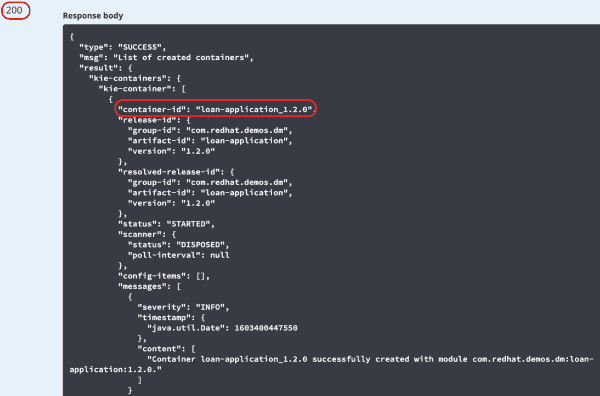](/sites/default/files/rhdm-hw-22.png)Figure 22: Success code 200 and the container id loan-application

#### 消费业务规则

现在，让我们使用 REST API 来消费我们用指导决策表实现的规则。

要向**决策服务**发送请求，如图 23 所示，导航到 **KIE 会话资产**，并搜索**POST "/server/containers/instances/{ container id**}。

[](/sites/default/files/rhdm-hw-23.png)Figure 23: KIE session assets

点击**试用**并填写请求参数:

*   “参数内容类型”和“响应内容类型”为“应用程序/JSON”；
*   “containerId”到“loan-application _ 1 . 2 . 0”(KIE 容器的 ID)；
*   在“正文”中，插入以下内容:

```
{

"lookup" : "default-stateless-ksession",

"commands":[

{

"insert":{

"object":{

"com.redhat.demos.dm.loan.model.Applicant":{

"creditScore":230,

"name":"Jim Whitehurst"

}

},

"out-identifier":"applicant"

}

},

{

"insert":{

"object":{

"com.redhat.demos.dm.loan.model.Loan":{

"amount":2500,

"approved":false,

"duration":24,

"interestRate":1.5

}

},

"out-identifier":"loan"

}

},

{

"fire-all-rules":{

}

}

]

}
```

点击**执行**(参见图 24)。

[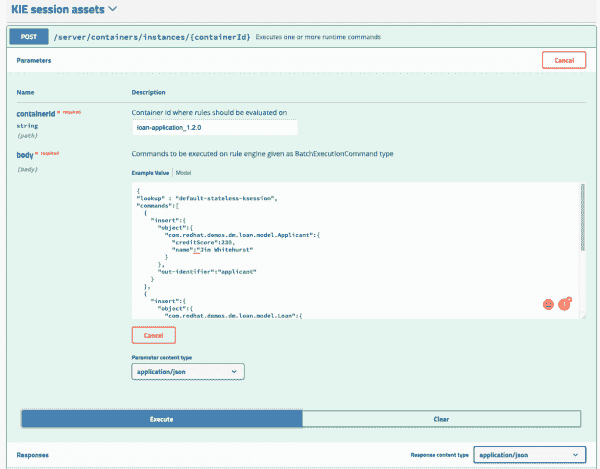](/sites/default/files/rhdm-hw-24.png)Figure 24: KIE Sessions window with parameters

该页面将显示一个代码为 **200** 的响应，以及一个列出规则执行结果的响应正文。特别是,“贷款”对象的 A**approved**字段现在应该读作 **True** ,“原因”应该带来图 25 中的消息:**祝贺您的贷款获得批准**，这是规则评估的结果。

[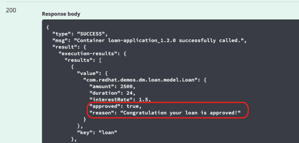](/sites/default/files/rhdm-hw-25.png)Figure 25: Page response

#### 消费决策

现在我们已经测试了我们的业务规则，让我们用 DMN 来测试我们实现的决策。为了做到这一点，我们将使用决策引擎 REST API。在 **KIE 服务器 Swagger UI** 中，如图 26 所示，导航到 **DMN 资产**，定位到**POST/Server/containers/{ container id }/DMN**。

[](/sites/default/files/rhdm-hw-26.png)Figure 26: DMN Assets in the KIE Server Swagger UI.

点击**试用**，填写这些参数:

*   ContainerID:贷款申请 _1.2.0
*   将**参数内容**类型和 R **响应内容类型**更改为**应用/json** 。
*   正文:

```
{

"model-namespace" : "https://kiegroup.org/dmn/_C159F266-40FF-49CB-B4D9-447DFACDDC16",

"model-name" : "recommendation",

"decision-name" : [ ],

"decision-id" : [ ],

"dmn-context" : {"Credit Score": 100}

}
```

请注意，我们发送的“信用评分”值为 100。基于这个输入，引擎将做出决定并给我们输出。点击**执行**并观察输出(见图 27)。

[](/sites/default/files/rhdm-hw-27.png)Figure 27: Click Execute and observe the output

在正文中，将信用评分改为 400，点击**执行**，检查执行结果。

## 恭喜你！

我们的 Hello World 到此结束。我们使用业务自动化操作器在 OpenShift 中安装了 Red Hat Decision Manager。我们还直接从 GitHub 导入了一个项目，我们检查了指导决策表和 DMN，这是实现业务逻辑的许多可能方法中的两种，我们通过部署和测试我们的服务结束了我们的 Hello World。

*Last updated: June 17, 2021*