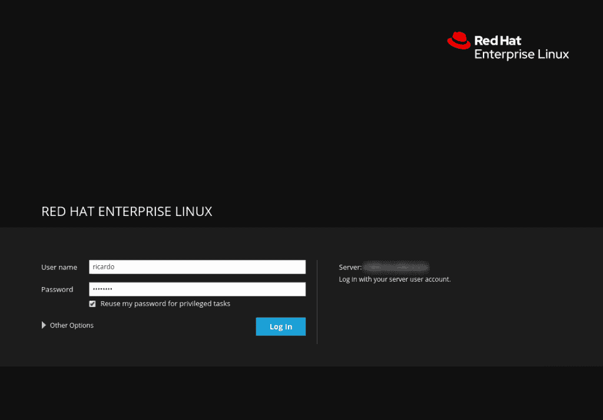
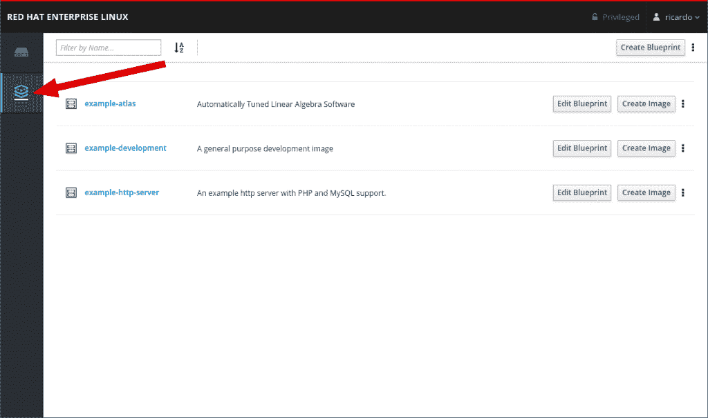
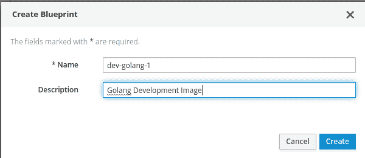
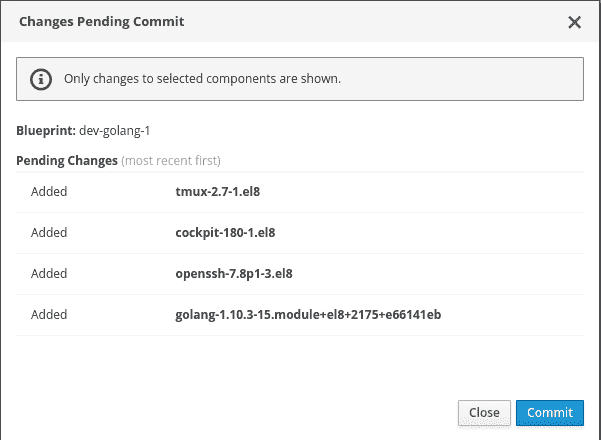
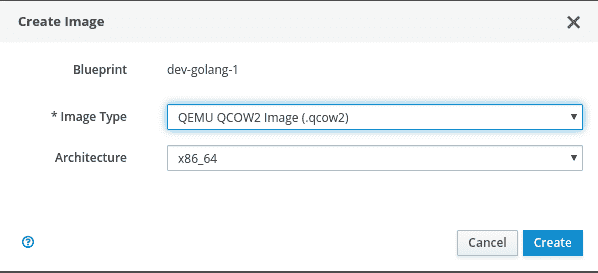
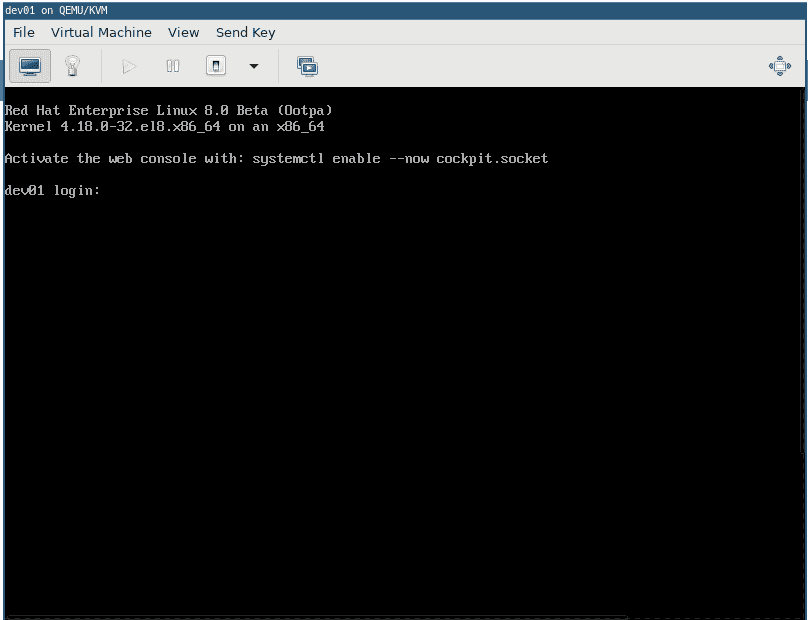
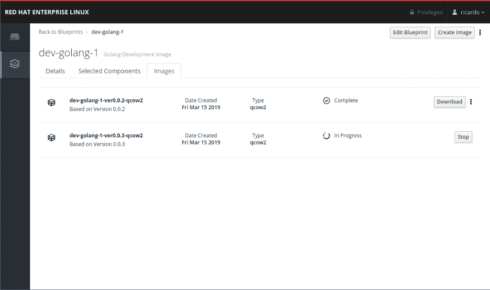

# Red Hat Enterprise Linux 8 映像构建器:构建自定义系统映像

> 原文：<https://developers.redhat.com/blog/2019/05/08/red-hat-enterprise-linux-8-image-builder-building-custom-system-images>

[Red Hat Enterprise Linux 8](https://developers.redhat.com/topics/linux/) 发布了一款名为 Image Builder 的新工具，允许您以各种格式创建自定义的 Red Hat Enterprise Linux 系统映像。其中包括与市场上主要云提供商和虚拟化技术的兼容性。因此，它使您能够根据自己的需求，在不同的平台上快速安装新的 Red Hat Enterprise Linux (RHEL)系统。

在本文中，我们将展示如何在 [Red Hat Enterprise Linux 8](https://developers.redhat.com/rhel8/) 中设置 Image Builder，并创建几个映像来测试其功能。Red Hat 建议在自己的专用虚拟机上运行 Image Builder。

按照本教程，您将需要一个运行 Red Hat Enterprise Linux 8 的虚拟机，我们将在其中安装 Image Builder。该虚拟机需要订阅，并且能够访问 Red Hat Enterprise Linux 8 软件包存储库。在这篇文章中，我们不会讨论 Red Hat Enterprise Linux 8 的安装。欲了解更多信息，请查阅产品[文档](https://access.redhat.com/documentation/en-us/red_hat_enterprise_linux/8/html/performing_a_standard_rhel_installation/index)。

## 安装图像生成器

Image Builder 依赖于“lorax-composer”软件包提供的功能。我们建议您在专用虚拟机中安装 Image Builder，因为它有特定的安全要求。在本教程中，我们将使用名为— *rh8comp2—* 的虚拟机来安装 Image Builder。

您可以通过 GUI、web 控制台界面或 CLI 使用 Image Builder，方法是安装 *composer-cli* 软件包。对于本教程，我们将使用两者的组合。

通过运行以下命令安装所需的软件包:

```
# yum install -y lorax-composer composer-cli cockpit-composer

```

该命令还将下载依赖项，包括 Cockpit(如果没有安装的话，用于启用 web 控制台)。

接下来，确保防火墙允许访问 Web 控制台:

```
# firewall-cmd --add-service=cockpit && firewall-cmd --add-service=cockpit --permanent
Warning: ALREADY_ENABLED: 'cockpit' already in 'public'
success
Warning: ALREADY_ENABLED: cockpit
success
# firewall-cmd --list-services
cockpit dhcpv6-client ssh

```

最后，启用并启动“lorax-composer”和“驾驶舱”服务:

```
# systemctl enable lorax-composer.socket
Created symlink /etc/systemd/system/sockets.target.wants/lorax-composer.socket → /usr/lib/systemd/system/lorax-composer.socket.
# systemctl enable cockpit.socket
Created symlink /etc/systemd/system/sockets.target.wants/cockpit.socket → /usr/lib/systemd/system/cockpit.socket.
# systemctl start lorax-composer
# systemctl start cockpit

```

现在，您已经启动并运行了 Image Builder。接下来，让我们使用 web 控制台 GUI 通过 Image Builder 创建一个图像。

## 使用 web 控制台创建自定义图像

安装 Image Builder 和 Web 控制台后，您可以通过将浏览器指向虚拟机的主机名或端口 9090 上的 IP 地址来访问系统管理 GUI。使用您的管理员用户凭据登录:

[](https://developers.redhat.com/blog/wp-content/uploads/2019/03/cockpit-login-ga-2019-05-08_21-49.png)

登录后，点击菜单左侧的*图像生成器*图标:

[](https://developers.redhat.com/blog/wp-content/uploads/2019/03/composer-2019-03-15_14-03.png)

### 创建图像蓝图

接下来，为你的形象创建一个蓝图。蓝图定义了您的映像中应该包含的内容。通过 web 控制台 GUI，您只能指定要包含的 rpm 软件包。为了指定用户，我们将在本教程的后面使用 Composer CLI。

点击*创建蓝图*按钮，创建新的蓝图。之后，为蓝图指定一个名称和描述。在这个例子中，我们创建了一个包含工具的映像来编译用 Go 编写的程序；因此，我们称它为 *dev-golang-1* :

[](https://developers.redhat.com/blog/wp-content/uploads/2019/03/create-blueprint-2019-03-15_14-04.png)

在下一个屏幕上，选择要包含在映像中的包。您可以使用左边的过滤栏来更容易地找到包。例如，键入`tmux`并按*回车*来查看 *tmux* 包。通过单击名称旁边的加号(+)将包添加到蓝图中。请注意，GUI 会自动添加包的依赖项。在本例中，我们将以下包添加到蓝图中:

*   战场
*   openssh
*   golang
*   tmux

[](https://developers.redhat.com/blog/wp-content/uploads/2019/03/blueprint-edit-final-2019-03-15_14-07.png)

请注意，您的系统上可用的软件包版本可能会有所不同。

包含所有必需的包后，点击屏幕顶部的*提交*按钮提交您的更改。在弹出的屏幕上，确认您的更改并点击*提交*按钮提交:

[](https://developers.redhat.com/blog/wp-content/uploads/2019/03/commit-2019-03-15_14-07.png)

### 开始图像创建

既然已经定义了蓝图，您可以通过点击右上角的*创建映像*按钮开始映像创建过程。在弹出屏幕上，选择图像类型。Image Builder 可以创建各种映像，包括 AWS、Azure、OpenStack、VMware 等等。对于这个例子，要部署一个本地 KVM 虚拟机，选择 *QEMU QCOW2* 格式并点击 *Create* :

[](https://developers.redhat.com/blog/wp-content/uploads/2019/03/create-image-2019-03-15_14-08.png)

创建图像可能需要几分钟时间。您可以通过导航至蓝图并点击*图像*选项卡，在 web 控制台上跟踪进度:

[](https://developers.redhat.com/blog/wp-content/uploads/2019/03/create-image-pending-2019-03-15_14-09.png)

您还可以通过检查 *lorax-composer* 单元的*日志*来跟踪 Image Builder 虚拟机上的详细日志:

```
# journalctl -fu lorax-composer

```

创建图像后，点击图像名称旁边的*下载*按钮下载图像:

[](https://developers.redhat.com/blog/wp-content/uploads/2019/03/create-image-complete-2019-03-15_14-16.png)

### 使用映像创建虚拟机

现在您可以使用这个映像在 *KVM/Libvirt* 上创建一个虚拟机。因为我们没有为该图像指定用户，您可以使用 *libvirt* 工具，如 *virt-customize* ，在使用之前进一步定制图像:

```
$ sudo virt-customize -a f492077c-6d4b-458a-8ac6-bfbc49fae499-disk.qcow2 --root-password password:test123 --hostname dev01
[   0.0] Examining the guest ...
[   5.8] Setting a random seed
[   5.8] Setting the hostname: dev01
[   5.8] Setting passwords
[   6.9] Finishing off

```

最后，使用您的全新映像创建一个虚拟机:

[](https://developers.redhat.com/blog/wp-content/uploads/2019/03/vm-dev01-2019-03-15_14-27.png)

在下一步中，我们将使用 Image Builder CLI 将用户直接添加到映像中。

## 使用 CLI 创建自定义映像

除了使用 web 控制台，您还可以使用 Image Builder CLI 创建映像。使用 CLI 时，您可以访问更多自定义选项，例如向映像添加用户和组。我们已经在 Image Builder 虚拟机中安装了 *composer-cli* 包，所以让我们使用它。

以 *root* 身份登录映像构建器虚拟机 *rh8comp2* 。首先，列出所有可用的蓝图:

```
# composer-cli blueprints list
dev-golang-1
example-atlas
example-development
example-http-server

```

正如你所看到的，我们使用 GUI 创建的 *dev-golang-1* 蓝图是可用的。我们将编辑该蓝图，以包括管理员用户。要编辑蓝图，请将其保存到文件中:

```
# composer-cli blueprints save dev-golang-1
# ls -l dev-golang-1.toml
-rw-r--r--. 1 root root 295 Mar 15 14:38 dev-golang-1.toml

```

该命令以 [TOML](https://github.com/toml-lang/toml) 格式保存蓝图。

接下来，编辑 *dev-golang-1.toml* 文件以添加新用户:

```
# vi dev-golang-1.toml
name = "dev-golang-1"
description = "Golang Development Image"
version = "0.0.2"
modules = []
groups = []
```

```
[[packages]]
name = "cockpit"
version = "*"
```

```
[[packages]]
name = "golang"
version = "*"
```

```
[[packages]]
name = "openssh"
version = "*"
```

```
[[packages]]
name = "tmux"
version = "*"
```

如您所见，该文件包含了我们在使用 GUI 创建蓝图时包含的所有包。为了添加一个新用户，我们包含了一个具有所需定制的新部分。在此之前，将版本提高 *0.0.1* 以表示蓝图的新次要版本:

```
version = "0.0.3"

```

现在，添加部分 **customizations.users** ，其中包含您想要创建的用户的详细信息，包括用户名、密码、SSH 密钥和组。

```
[[customizations.user]]
name = "ricardo"
description = "Ricardo user account"
password = "$6$nt7IeYW0hFj3ShZC$FdBCgZpfIi92q0sdcTozX1z8KnDAxtxy2b4A76fP4.QKy9kyLS82Vci76BjJFIMp3RHJNCBqUq.aihV0icdHf1"
key = "ssh-rsa AAAAB3NzaC1yc2EAAAADAQABAAABAQDHmjYFDBCrB1mgacb47t+y8UXSscnJl2WWlJluzqtInpT6At0nwqtdV3niYTHxju7e/As4MX3iwC8ubVp2DH8qXgvorDliV9SsIQTqvNKlwGkxZ5cqfYFlV4SUuS7tVTOg0yIqVSddZ2t0Sjmdp3PF7zrp6ayH7a9BBA0/8HQXU/lpdk76SGYL9L8PHOtMYnxtmr+WduoJ+X9zO9d3SUypX36NleFqhlpr1UfnSSkFO/PfRYUhry6HEmUk3Da7aS9hNS0lX/j6uf9RnSrNSzquVezyVMgsRnJ+5xr7KyhwtEig//Wr/j8TWmqvj645IWXTmj6Jw4uvi26bEORZVM5x ricardo@localhost"
home = "/home/ricardo/"
shell = "/usr/bin/bash"
groups = ["users", "wheel"]

```

您可以使用此命令，使用 *SHA512* 算法生成密码的散列版本:

```
# python3 -c "import crypt, getpass; print(crypt.crypt(getpass.getpass(), crypt.METHOD_SHA512))"
Password:
$6$nt7IeYW0hFj3ShZC$FdBCgZpfIi92q0sdcTozX1z8KnDAxtxy2b4A76fP4.QKy9kyLS82Vci76BjJFIMp3RHJNCBqUq.aihV0icdHf1

```

如果 Python 3 不可用，使用 yum 安装它。

# yum -y 安装 python3

完成文件编辑后，保存更改并将蓝图的新版本推送到 Image Builder，如下所示:

```
# composer-cli blueprints push dev-golang-1.toml

```

接下来，开始图像创建过程，使用 *QCOW2* 格式:

```
# composer-cli compose start dev-golang-1 qcow2
Compose e63c7b29-df96-4f8c-aeb4-c2b0a98bd05e added to the queue

```

然后，检查创建状态，如下所示:

```
# composer-cli compose status
e63c7b29-df96-4f8c-aeb4-c2b0a98bd05e RUNNING  Fri Mar 15 14:43:35 2019 dev-golang-1    0.0.3 qcow2
f492077c-6d4b-458a-8ac6-bfbc49fae499 FINISHED Fri Mar 15 14:14:13 2019 dev-golang-1    0.0.2 qcow2            1990852608

```

### 下载映像并创建虚拟机

您可以继续检查状态，直到它完成。创建映像需要几分钟时间:

```
# composer-cli compose status
f492077c-6d4b-458a-8ac6-bfbc49fae499 FINISHED Fri Mar 15 14:14:13 2019 dev-golang-1    0.0.2 qcow2            1990852608
e63c7b29-df96-4f8c-aeb4-c2b0a98bd05e FINISHED Fri Mar 15 14:49:17 2019 dev-golang-1    0.0.3 qcow2            1990983680

```

完成后，您可以使用 CLI 下载映像:

```
# composer-cli compose image e63c7b29-df96-4f8c-aeb4-c2b0a98bd05e
e63c7b29-df96-4f8c-aeb4-c2b0a98bd05e-disk.qcow2: 1898.75 MB

```

或者，您可以使用 web 控制台检查映像创建状态或下载新映像:
[](https://developers.redhat.com/blog/wp-content/uploads/2019/03/create-image-v003-2019-03-15_14-46.png)

一旦有了映像，您就可以像以前一样使用 KVM 来启动一个新的虚拟机。现在的区别是，该映像已经有了一个管理员用户，所以您不需要创建一个。因为我们提供了一个 SSH 密钥，所以不用密码就可以使用它登录新系统:

```
$ ssh ricardo@192.168.122.227
The authenticity of host '192.168.122.227 (192.168.122.227)' can't be established.
ECDSA key fingerprint is SHA256:2xZm9mk8qrCUcwVb9dyb9Pvj21T021/wiXrD96nFKgE.
Are you sure you want to continue connecting (yes/no)? yes
Warning: Permanently added '192.168.122.227' (ECDSA) to the list of known hosts.
Activate the web console with: systemctl enable --now cockpit.socket

```

登录新系统后，验证 Go 是否按照蓝图安装:

```
[ricardo@localhost ~]$ go version
go version go1.10.3 linux/amd64
[ricardo@localhost ~]$

```

使用 Image Builder CLI，您可以自动执行映像创建过程，并将其与 CI/CD 管道集成。

## 摘要

Image Builder 工具是一个多功能的解决方案，用于配置和创建自定义系统映像，使您能够在各种云和虚拟化平台中快速启动新的 Red Hat Enterprise Linux 系统。

你可以在 Red Hat Enterprise Linux 8 [文档](https://access.redhat.com/documentation/en-us/red_hat_enterprise_linux/8/html-single/composing_a_customized_rhel_system_image/index)或上游[项目博客](https://weldr.io/)中找到更多关于 Image Builder 的信息。

*Last updated: June 10, 2019*