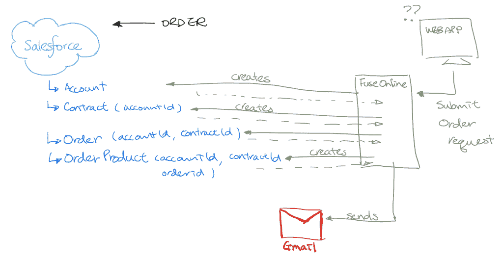
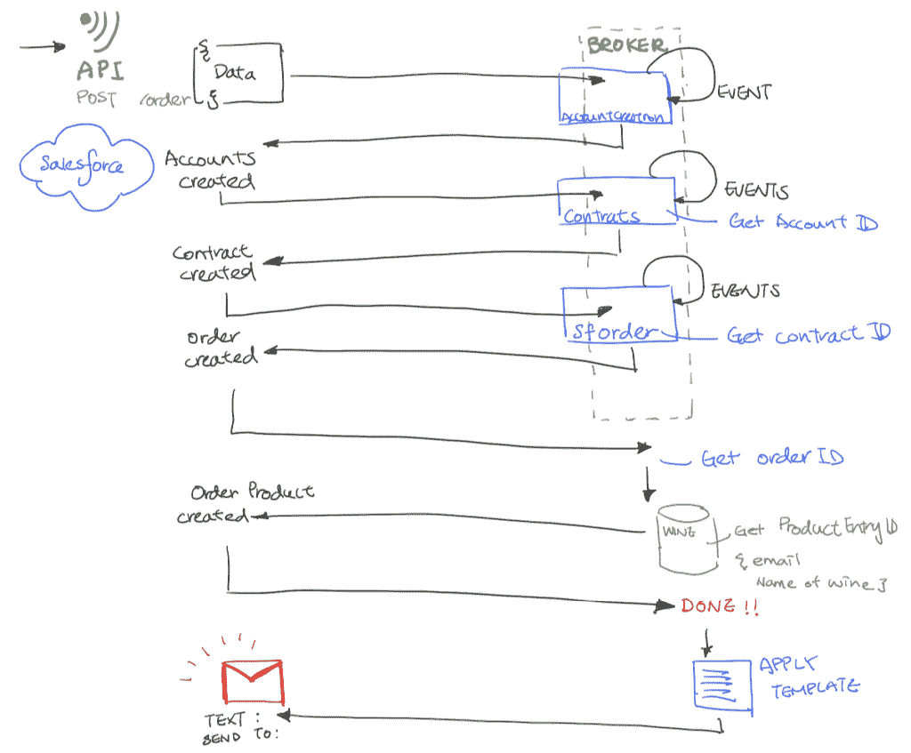

# 通过 Red Hat 集成完全集成到 Salesforce(第 2 部分)

> 原文：<https://developers.redhat.com/blog/2019/02/13/red-hat-integration-salesforce>

本文是关于 Red Hat 集成的三篇系列文章中的第二篇。[第一篇文章](https://developers.redhat.com/blog/2019/02/11/red-hat-integration-effortless-api-creation)描述了新的 Red Hat Integration bundle 如何允许公民集成商通过工具快速提供 API，使得在五个简单的步骤中轻松创建 API，并且我们实现了一个演示来展示 Red Hat 集成的完整 API 生命周期。演示是关于通过 API 提供葡萄酒标签和排名信息。

在本文中，我将通过使用 Salesforce 实现一个真实的业务交易来带您走得更远。我们将创建一个事件驱动的集成解决方案，在 Red Hat 集成上没有代码。

此演示的想法是通过网关、安全 API 从客户端 web 应用程序接收订单，然后处理订单并将所需数据转发到相应的 Salesforce 模块。从那里，Salesforce 将处理订单内容。

如果你想知道 API 是如何构建和实现的，请查看第一篇文章。在本文中，我将重点介绍如何使用事件驱动的方法与 Salesforce 集成。

在 Salesforce 中创建订单需要许多步骤。首先是为每一个用户建立一个账户，定义每一个用户的合同。之后，我们准备创建订单，但是需要单独处理订单的细节，以便将其与价格手册条目相关联。我描述的每个步骤都需要前面步骤的输出。因此，我们应该以异步方式构建我们的应用程序，以避免长时间挂起的进程。为了建立事件驱动的系统，我们需要某种媒介来保存和分发事件；它可以是一个消息代理或一个流媒体平台。这里，为了简单起见，我将只使用一个代理。

基本上，我们将使用代理从 API 收集所有事件调用，处理从 Salesforce 返回的结果，并将结果传递到下一步。如果我们将整个过程分解，这就是正在发生的事情:

1.接收传入的请求。

2.等待传入请求，并使用用户名在 Salesforce 中创建一个帐户。

3.等待成功创建帐户，然后使用帐户 ID 在 Salesforce 中创建合同。

4.等待成功创建合同，然后使用帐户 ID 和合同 ID 创建订单。

5.创建订单后，在订单中添加一个产品订单条目

因此，如果我们实现这个事件驱动的集成解决方案，我们将有五个完美的模块化集成[微服务](https://developers.redhat.com/blog/category/microservices/)运行并准备好处理事件，如下图所示。

除了在 Salesforce 中下订单，我们还希望在订单完成时通过电子邮件通知客户。可以在 [Red Hat Fuse Online](https://developers.redhat.com/products/fuse/overview/) 中使用模板来确保电子邮件的格式一致。为了将来自集成解决方案的数据应用到模板中，我们可以为电子邮件使用占位符和静态样板文本。

观看此视频，了解我是如何创建集成解决方案的。这里是我的回购协议的链接，其中包含您重新创建[演示](https://github.com/weimeilin79/fuseonlinewine)所需的一切。

[https://www.youtube.com/embed/-buHj8_Qbh4?autoplay=0&start=0&rel=0](https://www.youtube.com/embed/-buHj8_Qbh4?autoplay=0&start=0&rel=0)

玩得开心！

*Last updated: September 3, 2019*