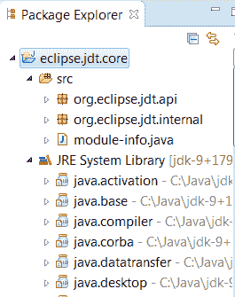
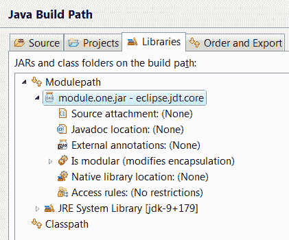
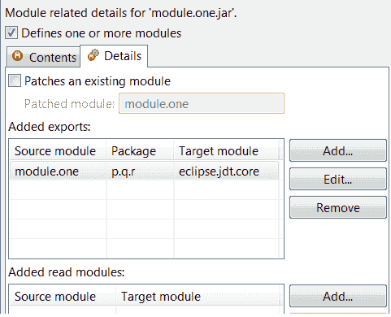
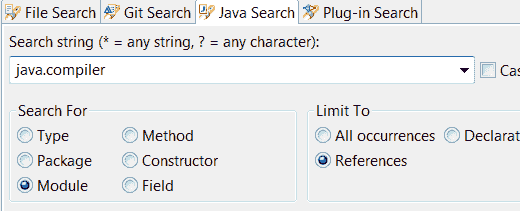

# 红帽介绍 JDK 9

> 原文：<https://developers.redhat.com/blog/2017/11/09/red-hat-introduces-jdk-9>

## 支持 Java 9

从[Red Hat JBoss Developer Studio 11.1](https://developers.redhat.com/products/devstudio/overview/)开始，现在支持 Java 9。

请注意，Red Hat JBoss Developer Studio 不在 Java 9 虚拟机上运行，但是允许管理和构建 Java 9 项目和工件。因此，如果您想要管理和构建 Java 9 项目，您必须首先在您的工作空间中定义一个 Java 9 JDK。

Java 9 在这里，JDT 完全支持它:

*   Eclipse 编译器 Java 版(ECJ)实现了所有新的 Java 9 语言增强。
*   更新了支持 Java 模块的重要特性，例如编译器、搜索和许多编辑器特性。

运行 Eclipse 和 Java Runtime 9 来获得 Java 9 支持并不是强制性的。然而，Java Runtime 9 需要在项目的构建路径上，以针对系统模块编译模块化项目。

*   当 Java Runtime 9 添加到项目的构建路径中时，系统模块会在包浏览器中的系统库下列出。

*   通过为现有的非模块化 Java 项目创建 module-info.java，可以将该项目快速转换为模块。一旦项目被转移到 compliance 9，就可以使用这个特性。

*   有了 Java 9 的支持，现在可以将库或容器添加到模块路径中，而不是类路径中。

*   一旦一个模块被添加到一个项目的模块路径中，点击**是模块化的**选项并编辑模块属性可以进一步扩展它的封装属性。以下示例显示了如何让 module.one 在当前 Java 项目的上下文中导出其包。

*   Java 搜索现在包括了一个新的搜索范围——模块。

### 还有更多…

您可以在[本页](http://tools.stage.jboss.org/documentation/whatsnew/jbosstools/4.5.1.Final.html)找到更多值得关注的更新。

*Last updated: March 19, 2020*