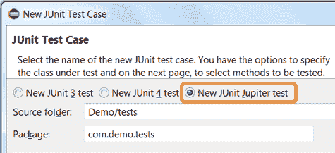
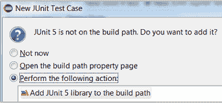
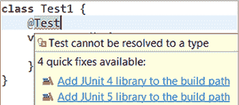
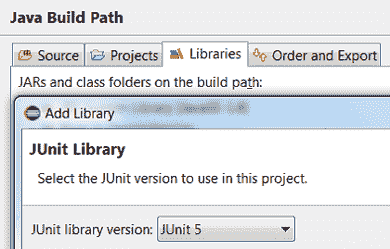
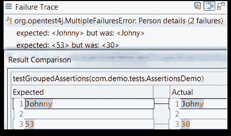
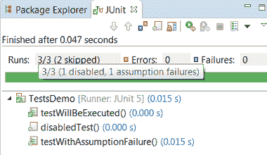
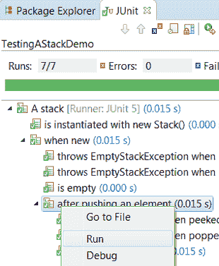
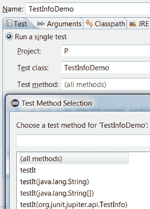
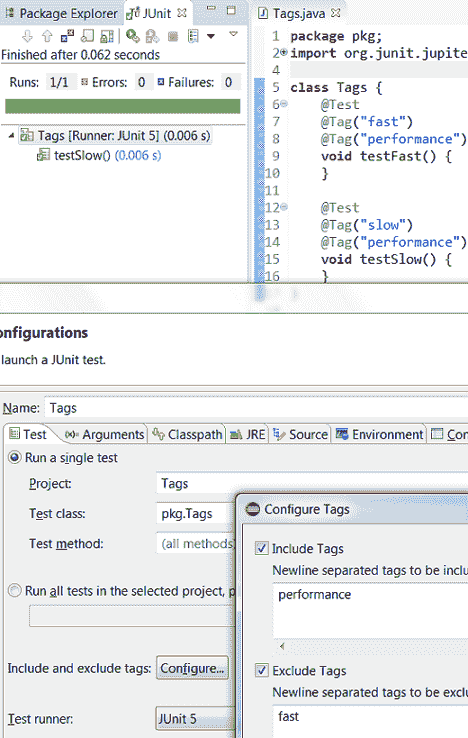

# 红帽推出 JUnit5

> 原文：<https://developers.redhat.com/blog/2017/11/08/red-hat-introduces-junit5>

## 支持 JUnit 5

从[红帽 JBoss Developer Studio 11.1](https://developers.redhat.com/products/devstudio/overview/) 开始，现在支持 JUnit 5。

JUnit 5 support is now available in Eclipse.

*   通过*新建 JUnit 测试用例向导创建新的 JUnit Jupiter 测试:

*   将 JUnit 5 库添加到构建路径中。

    *   新建 JUnit 测试用例向导提供了在创建新的 JUnit Jupiter 测试时添加它。

    

*   快速修复 **(Ctrl+1)** 关于 **@Test** 、 **@TestFactory** 、 **@ParameterizedTest** 、 **@RepeatedTest** 注释的建议。

*   在 Java 构建路径对话框中添加 JUnit 库。

*   使用新的 **test_jupiter** 模板创建一个 JUnit Jupiter 测试方法。

*   用新的 **test_factory** 模板创建一个 **@TestFactory** 方法。

*   JUnit Jupiter 的**断言**、**假设**、**动态容器、**和**动态测试**类现在默认添加到 **Eclipse 收藏夹**中。

这允许您通过内容辅助 **(Ctrl + Space)** 和快速修复 **(Ctrl + 1)** 从代码中快速导入这些类的静态方法。

*   在从 JUnit 视图打开的同一个**结果比较**对话框中查看分组断言的所有失败。

*   使用**转到文件**操作，或者只是双击从 JUnit 视图导航到测试，即使测试以自定义名称显示。

*   通过在 JUnit 视图或 Outline 视图中使用 **Run** 动作来(重新)运行单个**@嵌套**测试类。您甚至可以在编辑器中右键单击一个嵌套的测试类名，并使用 **Run As** 动作。

*   JUnit 启动配置中的**测试方法选择**对话框现在也显示了方法参数类型。

*   您可以在 JUnit 启动配置的**配置标签**对话框中提供要包含在测试运行中或从测试运行中排除的标签。

如果您正在使用一个 Eclipse 工作区，在该工作区中，您在 Eclipse 中通过@RunWith (JUnitPlatform.class)运行 JUnit 5 测试，而没有 JUnit 5 支持，那么您将在它们的启动配置中将 JUnit 4 作为测试运行程序。在支持 JUnit 5 的 Eclipse 中执行这些测试之前，您应该将它们的测试运行程序更改为 JUnit 5，或者删除它们，以便在运行测试时使用 JUnit 5 测试运行程序创建新的启动配置。

我们不支持在旧的 Eclipse 版本(不支持 JUnit 5)使用新的 Eclipse 版本(支持 JUnit 5)作为目标的环境中运行测试。此外，签出 JDT JUnit 运行时包(org.eclipse.jdt.junit.runtime，org.eclipse.jdt.junit4.runtime)并获取最新更改的开发人员会遇到上述问题。您应该使用新的 Eclipse 构建进行开发。

### 还有更多…

您可以在[本页](http://tools.stage.jboss.org/documentation/whatsnew/jbosstools/4.5.1.Final.html)找到更多值得关注的更新。

* * *

**Take advantage of your Red Hat Developers membership and** [**download RHEL**](http://developers.redhat.com/products/rhel/download/) **today at no cost.***Last updated: March 19, 2020*