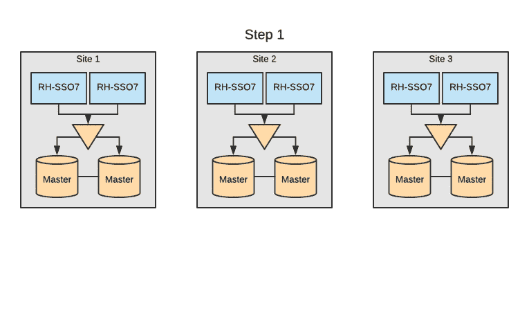
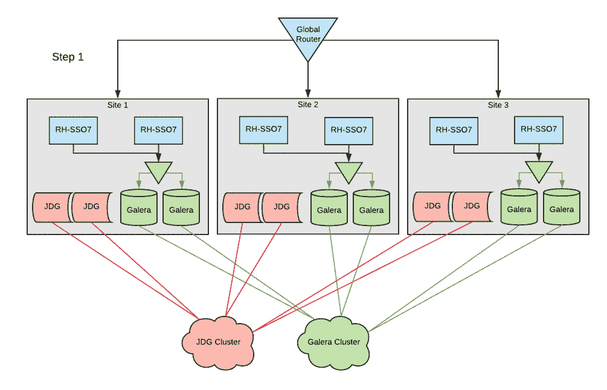

# 将 Red Hat SSO 过渡到高度可用的混合云部署

> 原文：<https://developers.redhat.com/blog/2019/02/14/red-hat-sso-high-availability-hybrid-cloud>

大约两年前，红帽 IT 完成了[将我们面向客户的认证系统](https://developers.redhat.com/blog/2016/10/04/how-red-hat-re-designed-its-single-sign-on-sso-architecture-and-why/)迁移到[红帽单点登录](https://access.redhat.com/products/red-hat-single-sign-on)(红帽单点登录)。因此，我们对新平台的性能和灵活性非常满意。由于一些架构决策是为了使用我们所掌握的技术来优化正常运行时间而做出的，所以直到现在我们都无法充分利用 Red Hat SSO 的强大功能集。这篇文章描述了我们现在如何解决全球站点之间的数据库和会话复制问题。

## 我们第一次部署的经验教训

Red Hat IT 最初推出多站点 SSO 时，每个站点都完全独立于其他站点。虽然这促进了平台的高正常运行时间，但也导致了许多限制，阻碍了一些新技术的发展。

最有问题的限制是，活动登录会话只存储在一个站点上——一个用户碰巧进行身份验证的站点。这意味着，如果该特定站点发生故障，用户将不得不在重定向到另一个站点时重新进行身份认证。重新认证会导致混乱和糟糕的客户体验，尤其是在滚动站点维护期间。

此外，这种架构阻止了 OpenID Connect (OIDC)授权代码流的采用，尽管它在 Red Hat SSO 产品中得到完全支持。授权代码流部分依赖于服务器到服务器的通信，而不是像 SAML 或其他 OIDC 流那样依赖于用户的浏览器。后端服务器请求可能不会被路由到包含活动用户会话的同一站点。这将导致后端授权代码流失败，最多会导致间歇性的 UI 错误。

最后，Red Hat SSO 的其他特性，如离线 OpenID 连接令牌和双因素身份验证(2FA)在这种多站点环境中根本无法使用。默认情况下，当用户将离线令牌或新的 2FA 设备与其帐户相关联时，Red Hat SSO 会将其保存在数据库中。如果没有站点间的数据库复制，这种新的关联只存在于单个站点中，从而使该技术无法在这种环境中正常工作。

由于这些和其他问题，我们知道下一步必须解决站点之间的数据库和会话复制。

### 致力于我们未来的多站点解决方案

通过与 Red Hat SSO 开发团队合作，详细介绍了多站点用例及目标。该团队探索了许多潜在的解决方案，最终采用了[跨数据中心复制模式](https://access.redhat.com/documentation/en-us/red_hat_single_sign-on/7.2/html/server_installation_and_configuration_guide/operating-mode#crossdc-mode)。

部署跨数据中心复制模式需要对 Red Hat SSO 部署的现有架构进行两项重大修改。第一个是将我们的数据库迁移到 Galera 集群，第二个是部署 [Red Hat 数据网格](https://developers.redhat.com/products/datagrid/overview/)(以前称为 Red Hat JBoss 数据网格)。

#### 迁移到 Galera 集群

Red Hat SSO 已经支持[数量的数据库](https://access.redhat.com/articles/2342861)，但是跨数据中心复制模式需要站点之间的同步复制，以确保整个部署中的数据完整性和一致性。例如，站点 A 上的新用户注册需要在站点 B 和 C 上立即可用，以防止额外的重复用户注册和冲突的数据库记录。

从 Red Hat SSO 7.2 开始，结合跨数据中心模式进行测试的两个解决方案是 Oracle Database 12c Release 1(12.1)RAC 和 Maria db server version 10 . 1 . 19 with Galera；红帽 IT 的部署是使用 MariaDB 与 Galera 集群。这三个站点中的每一个都有一对 MariaDB Galera 服务器，所以即使在单个站点中断的情况下，我们仍然可以保持法定多数。

SSO 集群已经利用 MariaDB 作为 RDBMS，但是多站点主动/主动需要将整个集群切换到 Galera 以实现跨数据中心模式。最初，三个站点中的每一个都有一对多主数据库主机。在不停机的情况下将 SSO 集群升级到 Galera 需要遍历站点。标准的 MariaDB 多主复制将在每个站点的数据库集群上被禁用，然后剩余的数据库服务器被添加到 Galera 集群。随后，本地 Red Hat SSO 节点被更新为使用现在属于 Galera 集群的 DB 服务器。最后，最后一个数据库服务器被重新初始化并添加到 Galera 集群中。

完成此过程是为了让我们能够在任何站点执行零停机升级。这之所以成为可能，是因为用户数据是由不同的服务处理的，而不是由 Red Hat SSO 控制的。如果不是这样，升级会更加复杂。Galera DB 的升级是在实现 Red Hat Data Grid 之前完成的，因此可以密切监视系统性能，并在必要时退出。

#### 部署 Red Hat 数据网格

红帽 SSO 利用 Infinispan 进行会话存储，它与[红帽 JBoss 企业应用平台](https://developers.redhat.com/products/eap/overview/)捆绑在一起。Red Hat Data Grid 是 Infinispan 的 Red Hat 支持版本，具有独立的服务器分布，与 JBoss EAP 的 Infinispan 结合使用，在所有站点复制缓存数据。Red hat Data Grid 明确支持[跨数据中心复制](https://access.redhat.com/documentation/en-us/red_hat_jboss_data_grid/7.1/html/administration_and_configuration_guide/set_up_cross_datacenter_replication)，将复制问题卸载到单独的服务器有助于最小化性能影响。每个 Red Hat SSO 实例都被配置为使用本地 Red Hat 数据网格集群作为 Infinispan 的远程存储。反过来，每个 Red Hat 数据网格集群都知道其他站点上的所有其他 Red Hat 数据网格集群。顾名思义，每个站点中的 Red Hat 数据网格集群形成一个网格，并在所有站点之间复制 SSO 会话缓存。如果您有主动/被动多站点 Red Hat SSO 部署，Red Hat 数据网格数据复制可以是异步的，或者对于主动/主动部署是同步的。每个 Red Hat SSO 站点都有一个三节点 Red Hat 数据网格集群，它确保跨站点复制在任何单个节点出现故障的情况下仍然存在。

部署 Red Hat 数据网格需要构建全新的 Red Hat Enterprise Linux 服务器集群。Red Hat SSO 不支持在同一台服务器上同时运行 Red Hat Data Grid 和 SSO，您也不希望这样做。按照[的基本设置步骤](https://access.redhat.com/documentation/en-us/red_hat_single_sign-on/7.2/html/server_installation_and_configuration_guide/operating-mode#setup)，创建和配置这些主机非常简单，只需为我们自己的目的做一些小的修改。其中一项修改是使用单独的 TCP 堆栈——在本地通道的不同端口上运行，而不是使用 UDP，因为一些云提供商不支持多播。另一个修改是使用非对称加密和身份验证，确保用户会话数据被加密，不会在网络上暴露。

对现有 Red Hat SSO 主机的配置更改遵循基本的设置步骤，几乎没有修改。在此环境中部署这些更改的最干净的方法是完全关闭单个站点，停止站点内所有 SSO 服务器上的 Red Hat SSO 服务。然后更新配置，Red Hat SSO 服务一次一台主机地恢复运行。这个过程确保了本地集群缓存中的所有条目都存在于 Red Hat 数据网格缓存中。否则，在启动主机时偶尔会遇到错误，因为它们无法将本地缓存内容与远程存储 Red Hat 数据网格内容进行协调。按照此程序，活动会话会滚动丢失，但不会导致面向客户的停机。

#### 

#### 衡量和监控绩效

最初，人们对跨站点同步复制的性能和稳定性有些担心，包括数据库级别和应用程序缓存级别。必须进行充分的监控，以便在性能下降时发出警报。

JMXtrans 代理非常有助于获取通常仅通过 JMX Infinispan 缓存性能、垃圾收集和内存/线程利用率公开的指标，并在像 [Graphite](https://graphiteapp.org/) 这样的工具中汇总这些指标。结合 [collectd](https://collectd.org/) 和 Graphite 插件，很容易获得所有相关的主机统计数据。此外，结合所有 Red Hat SSO 定制工具的 [Dropwizard 指标](https://metrics.dropwizard.io/4.0.0/),可以全面了解整个堆栈。

Groovy 脚本也是快速利用通过 JMX MBean 公开的任何属性或操作的好方法。例如，在内部，我们使用了许多 Groovy 脚本。这些功能与监视和报告 CacheContainerHealth 组件的状态、监视内存级别、在垃圾收集无法回收足够的空间时发出警报以及检查所有已配置缓存的跨站点复制状态密切相关。如果服务器突然不可用，这将导致快速反应。Groovy 脚本还简化了更复杂过程的自动化，比如在恢复完成后启动站点间的[状态转移](https://access.redhat.com/documentation/en-us/red_hat_jboss_data_grid/7.1/html/administration_and_configuration_guide/set_up_cross_datacenter_replication#state_transfer_between_sites)。

总之，Red Hat SSO 的跨数据中心复制模式允许 Red Hat IT 在全球范围内扩展其认证系统，同时提供极高的弹性和可用性。通过利用受支持的开源技术，Red Hat 构建了一个真正的多站点单点登录认证平台，能够处理下一代应用程序。

## 额外资源

*   [使用 Keycloak/Red Hat SSO 简化单点登录](https://developers.redhat.com/blog/2018/03/19/sso-made-easy-keycloak-rhsso/)
*   [使用 Keycloak/Red Hat SSO(开发实时视频)保护应用和服务](https://developers.redhat.com/videos/youtube/mdZauKsMDiI/)
*   [深入了解 Keycloak/Red Hat SSO(开发现场视频)](https://developers.redhat.com/videos/youtube/ZxpY_zZ52kU/)
*   [红帽单点登录:免费试一试！](https://developers.redhat.com/blog/2019/02/07/red-hat-single-sign-on-give-it-a-try-for-no-cost/)
*   [Red Hat 如何重新设计其单点登录(SSO)架构，为什么](https://developers.redhat.com/blog/2016/10/04/how-red-hat-re-designed-its-single-sign-on-sso-architecture-and-why/)
*   [Red Hat 单点登录服务器管理指南](https://access.redhat.com/documentation/en-us/red_hat_single_sign-on/7.3/html/server_administration_guide/)
*   [Red Hat 单点登录安全应用和服务指南](https://access.redhat.com/documentation/en-us/red_hat_single_sign-on/7.3/html/securing_applications_and_services_guide/)
*   [使用带有 Red Hat 单点登录/密钥锁的公共证书](https://developers.redhat.com/blog/2019/02/06/using-a-public-certificate-with-red-hat-single-sign-on-keycloak/)

### **关于作者**

Jared Blashka 是 Red Hat IT 身份和访问管理团队的高级软件应用工程师。他是一名[红帽认证工程师](https://www.redhat.com/rhtapps/services/verify/?certId=140-181-223)，拥有 8 年经验，专注于身份管理、应用生命周期管理和自动化。

*Last updated: February 13, 2019*