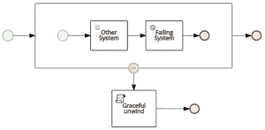
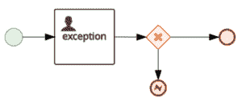
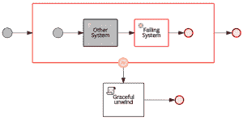
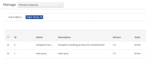

# 使用 Red Hat 流程自动化管理器减少数据不一致性

> 原文：<https://developers.redhat.com/blog/2018/08/22/reducing-data-inconsistencies-with-red-hat-process-automation-manager>

对于需要数字流程自动化(以前称为业务流程管理)的项目来说，通过特定流程管理数据协调是一种常见的需求，而[Red Hat Process Automation Manager](https://developers.redhat.com/products/rhpam/overview/)有助于解决这种需求。本文提供了以结构化和简洁的方式满足数据协调的良好实践和技术。

红帽流程自动化管理器的前身是红帽 JBoss BPM Suite，所以值得一提的是 [jBPM](http://jbpm.org/) 是为流程自动化管理器提供燃料的上游项目。博客文章[从 BPM 和业务自动化到数字自动化平台](https://middlewareblog.redhat.com/2018/07/18/from-bpm-and-business-automation-to-digital-automation-platforms/)解释了新名称背后的原因，并分享了这一重大发布的激动人心的消息。

## 数据协调

在流程的生命周期中，从系统和人那里收集数据，进行混合和丰富，然后传输到其他系统。在这个过程中，一个系统可能与其他系统不一致，并且一个特定的调用可能会以异常状态结束，为了成功地完成流程实例，必须对该异常状态进行处理。

数据不一致的原因有很多。其中，最常见的有:

*   用户输入不准确
*   信息来源过时或有误
*   信息的目的地过时或错误
*   目标系统已经包含插入的数据

有时，自动管理异常并通过一组操作来展开流程以保持数据完整性就足够了。在其他情况下，用户必须决定如何解决不一致。这种方法被称为*数据协调*—当系统捕捉到异常时，它会创建一个新的用户任务，用户有三个选项:重试、更改数据并重试，或者重新抛出异常。

这是基本要求，但有时组织需要复杂的流程来处理异常。例如，组织可能希望管理一个“分类”流程，该流程要求当第一次检测到错误时，将错误发送给特定的信息相关人员，他们可以决定哪个解决策略是正确的。例如，用户可能知道失败的系统在再次尝试插入数据之前需要更新。相反，信息涉众可能知道错误来自另一个系统或人为错误，因此他可以更改数据(*请求有效负载*)以便成功完成流程。

对于最后一个选项，用户认为流程是不可恢复的，因此最好的操作是将异常重新抛出给流程引擎。在这种情况下，重要的是流程被设计为处理异常，并通过调用补偿逻辑和留下一个干净的环境来优雅地展开流程实例。

## 合乎礼仪的异常处理

通常的方法是用管理异常情况的子流程来包装外部系统交互。通过这种方式，每当“业务流程”必须处理期望数据协调的外部系统时，设计者必须调用让用户参与解决的子流程。

即使这种方法可行，它也有一个很大的缺点，那就是为每个系统交互创建一个新的流程实例，这需要在出错时进行协调。例如，当一个流程完成时，它包含对需要额外关注的系统的三个调用，流程管理员将看到四个流程实例。即使子流程的生命周期确实很短，它也代表了一种开销，并使流程历史变得混乱。

有了[Red Hat Process Automation Manager](https://www.redhat.com/en/technologies/jboss-middleware/process-automation-manager)，有可能用一个真正优雅的解决方案来解决这个问题:异常处理装饰器。

一般来说，[装饰模式](https://en.wikipedia.org/wiki/Decorator_pattern)是向现有类添加新行为的一种方式。它类似于继承，但好处是可以在运行时添加。在这个特定的用例中，它用于管理工作项异常。由于对外部系统的任何远程调用都是由工作项处理程序管理的，所以我们可以利用装饰器来捕捉异常，并在需要时动态创建一个进程来管理它。

这个想法很简单，运行时的灵活性使它成为可能。在下面的存储库中，您会发现一个工作得相当好的实现，但是您可以自由地扩展和改进它: [decorator project](https://github.com/dmarrazzo/proc-decorator) 。

## 行动中的装饰者

为了理解装饰器在实践中是如何工作的，您必须将它编译并安装在一个 Maven 存储库中，该存储库可以被*流程服务器*(有时被称为 *Kie 服务器*)访问。如果您在本地机器上有一个独立的安装，发出以下命令就足够了:

`mvn install`

在下面的存储库中，您将发现一个利用装饰器来实现数据协调策略的示例 Process Automation Manager 项目:[装饰器使用项目](https://github.com/dmarrazzo/proc-decorator-usage)。

在 Business Central 存储库中克隆它，以检查内容并部署它。

项目`proc-decorator-usage`在自己的`pom.xml`文件中将装饰器定义为一个依赖项，然后配置依赖于`kie-deployment-descriptor.xml`文件的`work-item-handlers`部分。为了简单起见，在这个示例中，装饰器替换了标准的 REST 工作项处理程序，但是如果您想要将装饰器的影响限制到 REST 调用的子集，您可以创建另一个工作项处理程序定义(例如，ReconciledRest)。

下面的屏幕截图显示了定义装饰者的业务中心视图:

在工作项处理程序定义中，有唯一标识可重用服务任务的**名称**和**构造函数初始化**(使用 MVEL 表达式):`new example.ProcessTaskHandlerDecorator( org.jbpm.process.workitem.rest.RESTWorkItemHandler.class, runtimeManager)`

第一个参数是装饰器将要包含的工作项处理程序的类。在这个例子中，有 REST 工作项处理程序，但是同一个装饰器可以用于任何类型的工作项处理程序:Web 服务处理程序或定制处理程序。第二个参数是装饰器内部使用的运行时管理器的实例。

装饰器还有其他构造函数:

*   `ProcessTaskHandlerDecorator( Class<? extends WorkItemHandler> originalTaskHandlerClass, RuntimeManager runtimeManager, String processId )`。这个构造函数需要一个额外的参数:协调流程的流程 ID(例如，`src.exception-handling`)。使用这个构造函数，协调过程只定义一次，而不是在每个任务中传递，但副作用是协调过程对所有任务都是一样的。
*   `ProcessTaskHandlerDecorator( RuntimeManager runtimeManager )`这个构造省略了`originalTaskHandlerClass`,默认使用剩下的一个。

`main-proc`是一个虚构的进程，有两个服务调用:其他系统和失败的系统。后者是被配置为失败的 REST 调用，将触发装饰器逻辑来管理协调逻辑。这个调用链包装了异常处理逻辑。如果异常达到这一级别，这意味着协调过程无法修复故障，唯一的选择是放弃该实例并中止一切。从技术上讲，这是一种将原始异常托管回主进程的方法。设计管理意外事件的流程是一个很好的实践，这样流程可以优雅地展开:目标是留下一个干净的环境。这通常通过如下补偿逻辑来管理:取消预订，使记录无效，并发送电子邮件警告流程失败。下面是`main-proc`的示意图:

失败的系统是一个标准的 REST 调用，具有 REST 工作项处理程序期望的所有参数，除了装饰器使用的参数`processId`来标识需要协调时要启动的流程。请求被设计为失败，因为 URL 是`http://localhost`。因此，除非主机有一个 HTTP 服务器监听端口 80，否则它将引发一个异常，装饰器将显示其行为。

`exception-handling`是负责对账的流程。当失败的系统引发异常时，装饰器将触发它，这总是在我们的测试用例中，但是在实际情况中，主进程完成了它的正常生命，而没有参与协调过程。以下是示例协调过程的图表。

`exception-handling`是管理协调的最简单的流程:一个人工任务和一个到*正常端*或*错误端*的网关。**人工任务**表单包含以下字段:

*   **Url** 来改变 REST 请求的端点。在测试用例上下文中，在工作端点上切换请求并模拟成功的重试是很有用的。
*   **信息**改变请求有效载荷并请求重试。
*   **异常**萎靡不振。这是用户因失败而关闭协调流程的时候。这意味着不可能找到解决方案，原始错误被发送回发起流程(`main-proc`)。
*   **如果前一字段为假，重试**。这控制了重试行为。如果该字段为真，则使用表格中上述更改的参数再次发出对外部系统的调用。如果该字段为假，则失败的系统任务被标记为完成，主进程可以继续其生命。从协调的角度来看，这意味着用户已经用其他工具(Process Automation Manager 之外的工具)修复了问题。

装饰器将任务的所有输入参数传递给`exception-handling`进程，因此用户可以检查和更改导致异常的输入参数。事实上，当异常处理过程成功完成并请求重试时，装饰器会使用更新后的参数再次执行原来的任务逻辑(在本例中是 REST 调用)。顺便说一下，如果第二次执行失败，则实例化一个新的协调过程，以此类推。

以下步骤显示了运行时行为:

1.  构建并部署`proc-decorator-usage`项目。
2.  在过程定义视图中启动`main-proc`。在流程表中填写任意数据，点击**提交**。
3.  将打开“流程实例”页面。点击**图**；您可以注意到，出现故障的系统被突出显示。一个进程正在等待一个 REST 任务的事实表明装饰器正在工作。默认的 REST 任务行为是同步的。发出外部请求，并且结果必须在超时限制内返回；否则，将引发异常，流程会立即处理该异常。在出错的情况下，装饰器将正常的 REST 任务行为改为异步行为；流程执行暂停，等待协调流程完成。下面是等待对账的主流程图。
4.  切换到流程实例视图。您应该找到两个活动的流程实例:`main-proc`和`exception-handling`。后者是由装饰者实例化的。该屏幕截图显示了流程实例列表。
5.  切换到任务视图。例外任务是为负责协调的人员创建的。在这个示例中，所有用户都可以处理这个任务，但是在实际情况中，它应该被传递给对失败的系统负责的人。可以通过向失败的任务添加一个输入参数来扩展此示例，以标识负责该任务协调的用户；然后，这些参数可以用于动态分配人工任务的潜在所有者。
6.  打开、声明和启动任务。您可以测试三种可能的路线:
    *   **不要重试:**只要完成任务。这将成功关闭协调过程，并将失败的系统任务标记为已完成。然后连`main-proc`都会完成。
    *   **重试:**标记重试，更改信息字段并提供一个 URL 来匹配现有的 HTTP POST 端点。最后，使用 [SoapUI](https://www.soapui.org/) 或另一个类似的工具模拟一个 REST 服务并检查修改后的有效负载。如果 REST 调用成功(获得一个 HTTP 200 级别的响应)，那么流程甚至会成功完成。否则，第一个`exception-handling`过程将完成，并在`main-proc`仍在等待时开始新的过程。
    *   **再次抛出异常:**最后，标记异常字段，模拟对账失败。装饰器会将原始异常抛出给`main-proc`。在日志中检查正常展开脚本的执行情况。`main-proc`过程将完成，而`exception-handling`过程被中止，因为它到达了*错误结束*节点。

还有最后一点需要考虑:在这个例子中，异常表单被绑定到一个特定的数据对象(信息)。可以为协调任务创建一个用户界面，该界面能够呈现一个通用对象，并以这种方式用一个协调过程来处理不同的有效负载。

## 分析装饰器实现

本节提供了装饰器实现的简要描述。[源代码](https://github.com/dmarrazzo/proc-decorator)包含一些有趣的 Process Automation Manager API 使用示例。

### ProcessTaskHandlerDecorator

它扩展了由流程自动化管理器库提供的`org.jbpm.bpmn2.handler.AbstractExceptionHandlingTaskHandler`类，并为*工作项处理程序*实现了装饰器模式。

*   `handleExecuteException`。当运行`executeWorkItem`方法时修饰的工作项处理程序中发生异常时，调用该方法。它启动协调过程并附加一个由`ErrorHandlingCompletion`类实现的完成监听器。修饰的工作项处理程序的所有输入参数都被转移到协调过程中。
*   `handleAbortException`。当运行`abortWorkItem`方法时修饰的工作项处理程序中发生异常时，调用该方法。装饰者只是记录这种情况。
*   `rethrowException`。该方法将原始异常重新抛出到包含失败工作项处理程序的流程中。由`ErrorHandlingCompletion`类调用。

### ProcessCompletionListener

这是一个抽象类，侦听特定流程实例的完成情况。子类必须实现两个方法:`processCompleted`，在成功完成时调用；和`processAborted`，在流程到达*错误结束*节点时调用。这个抽象类被设计成即使在其他上下文中也可以重用。

### 错误处理完成

它扩展了前面的抽象类，并处理协调过程的完成。

*   `processCompleted`在对账流程正常完成时执行。如果重试变量为真，过程变量将覆盖修饰工作项处理程序的原始输入参数，并再次执行。否则，修饰的工作项处理程序将被关闭为中止(`abortWorkItem`)。如果一个未执行的任务应该被视为中止或完成，这是有争议的，但是在这两种情况下，包含的进程继续它的正常执行。
*   `processAborted`在对账过程以*错误结束*节点完成时执行。最初的错误被扔回到主进程。

## 结论

[Red Hat Process Automation Manager](https://www.redhat.com/en/technologies/jboss-middleware/process-automation-manager)是一项功能强大的技术，可减少不同系统之间的数据不一致性，这是数字流程自动化计划的主要优势之一。本文提出了一个通用的方法和一个可重用的资产来简化流程设计。