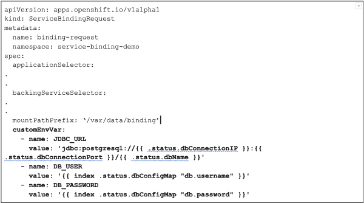
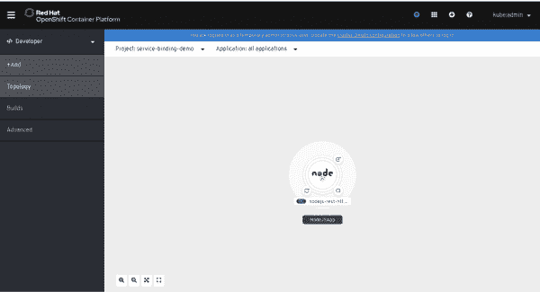
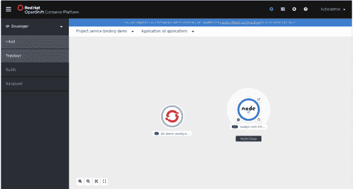
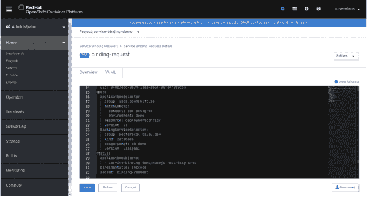
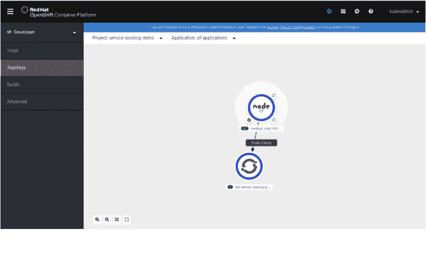
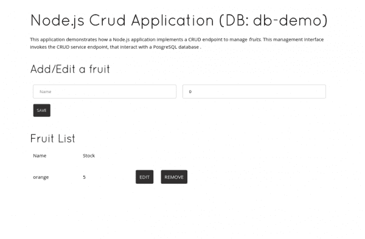

# 服务绑定操作符:正在运行的操作符

> 原文：<https://developers.redhat.com/blog/2019/12/20/service-binding-operator-the-operator-in-action>

在上一篇文章中，我们介绍了[服务绑定操作符](https://github.com/redhat-developer/service-binding-operator)，并解释了它是如何工作的。在本文中，我们将关注一个更高级的主题——自定义环境变量——并浏览一个典型的使用场景。

## 自定义环境变量

为了使绑定应用程序(例如，依赖于 JDBS 字符串的遗留 [Java](https://developers.redhat.com/developer-tools/java) 应用程序)和后台服务更加灵活，服务绑定操作符支持自定义环境变量的可选使用。为了使用定制的环境变量，应用程序开发人员创建一个如图 1 所示的`ServiceBindingRequest`:

在本例中访问 PostgreSQL 数据库的定制环境变量在`customEnvVar`下定义，并为应用程序提供定制绑定信息，以绑定其所需的后台服务。

## 运行中的服务绑定操作符

欣赏服务绑定操作符提供的特性的最佳方式是在典型的使用场景中观察它们的运行。一组管理后台服务的示例场景和操作符正在与服务绑定操作符并行开发。(这些场景和后台操作符的链接包含在本文的最后一节中。)

让我们使用其中一个场景和操作符作为例子。对于后台服务，我们将使用由这个示例操作符管理的 PostgreSQL 数据库。对于绑定到这个后台服务的应用程序，我们将使用[这个 Java，Spring Boot 示例应用程序](https://github.com/redhat-developer/service-binding-operator/tree/master/examples/nodejs_postgresql)，它实现了一个水果库存系统。

本示例应用程序和其他示例应用程序附带的文档包括全套说明，包括管理任务，如安装服务绑定操作符和支持服务。在此图中，我们将重点关注应用程序开发人员采取的步骤和服务绑定操作人员执行的操作。

在我们开始之前，我们必须安装服务绑定操作器。操作员可以通过[红帽打开](http://developers.redhat.com/openshift/)控制台中的操作员中枢进入控制台的管理视角，如图 1 所示:

Figure 2: Installing the Service Binding Operator.">

应用程序开发人员的步骤和服务绑定操作人员的操作顺序如下。

### 步骤 1:导入应用程序

应用程序开发人员登录到 [Red Hat OpenShift](http://developers.redhat.com/openshift/) 控制台的开发人员透视图，并通过引用应用程序的源 repo 创建一个新应用程序，如图 3 所示:

Figure 3: Creating a new app in the Red Hat OpenShift console's Developer perspective.

### 步骤 2:创建应用程序将使用的数据库

应用程序开发人员现在创建应用程序将使用的数据库，如图 4 所示。请注意，在这一点上，应用程序和数据库的后台服务没有绑定在一起:

Figure 4: Creating the database that the app will use.

OpenShift 为应用程序创建一个`Deployment`，为应用程序启动一个 pod，部署应用程序，并提供到应用程序的路线。此时，应用程序正在运行，但没有后台服务。我们的示例应用程序被构造为可以显示其主页，但是任何在水果库存中创建新条目的尝试都会失败，并由于缺少后台服务数据库而发出警报，如图 5 所示:

Figure 5: A failed entry creates an alert.

### 步骤 3:通过创建`ServiceBindingRequest`来表明绑定意图

此时，应用程序开发人员通过创建一个`ServiceBindingRequest`来表明将应用程序与支持服务绑定在一起的意图。这个`ServiceBindingRequest`包括定制的环境变量，这些变量提供数据库连接信息，比如用户名、密码和连接 URL，还有一个引用(`ResourceRef`)，它通过名称引用后台数据库服务，如图 6 所示:

### 步骤 4:服务绑定操作者与应用程序共享绑定信息

该信息由服务绑定操作符收集到一个中间秘密中，然后与应用程序共享。绑定信息对应于应用程序的标签和支持服务连接属性。

### 步骤 5:服务绑定操作符检测应用程序`Deployment`的变化

服务绑定操作符协调这些变化。控制该 pod 的实体(例如，`Deployment`或`DeploymentConfig)`重新启动 pod 以使更改生效，结果如图 7 所示:

Figure 7: The pod is now restarted.">

应用程序现在可以访问后台服务数据库，如图 8 所示:

Figure 8: The application in action.

## 下一步是什么？

服务绑定操作符是 100%开源的。下载代码，尝试新特性，提供反馈和想法，并贡献代码！

## 资源

*   [服务绑定运营商 GitHub repo](https://github.com/redhat-developer/service-binding-operator) 。
*   [一组示例](https://github.com/redhat-developer/service-binding-operator/blob/master/README.md#example-scenarios)，每个示例都说明了服务绑定操作符的一个使用场景，正在与操作符并行开发。每个示例都包含文档，可以通过 OpenShift web 控制台或命令行客户端运行。
*   示例后台服务操作员[可在此处](https://github.com/operator-backing-service-samples)获得。

*Last updated: January 25, 2021*