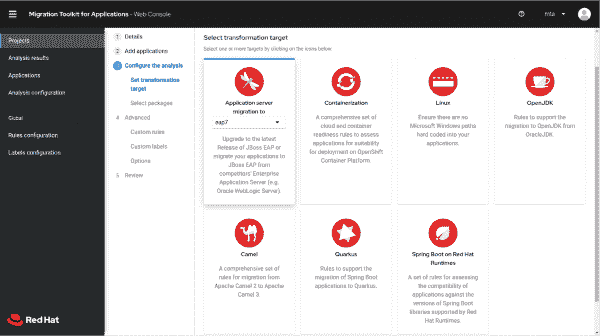
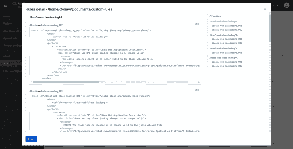
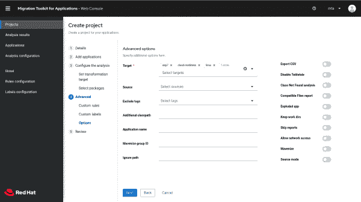
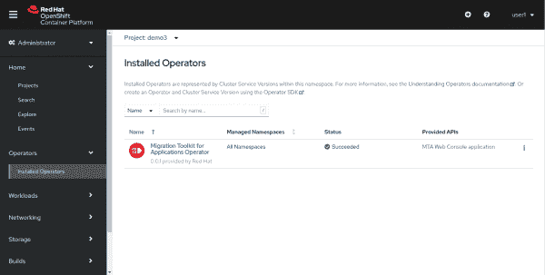
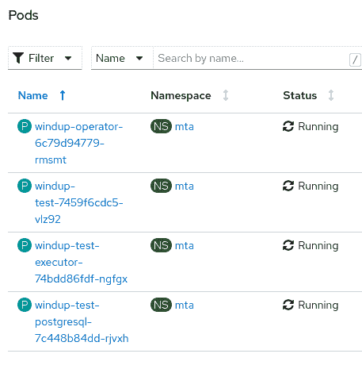
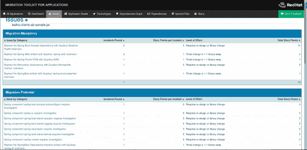

# 红帽 5.1.0 版应用迁移工具包中的 Spring Boot 到夸尔库斯迁移及更多内容

> 原文：<https://developers.redhat.com/blog/2020/12/08/spring-boot-to-quarkus-migrations-and-more-in-red-hats-migration-toolkit-for-applications-5-1-0>

红帽的[应用](https://developers.redhat.com/products/mta/overview)迁移工具包(之前称为红帽应用迁移工具包)已经到了 5.1.0 版本。这个版本包括用户界面的改进、新的应用程序操作员迁移工具包，以及支持开发团队从 Spring Boot 迁移到 Quarkus 的新规则。

## 关于应用程序的迁移工具包

migration toolkit for applications 最初旨在支持 JBoss Enterprise Application Platform(JBoss EAP)从 Oracle WebLogic 等专有应用服务器进行升级和迁移。它已经发展到支持更广泛的移民途径，包括[集装箱化](https://developers.redhat.com/topics/containers)。 [Java](https://developers.redhat.com/topics/enterprise-java) 开发人员使用该工具包协助从 Oracle Java 开发工具包(JDK)迁移到 [OpenJDK](https://developers.redhat.com/products/openjdk/overview) ，从 Apache Camel 2 迁移到 Apache Camel 3，从 Spring Boot 迁移到红帽运行时上的 [Spring Boot](https://developers.redhat.com/topics/spring-boot) ，等等。

migration toolkit for applications 分析您的代码，揭示可能不适用于容器或 Linux 的专有技术和模式。然后，它提出了使您的应用程序可移植的更改。最新版本的 migration toolkit for applications 5 . 1 . 0 包含了一些特性，可以简化向新兴技术的迁移，如 [Quarkus](https://developers.redhat.com/products/quarkus/getting-started) 。

**注意**:参见 *[使用应用程序迁移工具包 5.0](https://developers.redhat.com/blog/2020/09/04/migrate-your-java-apps-to-containers-with-migration-toolkit-for-applications-5-0/)* 将您的 Java 应用程序迁移到容器，了解更多可用的迁移路径。

## 用户界面改进

migration toolkit for applications 为其用户界面(UI)使用众所周知的开源 [Patternfly](https://www.patternfly.org/) 框架。Patternfly 最近已经发展到版本 4。然而，对于这个版本，我们不仅仅是升级到了最新的版本。我们还借此机会回顾了该界面，并对其进行了改进，以提供更加简化的开发人员体验。

借助新的 migration toolkit for applications UI，我们试图充分利用 Patterfly 成熟的设计语言。如图 1 所示，UI 包括项目创建和管理元素，以及各种转换路径的改进图标。

Figure 1: Icons show the available transformation paths in the new migration toolkit for applications user interface.

我们还提供了一种更简单的方法来实施和管理用于迁移和现代化的规则。管理您自己的定制规则，适应您自己的代码风格和内部框架，比以往任何时候都更容易。图 2 显示了改进的应用程序迁移工具包 UI 中的规则审查特性。

Figure 2: Managing custom rules in the new user interface.

最后，如图 3 所示，UI 包含了一个用于创建迁移项目的新向导。该向导提供了对标准功能的轻松访问和对高级功能的更多控制。

Figure 3: The new interface makes it easy to select advanced options for a migration project.

## 面向应用运营商的全新迁移工具包

在 [Red Hat OpenShift](https://developers.redhat.com/products/openshift/overview) (Red Hat 的云本地计算基金会认证的，完全开源的 [Kubernetes](https://developers.redhat.com/topics/kubernetes) 发行版)上部署和维护应用程序更易于 OpenShift 操作人员管理。我们现在已经构建了一个完全开源的操作器来帮助在 OpenShift 上部署和管理应用程序的迁移工具包。图 4 显示了安装在 OpenShift 上的新的应用程序操作员迁移工具包。

Figure 4: The new migration toolkit for applications Operator installed on OpenShift.

应用程序迁移工具包操作员执行以下操作:

*   为应用程序对象部署迁移工具包。
*   从 OpenShift 安装中删除应用程序迁移工具包。
*   发布路线。

您可以轻松访问它，并将其部署在 [OpenShift 4.5](https://developers.redhat.com/courses/openshift/playground-openshift) 和更高版本上。一旦它被部署，您就可以让任何开发人员在他们自己的项目中使用它。我们还为之前的 OpenShift 版本提供了一个部署模板，包括 OpenShift 4 和 OpenShift 3.11。图 5 显示了由 migration toolkit for applications Operator 部署和管理的资源。

Figure 5: Resources deployed by the instantiated Operator.

## 支持从 Spring Boot 迁移到夸尔库斯

Red Hat 现代化和迁移解决方案团队与全球客户合作。最近，我们看到目前使用 Spring Boot 的开发团队对 Quarkus 越来越感兴趣。开发团队对 Quarkus 的速度优势、低内存占用和最小启动时间感兴趣。团队采用 Quarkus 是为了提高生产力和减少代码。在这个版本中，我们与 Red Hat 的 Spring Boot 团队合作开发了一套规则，以帮助减少从 Spring Boot 到 Quarkus 的 Java 应用程序代码现代化所需的工作和时间。

对于 migration toolkit for applications 5 . 1 . 0 版本，我们重点关注已经作为 Quarkus Spring Boot 扩展实现的 APIs that are。我们已经比以往任何时候都更容易将这些 Spring Boot 依赖项替换为它们的等价 Quarkus 扩展。作为迁移的一部分，migration toolkit for applications 还会报告当前没有 Quarkus 等价物的任何 Spring Boot 工件。

这个版本包括总共 22 条规则，涵盖了依赖注入集成、度量、持久性、安全性、web、shell 等等。每条规则都是用真实世界的代码开发和测试的。图 6 显示了一个规则示例，现在可供计划从 Spring Boot 迁移到 Quarkus 的开发人员、架构师和其他社区合作伙伴使用。

Figure 6: Migration toolkit for applications uses its new rules collection to analyze a Spring Boot-to-Quarkus migration.

## 下载并使用应用程序迁移工具包 5.1.0

访问[应用迁移工具包下载页面](https://developers.redhat.com/products/mta/download)获得免费安装。您可以使用[入门指南](https://developers.redhat.com/products/mta/getting-started)在几分钟内启动并运行 migration toolkit for applications 5 . 1 . 0，无论是在您的笔记本电脑、虚拟机还是您自己的 OpenShift 环境中。

## 结论

我们希望您和全球的其他开发人员能够享受到 migration toolkit for applications 5 . 1 . 0 带来的全新用户体验。正如本文所讨论的，当前版本包括一个改进的用户界面、一个新的面向应用程序操作员的迁移工具包，以及支持从 Spring Boot 迁移到 Quarkus 的规则。

要充分利用 5.1.0 版迁移工具包，请参阅[5 . 1 . 0 版迁移工具包文档](https://access.redhat.com/documentation/en-us/migration_toolkit_for_applications/)。除此之外，您可以使用文档来学习如何[编写自己的迁移规则](https://access.redhat.com/documentation/en-us/migration_toolkit_for_applications/5.0/html/rules_development_guide/index)。

我们在 Red Hat 所做的一切都是开源和基于社区的。如果你想参与这个项目，请加入我们的 [konveyor.io](http://konveyor.io) 项目和社区。该项目托管应用程序迁移工具包和其他现代化和迁移工具的源代码、最佳实践指南等。您也可以在 Twitter [@MTAbyRedHat](https://twitter.com/MTAbyRedHat) 上关注我们，了解最新动态，并直接与应用程序迁移工具包团队联系。我们期待帮助您将您的应用提升到一个新的水平！