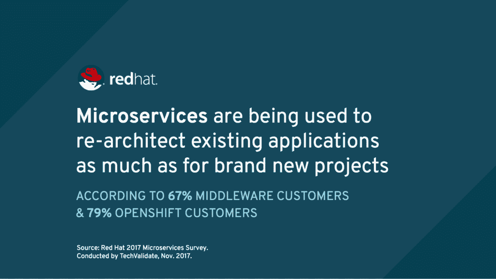
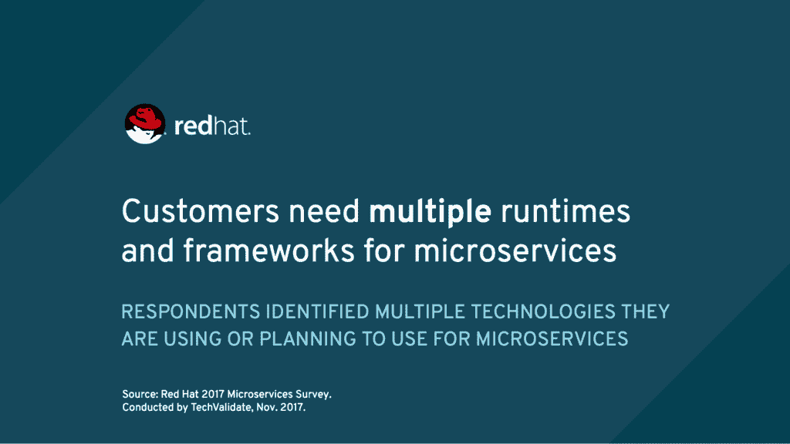
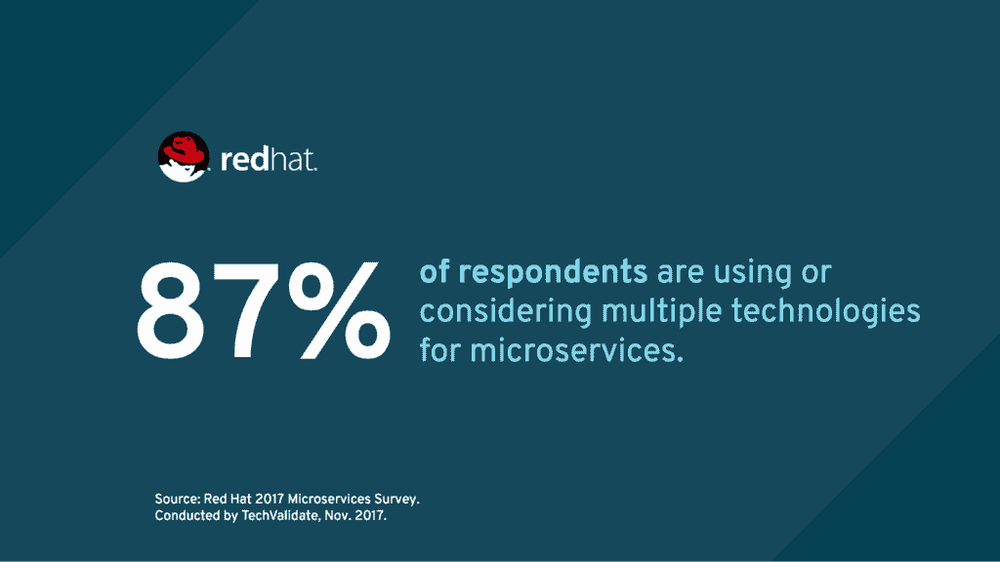
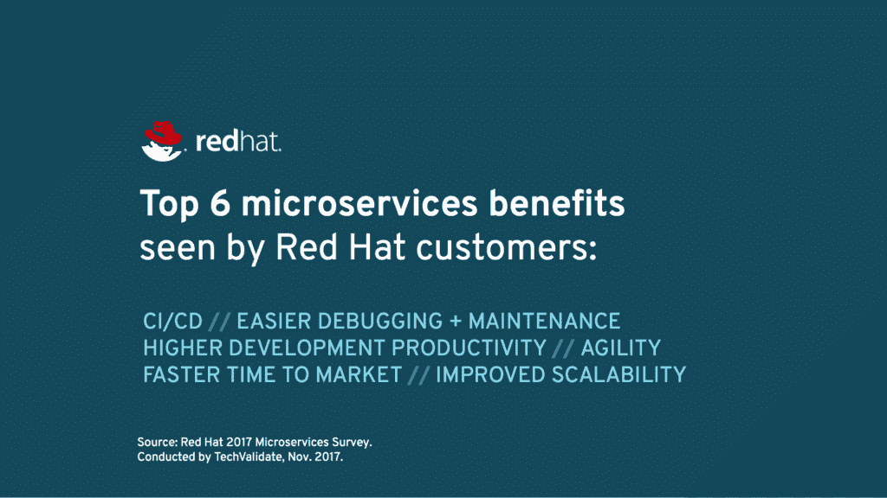
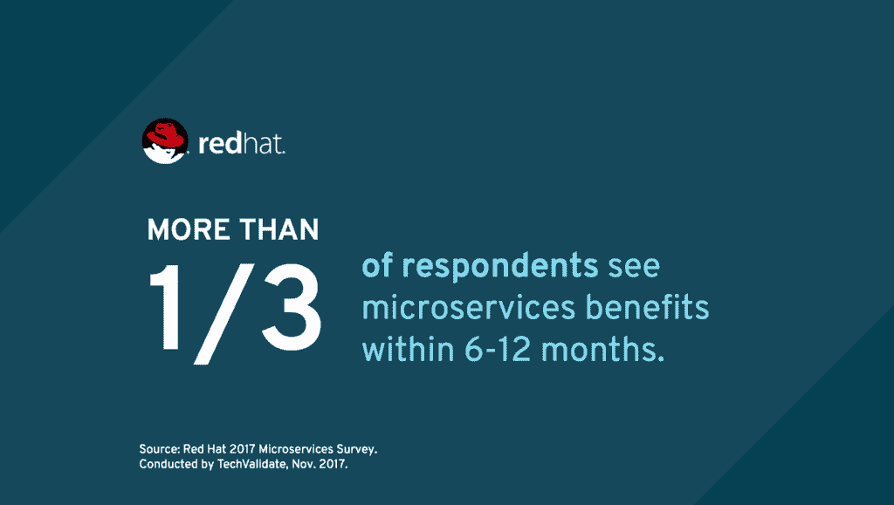
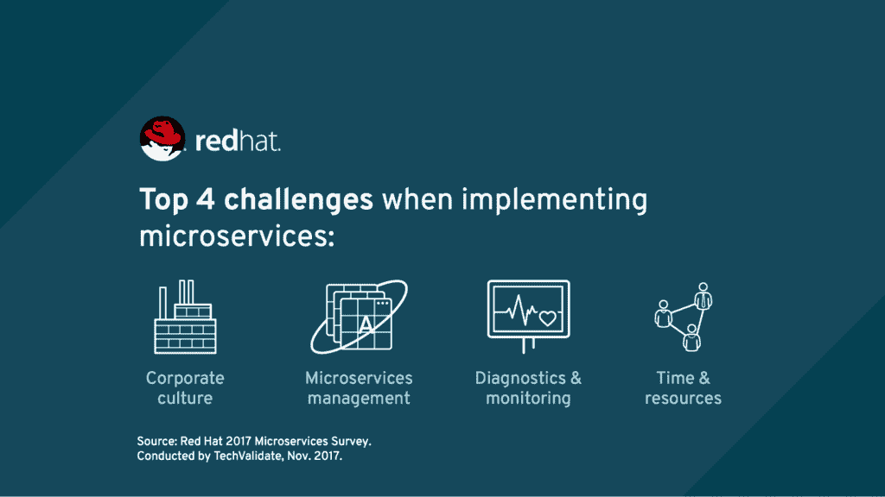
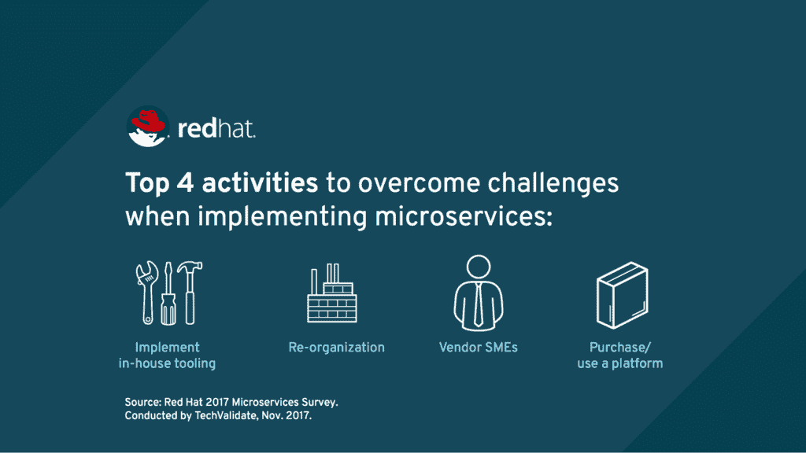
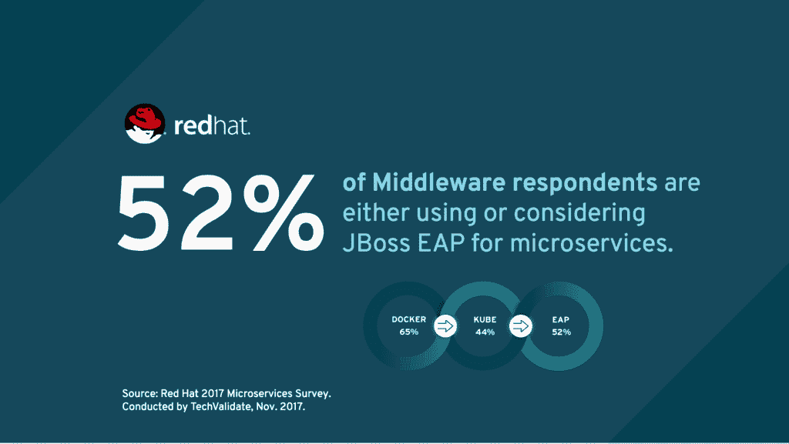
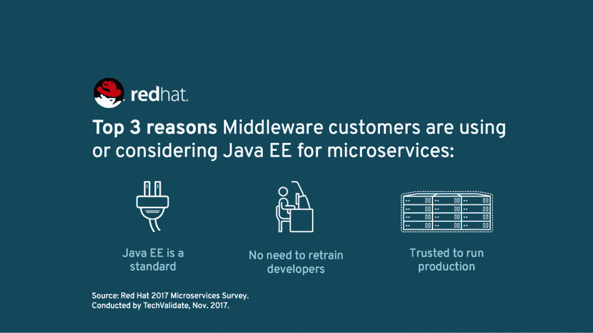
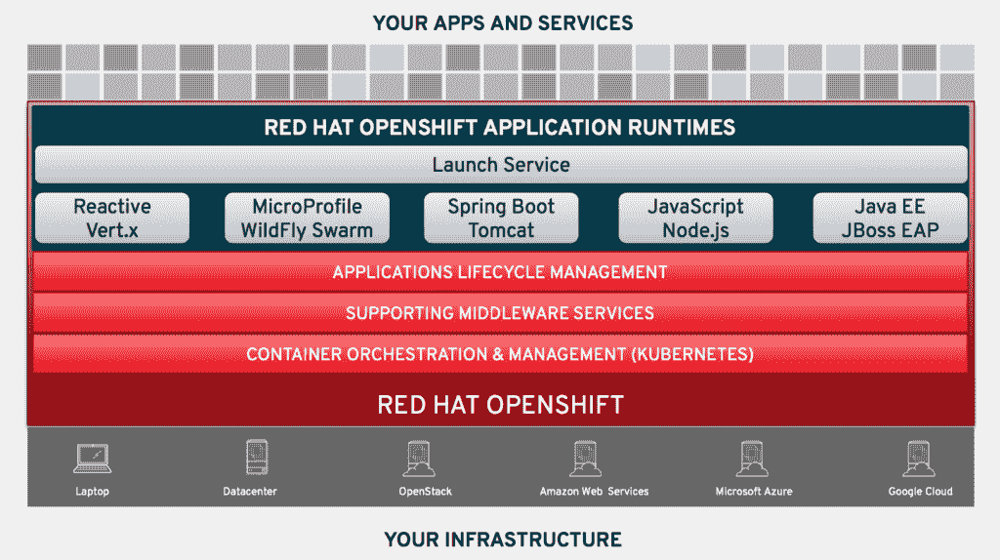

# 2017 年微服务调查状况-您需要了解的八大趋势

> 原文：<https://developers.redhat.com/blog/2017/12/05/state-microservices-survey-2017-eight-trends-need-know>

在 2017 年秋季，我们与我们的 Red Hat 中间件和 Red Hat OpenShift 客户进行了一项微服务调查。以下是从调查结果中发现的八个有趣趋势:

## **I .微服务正被用于重新构建现有的应用程序，就像用于全新的项目一样**

技术供应商在市场中似乎非常强调将微服务定位为仅用于新项目。然而，我们的调查显示，组织也在使用微服务来重新构建现有和遗留应用。

67%的 Red Hat 中间件客户和 79%的 Red Hat OpenShift 客户表示了这一点。这些数据告诉我们，微服务在用户的整个 IT 转型之旅中都为他们提供了价值——无论他们只是希望更新其当前的应用程序组合，还是正在准备新的计划。因此，如果您只关注微服务的绿地项目，那么也开始评估您的现有应用以进行微服务重构分析可能是个不错的主意。微服务引入了一系列我们的客户已经开始看到的好处，他们不仅将这些好处应用于新项目，也应用于现有项目。

## **二。客户更喜欢微服务的多运行时/多技术/多框架方法**

没有单一的运行时、平台或框架最适合微服务。客户正在使用“正确任务的正确工具”,而不是将自己与微服务的单一技术、运行时或框架结合起来。事实上，44%的 Red Hat 中间件客户和 50%的 Red Hat OpenShift 客户相信“为正确的任务使用正确的工具”

此外，87%的受访者表示他们正在使用或考虑多种技术来开发微服务。

因此，如果您使用单一运行时、技术或框架进行微服务开发，明智的做法可能是开始研究其他运行时、技术和框架，并选择最适合您试图解决的问题的一个。换句话说，现在是将您的单一技术方法扩展到多技术方法的好时机。

## 三。**微服务带来的六大优势**

受访者指出了他们已经获得的许多好处。前六名分别是:

1.  持续集成(CI) /持续部署(CD)
2.  敏捷度
3.  改进的可扩展性
4.  更快的上市时间
5.  更高的开发效率
6.  更容易调试和维护

如果您对在新项目中使用微服务或重新设计现有应用犹豫不决，请不要再等了。这些优势在用户中排名最高，最重要的是，这些优势已经从使用微服务中获得。

## **四。微服务的好处可以在 2 到 12 个月内实现**

33%的受访者表示他们在 2 到 6 个月内实现了微服务的优势，34%的受访者在 6 到 12 个月内实现了微服务的优势。

如调查结果所示，客户可以很快获得微服务的好处。为了保持竞争力，在微服务方面没有理由保持观望。

## **五.实施微服务的四大挑战**

实施微服务并不是解决所有问题的灵丹妙药。他们有自己的挑战。红帽受访者确定的四大挑战是:

1.  企业文化和组织挑战
2.  微服务管理
3.  诊断和监控
4.  时间和资源

微服务的开发需要软件开发方式的转变。这对于喜欢现状的组织来说是一个挑战，因为他们熟悉当前的流程和程序。此外，在不愿意投资对员工进行与他们的专业知识不同的技术再培训的组织中，学习新的运行时、技术或框架可能是一项挑战。如果无法接受再培训，那么在市场上寻找在选定微服务技术方面拥有合适经验和背景的资源可能是一个挑战。最后，微服务面临两个技术挑战:微服务管理、诊断和监控。您应该评估市场上提供解决这些技术挑战的功能的可用解决方案。微服务解决方案不断发展，并基于许多最新的创新性开源技术添加功能。

## 六。克服挑战的四大活动

组织正在开展活动来应对实施微服务时遇到的挑战。受访者确定的缓解这些挑战的前四项活动是:

1.  开发/实施内部微服务工具
2.  重组
3.  与供应商主题专家合作/将供应商作为可信赖的顾问
4.  购买或使用微服务平台/解决方案

受访者表示，在微服务方面，他们一直依赖供应商和供应商 SME 作为他们值得信赖的顾问。此外，许多人回应说，重组是一种缓解活动，可以克服与企业文化相关的微服务挑战。因此，请评估市场上的微服务解决方案，并选择最符合您要求的解决方案。如果解决方案中存在任何差距，请在内部实施这些差距。依靠供应商的指导来调整和实施微服务。为了激发组织既定流程的变革，您可能需要重组团队。通常情况下，引入文化变革和重组的最佳方式是通过实验室式的参与来体验。

## **七。应用服务器可用于微服务**

Docker 和 Kubernetes 等技术展示了容器作为实现微服务的技术的成功，52%的红帽中间件受访者正在使用或考虑红帽 JBoss 企业应用平台(JBoss EAP)来实现微服务。

如前所述，组织不仅为新项目应用微服务，也为现有应用程序应用微服务，其中许多应用程序是使用传统应用服务器用 Java EE 编写的。但是并不是所有的应用服务器都是一样的。市场上的许多应用服务器尚未经过现代化改造或重新设计，无法满足云原生开发的需求。Red Hat JBoss Enterprise Application Platform 是一款现代化、模块化、轻量级且灵活的应用服务器，红帽中间件客户正在使用或考虑将其用于微服务，他们非常了解其性能和内存优化。

如果您的员工在 Java EE 和应用服务器方面拥有丰富的经验和专业知识，您可以利用他们的经验在现代应用服务器中开发微服务。在一个多运行时/多技术/多框架的微服务世界里，红帽 JBoss 企业应用平台形式的 Java EE，是一个你可以在其中开发微服务的运行时。在选择多运行时微服务解决方案时，确保它支持 Java EE 和其他运行时。

## **VIII。标准对于开发微服务的客户仍然很重要**

Red Hat 中间件客户使用或考虑使用 Java EE 进行微服务的三大原因是:

1.  Java EE 是一个标准
2.  无需重新培训员工
3.  我们信任 Java EE 来运行生产，因为它是成熟的企业级产品

这表明 Red Hat 中间件客户看到了开源社区驱动的标准和规范的价值，这些标准和规范旨在运行企业应用程序，并具有可靠性、可用性、可伸缩性和性能(RASP)功能。因此，如果像 Red Hat 中间件客户一样，您正在使用或考虑将 Java EE 作为您的微服务运行时之一，那么您是一个好公司。

## **在您的微服务之旅中，Red Hat 如何帮助您？**

Red Hat OpenShift 应用程序运行时是我们的一套现代云原生应用程序运行时和框架，为正在超越 3 层架构并采用云原生应用程序开发的组织提供有指导的开发人员体验。它由一组精选的框架和运行时组成:

*   Eclipse vert . x for reactive programming
*   用于 JavaScript 编程的 Node.js】
*   wildly Swarm/Eclipse micro profile——使用开源社区驱动的微服务企业 Java 库在可运行的 jar 中组装您的项目
*   红帽 JBoss 企业应用平台-使用 Java EE 进行编程
*   Apache Tomcat -用于 web 应用程序编程
*   Spring Boot——使用开源企业 Java 库在可运行的 jar 中组装你的项目

所有这些框架和运行时都完全集成到 Red Hat OpenShift 中，并针对其进行了优化。在对市场和客户需求进行仔细细致的分析后，Red Hat 选择了这些运行时来包含和集成到 Red Hat OpenShift 应用程序运行时中。当 Red Hat 继续监视市场和客户需求时，它可能会更新或增加这一组管理运行时。Red Hat OpenShift 应用程序运行时还包括引导任务和助推器的概念，以加速应用程序和微服务的开发，以及通过 OpenShift.io 提供云原生开发人员体验。

如果您在开始使用现有应用程序时需要帮助，Red Hat 提供免费的应用程序现代化和迁移发现研讨会。如果您想要转变您的组织文化，加快您的下一个应用程序开发项目，并使 DevOps 成为现实，我们有我们的开放式创新实验室来帮助您完成这一努力。

最后，我们的微服务主题专家将随时为您和付费 Red Hat 订阅客户提供咨询。

更多信息:

[【红帽 OpenShift 应用运行时(在 developers.redhat.com)](https://developers.redhat.com/products/rhoar/overview/)

[【红帽 OpenShift 应用运行时(产品登陆页面)](https://www.redhat.com/en/technologies/cloud-computing/openshift/application-runtimes)

[Eclipse 微文件](http://microprofile.io)

[红帽中间件](https://www.redhat.com/en/technologies/jboss-middleware)

日食绿. x

[野生蜂群](http://wildfly-swarm.io)

[红帽企业应用平台](https://www.redhat.com/en/technologies/jboss-middleware/application-platform)

[红帽 OpenShift 集装箱平台](https://www.openshift.com/container-platform/index.html)

[红帽应用现代化](https://www.redhat.com/en/explore/application-modernization)

[红帽开放创新实验室](https://www.redhat.com/en/open-innovation-labs)

*Last updated: December 11, 2017*