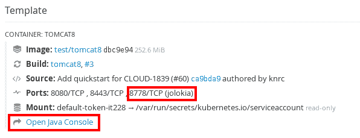
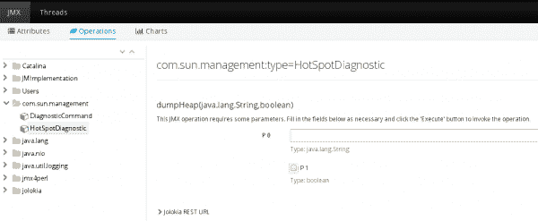

# OpenShift 上的 Java 应用程序故障排除

> 原文：<https://developers.redhat.com/blog/2017/08/16/troubleshooting-java-applications-on-openshift>

## 是关于什么的？

几年前，随着基于 Kubernetes 的第三个版本的发布，OpenShift 受到了极大的关注。越来越多的公司在对 OpenShift Container Platform (OCP)进行全面评估后，已经构建了内部或云中的 PaaS。下一步，他们已经开始在 OCP 上运行他们的应用程序。在生产环境中运行应用程序的一个重要方面是在事件发生后快速将服务恢复到正常服务级别的能力，随后是对底层问题的识别和解决。在这方面，我想在这篇博客中介绍几种排除运行在 OpenShift 上的 Java 应用程序故障的方法。其他语言也可以采用类似的方法。

借助以下特性，可以在开发阶段调试应用程序:

*   用于解决启动过程中问题的调试模式。
*   端口转发，用于将像 JBDS 这样的 IDE 连接到远程容器中运行的应用程序，并使用断点和对象检查对其进行调试。

这一点已经在博客中提出，比如这里的和这里的。

**在这篇博客中，相反，我想把重点放在对生产中的应用程序进行故障排除上**,并涵盖诸如捕获堆和线程转储、每个线程的资源消耗等内容。这些技术在过去不止一次地有助于解决死锁、内存泄漏或由于过多的垃圾收集导致的性能下降等问题。

让我们进入问题的核心！

## 有什么事吗？

这一切都始于注意到有可疑之处。OpenShift 提供了几种检查应用程序健康状况的机制。

**健康和准备状态**

支持自定义探测的内置健康和就绪检查是第一种防御机制。OpenShift 通过停止有故障的容器并开始一个新的容器来对前者的否定回答做出反应。后者的答案是将吊舱从工作轮换中取出。没有请求被转发到故障容器的服务和路由器层。

**日志**

可以通过几种方式访问容器日志:

*   $ oc 日志<pod-name></pod-name>
*   web 控制台
*   集合日志的基巴纳

**指标**

CPU 和内存消耗可以在 web 控制台中看到，也可以通过 Hawkular、Prometheus 或与其中一个集成的监控系统访问，或者直接访问 Heapster 或 kubelet API。自定义指标也可以通过 JMX 或普罗米修斯端点收集。取决于时间范围的趋势可以在 Prometheus、Hawkular 或 CloudForms 上可视化

**JMX**

除了定制的度量标准，如果已经实现了特定的 MBeans，JMX 还可以访问 JVM 或应用程序本身的信息，例如 EAP 就是这种情况。

**事件**

当由于内存不足或运行状况检查未给出肯定答案而终止并重新启动 pod 时，会创建一个事件，可通过 CLI 在 web 控制台中看到该事件:“oc get events”或监视事件的监视系统。

下一步做什么？

## 让我们找到根源

在容器出现之前，当人们想要调查影响性能的内存泄漏、死锁或垃圾收集时，一些众所周知的技术允许捕获改善这种情况所需的信息，例如:

*   线程转储
*   堆转储
*   捕获线程资源消耗(RAM、CPU)
*   垃圾收集周期分析(持续时间和频率)

在类似于[这个](https://access.redhat.com/solutions/46596)或者[这个](https://dzone.com/articles/how-to-take-thread-dumps-7-options)的文章中已经描述了通过在关键时间点的快照或者一系列快照来获取演化的静态状态的技术。

好消息是，所有这些都可以用运行在 OpenShift 上的容器来完成，差别很小。让我们更详细地看一下。

**mbean；Java 控制台**

xPaaS 映像部署了 Jolokia 库，提供了面向 JMX 的 REST API。这也可以用于其他 Java 应用程序。如果容器有一个名为“Jolokia”的端口，那么在 OpenShift Web 控制台的 pod 页面上会显示一个指向 Java 控制台的链接。

[](/sites/default/files/blog/2017/08/img_598d90ec8f441.png)Figure 1: Link to the Java Console">[](/sites/default/files/blog/2017/08/img_598d91168869d.png)Figure 2: Java Console">

下面是一些对我们的目的有用的 MBean 操作。

*   hotspot diagnostic . dumpHeap
    com . sun . management . hotspot diagnostic MBean 允许通过 dump heap 方法获取堆转储(该页面还提供了它的 URL)。该方法有两个参数:
    *   outputFile -依赖于系统的文件名
    *   live -如果为 true，则只转储活动对象，即其他人可以访问的对象。

*   diagnostic command . gcclasshistogram
    com . sun . management . diagnostic command . gcclasshistogram 提供堆直方图，这有助于查看已加载到内存中的类及其实例的数量。
*   diagnostic command . thread print
    com . sun . management . diagnostic command . thread print 是获取线程转储的一种便捷方式。
*   垃圾收集器。LastGcInfo
    com . sum . management . LastGcInfo 提供关于垃圾收集的信息。特别有趣的是它们发生的频率和持续的时间。

根据调查情况，其他 MBeans 可能会提供有价值的信息。

**命令行**

可以通过命令行收集类似于上一章所描述的信息。因此，首先需要检索 pod 的名称，可能还有容器的名称:

```
$ oc get pods -n test
NAME              READY     STATUS    RESTARTS   AGE
**tomcat8-4-37683**   1/1       Running   2          4d

$ oc describe pod tomcat8-4-37683
Name:			tomcat8-4-37683
Namespace:		test
Security Policy:	restricted
Node:			osenode3.sandbox.com/192.168.122.143
Start Time:		Wed, 02 Aug 2017 22:07:15 +0200
Labels:		app=tomcat8
		deployment=tomcat8-4
 		deploymentconfig=tomcat8
Status:		Running
IP:		**10.128.1.3**
Controllers:	ReplicationController/tomcat8-4
Containers:
   **tomcat8**:
```

以下示例将针对 IP 地址为 10.128.1.3、容器名称为 tomcat8 的 pod tomcat8-4-37683 给出。这需要更改为特定于运行应用程序的 pod 和容器的值。

*   清除打印

如果容器内的 JDK 可用，就可以使用 jcmd(以前的 jmap)。在许多公司中，出于安全原因(减少攻击面)，只有 JRE 安装在生产机器上。在这种情况下，要获取一个核心转储就有点麻烦了，您的容器中可能没有 gdb，可以使用 jmap 从核心转储中提取内存转储。我所知道的唯一方法是通过 Jolokia 使用 JMX API。在大多数情况下，您的 java 进程将是在容器内运行的唯一进程，并且将具有 id 1。

注意:注意进行堆转储会冻结 JVM 并影响应用程序性能，这一点很重要。限制影响的一个选择是只采用直方图。

下面是如何用 jcmd 实现这一点。

*jcmd*

```
$ oc exec tomcat8-4-37683 -c tomcat8 -- jcmd 1 GC.heap_dump /tmp/heap.hprof \
oc rsync tomcat8-4-37683:/tmp/heap.hprof . \
oc exec tomcat8-4-37683 -- rm /tmp/heap.hprof
$ oc exec tomcat8-4-37683 -c tomcat8 -- jcmd 1 GC.class_histogram
```

在 Jolokia 中，从命令行参与要多一点。以下直接连接到 pod 的示例将从具有所需证书和连接的主服务器上运行。或者，master 可以用作反向代理，就我所见，只用于 GET 请求。作为监控解决方案的一部分，还应该注意不要给主机增加不必要的负载。

*Jolokia*

```
 **Direct connection**
 $ curl -k -H "Authorization: Bearer $(oc sa get-token management-admin -n management-infra)" \
           -H "Content-Type: application/json" \
           --cert /etc/origin/master/master.proxy-client.crt \
           --key /etc/origin/master/master.proxy-client.key \
           'https://10.128.1.3:8778/jolokia/' \
           -d '{"mbean":"com.sun.management:type=HotSpotDiagnostic", "operation":"dumpHeap", "arguments":["/tmp/heap.hprof","true"], "type":"exec"}' \
   oc rsync tomcat8-4-37683:/tmp/heap.hprof . \
   oc exec tomcat8-4-37683 -- rm /tmp/heap.hprof
 $ curl -k -H "Authorization: Bearer $(oc sa get-token management-admin -n management-infra)" \
           -H "Content-Type: application/json" \
           --cert /etc/origin/master/master.proxy-client.crt \
           --key /etc/origin/master/master.proxy-client.key \
           'https://10.128.1.3:8778/jolokia/' \
           -d '{"mbean":"com.sun.management:type=DiagnosticCommand", "operation":"gcClassHistogram", "arguments":["-all"], "type":"exec"}' \
 | sed 's/\\n/\n/g' > histogram.hprof
 **Using the master as reverse proxy**
 $ curl -H "Authorization: Bearer $(oc whoami -t)" \
        -H "Content-Type: application/json" \
        'https://osemaster.sandbox.com:8443/api/v1/namespaces/test/pods/https:tomcat8-4-37683:8778/proxy/jolokia/exec/com.sun.management:type=HotSpotDiagnostic/dumpHeap/!/tmp!/heap.hprof/true' \
        oc rsync tomcat8-4-37683:/tmp/heap.hprof . \
        oc exec tomcat8-4-37683 -- rm /tmp/heap.hprof
 $ curl -H "Authorization: Bearer $(oc whoami -t)" \
        -H "Content-Type: application/json" \
        https://osemaster.sandbox.com:8443/api/v1/namespaces/test/pods/https:tomcat8-4-37683:8778/proxy/jolokia/exec/com.sun.management:type=DiagnosticCommand/gcClassHistogram/-all | sed 's/\\n/\n/g' > histogram.hprof
```

内存转储的分析可以使用 Eclipse 内存分析工具(MAT)来执行:
[【http://www.eclipse.org/mat/】](http://www.eclipse.org/mat/)

*   线程转储

除了 jcmd(以前的 jstack)之外，还可以通过向 Java 进程发送 SIGQUIT(3)信号来进行线程转储。

*jcmd*

```
$ oc exec tomcat8-4-37683 -c tomcat8 -- jcmd 1 Thread.print
```

终止信号

```
$ oc exec tomcat8-4-37683 -c tomcat8 -- kill -3 1
```

注意:这不会终止 Java 进程，除非它是用-Xrs 启动的，这会禁用 JVM 中的信号处理。线程转储被写入标准输出，该输出被重定向到容器日志。结果如下所示:

```
$ oc logs tomcat8-4-37683
[...]
Full thread dump OpenJDK 64-Bit Server VM (25.131-b12 mixed mode):
"Attach Listener" #24 daemon prio=9 os_prio=0 tid=0x00007ff2f4001000 nid=0x36 runnable [0x0000000000000000]
   java.lang.Thread.State: RUNNABLE
"Thread-6" #23 daemon prio=5 os_prio=0 tid=0x00007ff2e8003800 nid=0x26 waiting on condition [0x00007ff2ec3fa000]
   java.lang.Thread.State: WAITING (parking)
 at sun.misc.Unsafe.park(Native Method)
	-  parking to wait for  <0x00000000d3b4e070> (a java.util.concurrent.locks.AbstractQueuedSynchronizer$ConditionObject)
 at java.util.concurrent.locks.LockSupport.park(LockSupport.java:175)
[...] 
```

*Jolokia*

```
 **Direct connection**
 $ curl -k -H "Authorization: Bearer $(oc sa get-token management-admin -n management-infra)" \
           -H "Content-Type: application/json" \
           --cert /etc/origin/master/master.proxy-client.crt \
           --key /etc/origin/master/master.proxy-client.key \
           'https://10.128.1.3:8778/jolokia/' \
           -d '{"mbean":"com.sun.management:type=DiagnosticCommand", "operation":"threadPrint", "arguments":["-l"], "type":"exec"}' \
 | sed 's/\\n/\n/g' | sed 's/\\t/\t/g' > thread.out
 **Using the master as reverse proxy**
 $ curl -H "Authorization: Bearer $(oc whoami -t)" \
        -H "Content-Type: application/json" \
        'https://osemaster.sandbox.com:8443/api/v1/namespaces/test/pods/https:tomcat8-4-37683:8778/proxy/jolokia/exec/com.sun.management:type=DiagnosticCommand/threadPrint/-l' \
 | sed 's/\\n/\n/g' | sed 's/\\t/\t/g' > thread.out
```

*   资源消耗

查看前一个命令列出的每个线程消耗了多少资源通常很方便。这可以通过 top 命令轻松完成:

```
$ oc exec tomcat8-4-37683 -c tomcat8 -- top -b -n 1 -H -p 1 > top.out
$ cat top.out
top - 07:16:34 up 19:50,  0 users,  load average: 0.00, 0.08, 0.12
Threads:  23 total,   0 running,  23 sleeping,   0 stopped,   0 zombie
%Cpu(s):  2.4 us,  0.7 sy,  0.0 ni, 96.7 id,  0.1 wa,  0.0 hi,  0.1 si,  0.0 st
KiB Mem :  2915764 total,   611444 free,  1074032 used,  1230288 buff/cache
KiB Swap:        0 total,        0 free,        0 used.  1622968 avail Mem

   PID USER      PR  NI    VIRT    RES    SHR S %CPU %MEM     TIME+ COMMAND
     1 1000060+  20   0 3272048 272060  16084 S  0.0  9.3   0:00.03 java
    15 1000060+  20   0 3272048 272060  16084 S  0.0  9.3   0:09.97 java
    16 1000060+  20   0 3272048 272060  16084 S  0.0  9.3   0:00.14 java
```

第 9 列显示 CPU 消耗，第 10 列显示每个线程的内存消耗。

使用线程转储分析器，可以通过线程 id(TDA 的 native-id)将资源消耗与线程信息进行映射。有关 TDA 的更多信息，请访问:

[https://github.com/irockel/tda](https://github.com/irockel/tda)

如果您不想使用工具，您需要将线程 id 转换为十六进制，以匹配线程转储中的 nid 字段。类似这样的东西应该可以完成这项工作:

```
$ echo "obase=16; <thread-id>" | bc
```

*   垃圾收集

频繁而持久的垃圾收集可能是应用程序出现问题的征兆。完全垃圾收集也可能会给请求处理增加不可接受的延迟，因为它“停止了世界”。关于垃圾收集的信息收集是与故障排除性能问题和优化相关的另一个常见活动。

Jstat 通常用于捕获垃圾收集的信息。不幸的是，对于 OpenShift 上的大量图像，它不能开箱即用。原因是 Java 将相关信息存储在文件/tmp/hsperfdata_ 中。OpenShift 上的容器默认使用一个大的用户 id，比如 1000060000，不同项目中的容器使用不同的用户 id。这是出于安全原因:这个用户 id 不会与主机系统上的任何真实用户相匹配。它增加了一个额外的保护层。这种动态分配用户 id 的结果是，在容器内的/etc/passwd 中没有匹配的用户 id，因此 java 进程不能将数据存储到/tmp/hsperfdata_ 中。有变通办法。一种是有一个可写的/etc/passwd，在启动时更新。更好的方法是使用 nss 包装器。例如，Jstat 将与这里的 Jenkins 图像[一起开箱即用。](https://hub.docker.com/r/openshift/jenkins-2-centos7/)

*指向*

```
$ oc exec tomcat8-4-37683 -- jstat -gcutil 1 10000 5 > jstat.out
```

*Jolokia*

```
 **Direct connection**
 $ curl -k -H "Authorization: Bearer $(oc sa get-token management-admin -n management-infra)" \
           -H "Content-Type: application/json" \
           --cert /etc/origin/master/master.proxy-client.crt \
           --key /etc/origin/master/master.proxy-client.key \
           'https://10.129.0.2:8778/jolokia/' \
            -d '{"mbean":"java.lang:type=GarbageCollector,name=PS MarkSweep", "attribute":"LastGcInfo", "type":"read"}'
 $ curl -k -H "Authorization: Bearer $(oc sa get-token management-admin -n management-infra)" \
           -H "Content-Type: application/json" \
           --cert /etc/origin/master/master.proxy-client.crt \
           --key /etc/origin/master/master.proxy-client.key \
           'https://10.129.0.2:8778/jolokia/' \
           -d '{"mbean":"java.lang:type=GarbageCollector,name=PS Scavenge", "attribute":"LastGcInfo", "type":"read"}'
 **Using the master as reverse proxy**
 $ curl -H "Authorization: Bearer $(oc whoami -t)" \
        -H "Content-Type: application/json" \
        'https://osemaster.sandbox.com:8443/api/v1/namespaces/test/pods/https:tomcat8-4-37683:8778/proxy/jolokia/read/java.lang:type=GarbageCollector,name=PS%20MarkSweep/LastGcInfo
 $ curl -H "Authorization: Bearer $(oc whoami -t)" \
        -H "Content-Type: application/json" \
        'https://osemaster.sandbox.com:8443/api/v1/namespaces/test/pods/https:tomcat8-4-37683:8778/proxy/jolokia/read/java.lang:type=GarbageCollector,name=PS%20Scavenge/LastGcInfo
```

*   时间的演变

如果没有合适的监控解决方案来收集故障排除所需的信息，可以很容易地将上述命令组合成一个脚本，定期启动该脚本以查看动态方面:对象、线程创建、内存和 CPU 消耗的变化等。由于创建完整的堆转储会造成干扰，因此建议将内存捕获限制为直方图。

## 搬起石头砸自己的脚

运营团队经常面临的一个问题是，事件的解决会导致数据丢失，而这些数据本可用于确定根本原因和修复根本问题。ITIL 理论说:

*   事件管理生命周期的目标是尽快恢复服务，以满足 SLA 要求。
*   问题管理职能的目标是识别潜在的原因因素，这可能与多个事件有关。

在由于内存泄漏导致死锁或性能下降的情况下，响应通常是重启应用程序，以尽快恢复到正常状态。不幸的是，这样做您就删除了应用程序状态，而应用程序状态本可以为您提供解决底层问题的关键信息。我不止一次像一个天文学家一样耐心地等待彗星回来，在我的情况下，下一次事件发生时，我所有的工具都在捕捉数据的金色尘埃，这将使我能够确定事件的原因……不幸的是。OpenShift 提供了先进的编排功能，在这方面，它们可以再次提供帮助。

理想情况下，为了实现高可用性，您的应用程序应该运行多个实例，但即使不是这样，下面的方法也会有所帮助。基本原理非常简单:不要杀死有问题的容器，而是将它从请求服务池、OpenShift 中的服务和路由层中取出。不幸的是，如果应用程序使用消息传递系统，这将毫无帮助。服务和路由基于标签/选择器机制知道请求将被发送到的 pod。您只需更改故障 pod 上的标签，就可以将其从支持服务和处理请求的 pod 中取出。让我们看看如何快速开始。

*   创建应用程序。

    ```
    $ oc new-app --name=myapp jboss-webserver30-tomcat8-openshift~https://github.com/openshiftdemos/os-sample-java-web.git
    ```

*   将部署扩展到两个实例(可选)

    ```
    $ oc scale dc myapp --replicas=2
    ```

*   更换“故障”pod 上的标签

```
$  oc get pods
NAME              READY     STATUS      RESTARTS   AGE
myapp-1-build     0/1       Completed   0          3m
myapp-1-gd2fn     1/1       Running     0          1m
myapp-1-q1k3n     1/1       Running     0          2m

$ oc describe service myapp
Name:			myapp
Namespace:		test
Labels:			app=myapp
Selector:		app=myapp,deploymentconfig=myapp
Type:			ClusterIP
IP:			172.30.225.169
Port:			8080-tcp	8080/TCP
Endpoints:		10.128.1.6:8080,10.129.0.250:8080
Port:			8443-tcp	8443/TCP
Endpoints:		10.128.1.6:8443,10.129.0.250:8443
Port:			8778-tcp	8778/TCP
Endpoints:		10.128.1.6:8778,10.129.0.250:8778

$ oc label pod myapp-1-gd2fn --overwrite deploymentconfig=mydebug
pod "myapp-1-gd2fn" labeled
$ oc get pods
NAME              READY     STATUS      RESTARTS   AGE
myapp-1-build     0/1       Completed   0          8m
myapp-1-gd2fn     1/1       Running     0          5m
myapp-1-gtstj     1/1       Running     0          5s
myapp-1-q1k3n     1/1       Running     0          7m

$oc describe service myapp
Name:			myapp
Namespace:		test
Labels:			app=myapp
Selector:		app=myapp,deploymentconfig=myapp
Type:			ClusterIP
IP:			172.30.225.169
Port:			8080-tcp	8080/TCP
Endpoints:		10.128.1.7:8080,10.129.0.250:8080
Port:			8443-tcp	8443/TCP
Endpoints:		10.128.1.7:8443,10.129.0.250:8443
Port:			8778-tcp	8778/TCP
Endpoints:		10.128.1.7:8778,10.129.0.250:8778
```

在更改标签之后，OpenShift 会立即启动一个新的 pod 来满足部署配置需求:拥有两个正在运行的实例→事件已解决。然而，有故障的容器仍在运行，被隔离。您可以在上面的输出中看到，服务组件中端点列表中 IP 为 10.128.1.7 的新容器替换了 IP 为 10.128.1.6 的容器。

默认情况下，服务层通过 iptables 实现。很容易看出故障 pod 被从服务转发中取出:

```
$ iptables -L -n -t nat | grep test/myapp:8080
KUBE-MARK-MASQ  all  --  10.129.0.250 0.0.0.0/0  /* test/myapp:8080-tcp */
DNAT       tcp  --  0.0.0.0/0         0.0.0.0/0  /* test/myapp:8080-tcp */ tcp to:10.129.0.250:8080
KUBE-MARK-MASQ  all  --  10.128.1.7   0.0.0.0/0  /* test/myapp:8080-tcp */
DNAT       tcp  --  0.0.0.0/0         0.0.0.0/0  /* test/myapp:8080-tcp */ tcp to:10.128.1.7:8080
```

以类似的方式，在 OpenShift 中可以查看 HAProxy 配置，并看到它已经实现。为此，您需要登录到路由器(“oc rsh”)。以下是配置文件中的相关部分:

/var/lib/haproxy/conf/haproxy . config

```
# Plain http backend
backend be_http_test_myapp
[...]
  server 625c4787bdcee4668557b3d7edb1c168 10.128.1.7:8080 check inter 5000ms cookie 625c4787bdcee4668557b3d7edb1c168 weight 100

  server 4c8bc31e32a06e7a7905c04aa02eb97b 10.129.0.250:8080 check inter 5000ms cookie 4c8bc31e32a06e7a7905c04aa02eb97b weight 100
```

既然事件已经解决，我们可以使用前面描述的一些技术对应用程序进行故障诊断并解决问题。当你完成后，豆荚就可以被杀死了。

```
$ oc delete pod myapp-1-gd2fn
```

如果您决定将其重新标记为以前的值，那么复制控制器会注意到比所需数量多了一个 pod，并会杀死其中一个 pod 以返回到所需状态。

就是这样！

*Last updated: October 18, 2018*