# 使用 Marketplace 将 CockroachDB 添加到 OpenShift

> 原文：<https://developers.redhat.com/articles/use-marketplace-add-cockroachdb-operator-openshift>

混合云世界中任何开发人员的目标之一都是快速创建解决方案，使企业能够对不断发展的生态系统做出反应。[Red Hat market place](https://marketplace.redhat.com?intcmp=7013a000002DeP7AAK)提供统一的体验，从领先的云供应商支持的综合目录中购买容器化软件，使用 [Red Hat OpenShift 容器平台在所有云上部署该软件，](https://developers.redhat.com/openshift)监控软件支出，并跟踪许可证使用和到期情况。


本文将介绍使用 Red Hat Marketplace 进行帐户注册、集群设置和 CockroachDB 试用版安装的过程。

## 设置市场帐户

从访问 [Red Hat Marketplace](https://marketplace.redhat.com?intcmp=7013a000002DeP7AAK) 开始，查看准备安装到您的 Red Hat OpenShift 集群中的容器化软件目录。如果您有一个现有的 IBM ID 或 Red Hat ID，单击页面右上角提供的**登录**链接开始这个练习。否则，如果您没有帐户，请点击**创建帐户**按钮。(**创建帐户**过程将提供一个 IBM ID。)

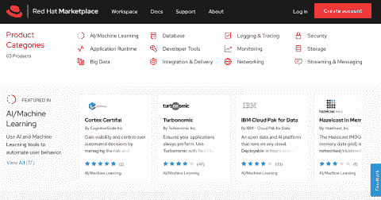

填写注册页面上要求的信息。对于**账户类型**，如果您是为了商业目的注册账户，请选择**公司**；否则，选择**个人**。点击**下一个**。

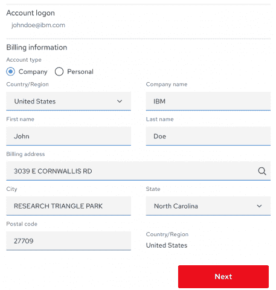

可以用信用卡或发票设置支付选项。使用发票选项需要您有一个 **IBM 客户号**和一个**采购订单号。**点击**下一步**，完成注册。

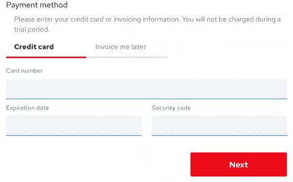

## 将集群添加到 OpenShift

在从市场部署软件之前，必须将 OpenShift 集群添加到您的市场工作区。Marketplace 为您提供了使用任何 OpenShift 集群的灵活性，而不管其位置如何。只要群集可以与市场服务器通信，群集的位置可以是公共的或私有的。

## 先决条件

1.现有的 OpenShift 集群:对于本文，我们选择在 IBM Cloud 上使用托管的 OpenShift 集群。如果您没有集群，请在您选择的[公共云或私有云上提供 OpenShift 容器平台。](https://www.openshift.com/try?intcmp=701f20000012jmYAAQ)设置时，选择 OpenShift 版或更高版本。

2.部署密钥:需要一个部署密钥来将您的 OpenShift 集群链接到市场。选择右上角的下拉菜单，进入**我的账户**页面。

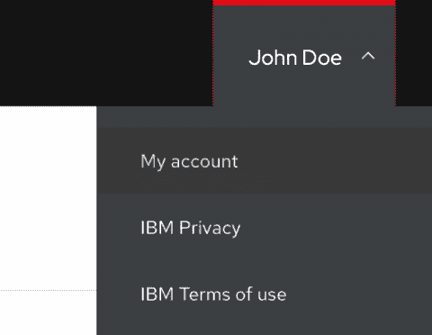

请注意，此页面为您提供对 Marketplace 的所有帐户管理功能的访问，如帐户信息、访问权限、消费、优惠和密钥。选择**部署键**然后点击**创建键**。

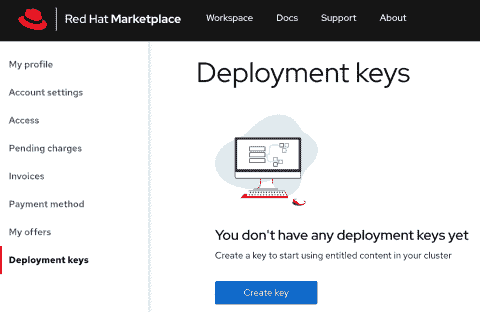

在点击**保存**按钮之前，复制密钥并将其保存在安全的地方以备后用。

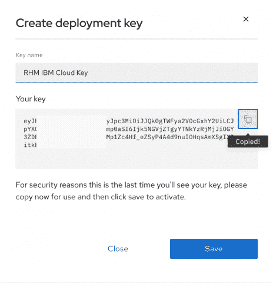

现在，让我们继续添加 OpenShift 集群。选择**工作区>集群**并点击**添加集群**

输入最能代表您要添加的集群的名称(例如**数据库**

安装运行安装脚本所需的额外的([CLI](https://docs.openshift.com/container-platform/4.3/cli_reference/openshift_cli/getting-started-cli.html)和 [jq](https://stedolan.github.io/jq/download/) JSON 处理器)。使用管理员凭据使用`oc login`命令登录到您的集群。

运行 operator 安装脚本，并提供在上一步中创建的部署密钥作为输入参数。请注意，**帐户 id** 和**集群 uuid** 是预先填充的。

`curl -sL https://marketplace.redhat.com/provisioning/v1/scripts/install-rhm-operator | bash -s <account-id> <cluster-uuid> <deployment-key>`

成功完成后，您应该会看到以下输出:

```
==================================================================================
                    [INFO] Installing Red Hat Marketplace Operator...
==================================================================================
STEP 1/6: Creating Namespace...
namespace/redhat-marketplace-operator created
STEP 2/6: Creating Red Hat Marketplace Operator Group...
operatorgroup.operators.coreos.com/redhat-marketplace-operator created
STEP 3/6: Creating Red Hat Marketplace Operator Subscription...
Checking for Cluster Service Version...
Checking for Custom Resource Definition...
subscription.operators.coreos.com/redhat-marketplace-operator created
STEP 4/6: Applying global pull secret...
secret/pull-secret data updated
STEP 5/6: Applying Red Hat Marketplace Operator Secret...
secret/rhm-operator-secret created
STEP 6/6: Creating Red Hat Marketplace Operator Config Custom Resource...
marketplaceconfig.marketplace.redhat.com/marketplaceconfig created
Red Hat Marketplace Operator successfully installed
```

点击**添加集群**按钮完成此步骤添加集群。该集群应该出现在**集群**页面中，状态为**已注册**。如果状态显示**代理未安装**，您可能需要等待 15 分钟才能完成注册。

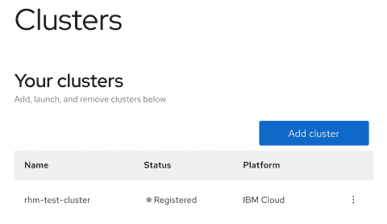

检查 OpenShift 集群中已安装的操作符列表。红帽市场运营商现在应该是其中之一。

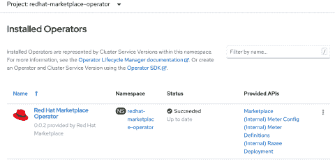

最后一步:如果您的集群运行在 IBM Cloud 上，那么运行下面的命令来重新加载 worker 节点。这一步可能需要 20-30 分钟。

`ibmcloud ks worker reload --cluster <cluster-id> --worker <worker-node-name>`

使用`ibmcloud ks clusters and ibmcloud ks workers --cluster <cluster-id>`来确定集群 id 和节点名称。

示例输出:

```
Reload worker? [kube-bqegbk1w00v8gmbt37l0-rhmtestcluster-default-000001d8] [y/N]> y
Reloading workers for cluster rhm-test-cluster...
Processing kube-bqegbk1w00v8gmbt37l0-rhmtestcluster-default-000001d8...
Processing on kube-bqegbk1w00v8gmbt37l0-rhmtestcluster-default-000001d8 complete.
```

现在，您可以尝试目录中的任何软件了。

如果您遇到错误并需要帮助来解决问题，请联系市场 [技术支持](https://marketplace.redhat.com/en-us/support?intcmp=7013a000002DeP7AAK) 。

## 试用软件

让我们通过选择一个 SQL 数据库操作符来看看**免费试用**选项是如何工作的。CockroachDB 是一个云原生数据库——适用于 Kubernetes 的可扩展分布式 SQL。对于 OpenShift 来说，这是一个很好的选择，因为它提供了 SQL 的熟悉性和强大功能以及现有 ORM 的舒适性——自动化分片确保了在扩展应用程序时的出色性能。

前往[市场目录](https://marketplace.redhat.com?intcmp=7013a000002DeP7AAK)并搜索 CockroachDB。选择 CockroachDB 单幅图块。

CockroachDB 产品页面为您提供了与该产品相关的概述、文档和定价选项。点击**免费试用**按钮。

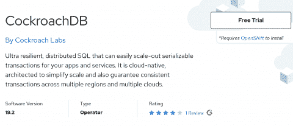

接下来，购买摘要将显示**订购期限**，总费用为 0.00 美元。点击**开始试用**。返回**工作区>我的软件**查看您购买的软件列表。

在您的 OpenShift 集群中创建一个希望安装操作符的项目。您可以在命令行使用以下命令来完成此操作:

`oc new-project cockroachdb-test`

回到 web dashboard，选择**cocroach db**tile，然后选择 **Operators** 选项卡。点击**安装操作器**按钮。保留**更新渠道**和**审批策略**的默认选择。为操作员选择集群和名称空间范围作为 cockoroach db-test，然后单击 **Install** 。

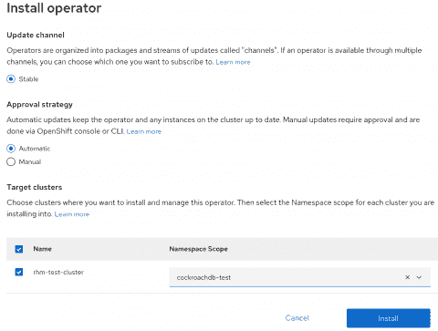

屏幕顶部会出现一条如下所示的消息，指示集群中启动的安装过程。


登录你的 OpenShift 集群，在**操作符>下查看已安装操作符**确认安装成功。操作员应在项目 cockoroach db-test 下列出。

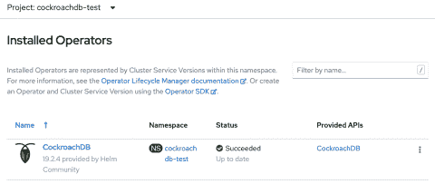

## 创建数据库实例

从 cocroach db 的 installed Operators 页面，点击 Provided APIs 下的链接**cocroach db**。

点击**创建 cocroach db**按钮。接受默认的 YAML 并点击**创建**按钮。

在继续之前，回顾一下关于如何[在安全模式](https://www.cockroachlabs.com/docs/stable/orchestrate-a-local-cluster-with-kubernetes.html)下设置数据库的指导，然后返回到本文来完成操作员设置。

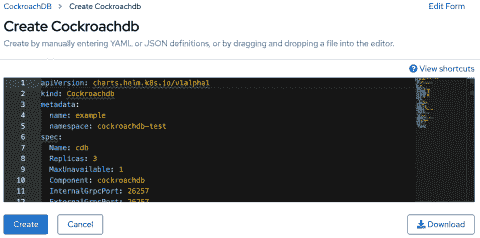

当数据库安装完成时，CockroachDB pods 应该会出现。运行以下命令检查状态。

`oc project cockroachdb-test`

您应该会得到类似如下的结果:

```
Now using project "cockroachdb-test" on server "https://c100-e.us-east.containers.cloud.ibm.com:32345".
```

您可以使用`kubectl get pods`命令来查看 CockroachDB pods 的状态，看看什么时候一切就绪。所有窗格的状态必须是“正在运行”或“已完成”:

`kubectl get pods`

```
NAME                             READY   STATUS      RESTARTS   AGE
cockroachdb-7486949c78-kdvcm     1/1     Running     0          46m
example-cockroachdb-0            1/1     Running     0          36m
example-cockroachdb-1            1/1     Running     0          36m
example-cockroachdb-2            1/1     Running     0          36m
example-cockroachdb-init-l5m56   0/1     Completed   0          36m
```

现在，让我们创建一个用户和一个数据库。我们将使用下面的命令来启动 CockroachDB 客户端:

`kubectl run -it --rm cockroach-client \`

`--image=cockroachdb/cockroach \`

`--restart=Never \`

`--command -- \`

`./cockroach sql --insecure --host=example-cockroachdb-public.cockroachdb-test`

这应该会将您带到一个类似下面的命令提示符下，运行 CockroachDB 客户端。如果看不到命令提示符，请尝试按 enter 键。

`root@example-cockroachdb-public.cockroachdb-test:26257/defaultdb>`

在客户端命令提示符下，运行以下 SQL 命令:

`CREATE USER IF NOT EXISTS maxroach;`

这就创建了我们将要使用的用户帐户， **maxroach** 。

`CREATE DATABASE bank;`

这将创建名为 **bank** 的数据库。

`GRANT ALL ON DATABASE bank TO maxroach;`

这给了我们的用户账户 **maxroach** ，更新我们的数据库**银行**的许可。

此时，我们有了一个用户帐户和一个数据库。键入`\q`退出客户端控制台。

现在，让我们通过管理控制台查看我们在前面的步骤中运行的命令的结果。可以通过端口转发在本地主机上访问控制台。

`kubectl port-forward example-cockroachdb-0 8080`

`Forwarding from [::1]:8080 -> 8080`

该页面应加载**集群概述**

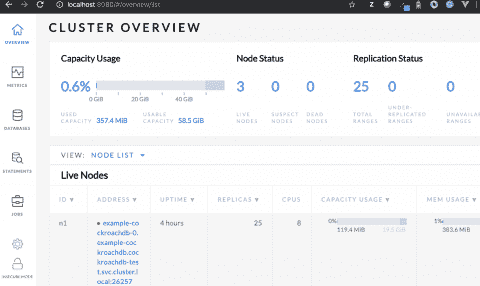

点击左侧导航面板中的**数据库**。

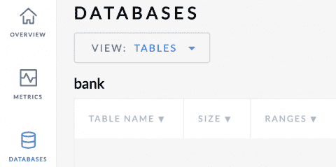

如果您在安装操作员或使用任何产品时遇到问题，并且已经用尽了所提供的自助选项，[market place Central Support Triage team](https://marketplace.redhat.com/en-us/support?intcmp=7013a000002DeP7AAK)随时准备根据需要提供帮助。前往 https://marketplace.redhat.com/en-us/support的[和](https://marketplace.redhat.com/en-us/support?intcmp=7013a000002DeP7AAK)，提交包含产品和问题详情的支持案例，我们将尽快与您联系。

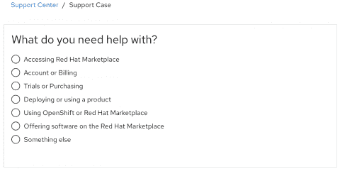

## 结论

在后续系列中，我们将深入探讨 Marketplace 如何帮助您将一个想法从概念验证或试点快速转化为生产规模的应用程序。您还将看到在单一位置管理您的混合云应用程序的软件消耗的好处。

*Last updated: April 21, 2021*