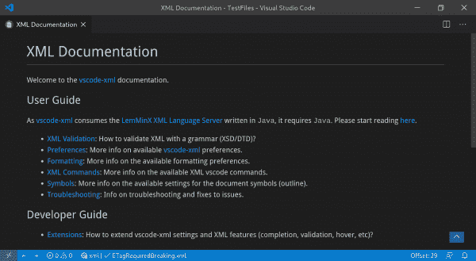
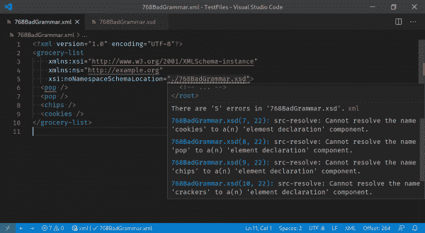
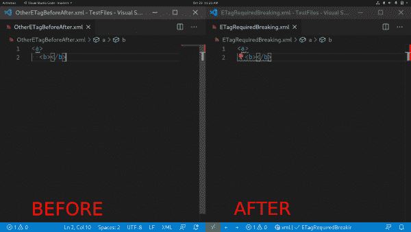
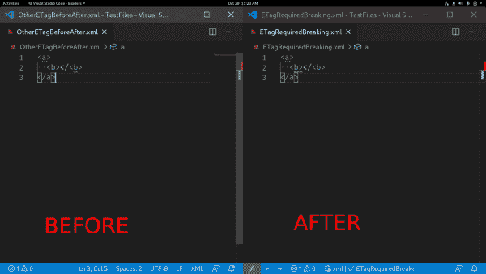
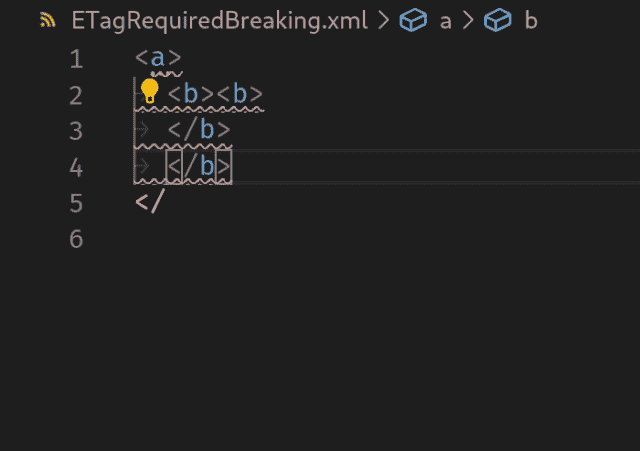
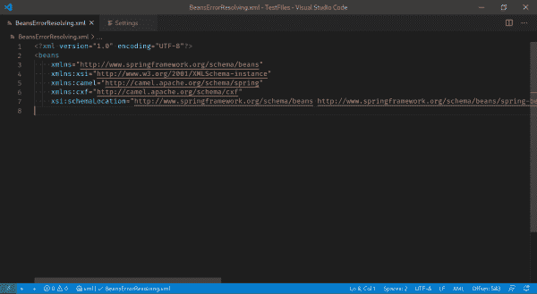
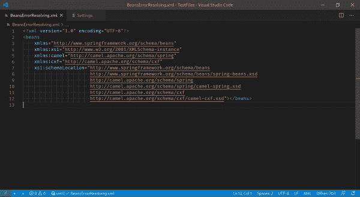

# vscode-xml 0.14.0:一个更加可定制的 VS 代码 xml 扩展

> 原文：<https://developers.redhat.com/blog/2020/11/10/vscode-xml-0-14-0-a-more-customizable-xml-extension-for-vs-code>

Red Hat 的 Visual Studio 代码 (VS 代码)的 [XML 扩展自上一版本以来有了显著的改进。本文概述了`vscode-xml`扩展 0.14.0 版本中最值得注意的更新。改进包括嵌入式设置文档、可定制的文档大纲、无缝 XML 目录导航的链接以及模式验证的错误聚合。](https://developers.redhat.com/products/vscode-extensions/overview)

## 嵌入式设置文档

我们改进了开发人员设置 XML 文档验证的文档。我们还为所有可用的设置添加了详细的嵌入式描述。嵌入式文档与从 vscode-xml 的 [GitHub 存储库中获得的文档相同。现在，您可以直接在 VS 代码中访问文档，而不需要互联网连接。](https://github.com/redhat-developer/vscode-xml/blob/master/docs/)

要查看 VS 代码中的文档，打开命令面板( **Ctrl+Shift+P** )并选择 **XML: Open XML Documentation** ，如图 1 所示。

[](/sites/default/files/blog/2020/11/OpenXMLDocumentation.png)Search “XML Documentation” in the command palette in order to find the command to open the documentation home page

图 2 显示了`vscode-xml`文档主页。

[](/sites/default/files/blog/2020/11/XMLDocumentationPage.png)The documentation home page has links to several pages that describe how to use and configure the extension

设置描述现在包含指向文档的链接。如图 3 所示，您可以使用这些链接获得关于特定设置的更多信息。

[](/sites/default/files/blog/2020/11/OpenEmptyElementsDocumentation.gif)There is a link in the description of the Empty Elements XML formatting option in the VS Code settings page. Clicking on it navigates to the related section in the XML Documentation, which provides a more detailed description of the option, along with examples.

Figure 3: Click a link to view the detailed documentation for that setting.

新的嵌入式文档应该为使用`vscode-xml`扩展的开发人员提供一个快速入门。

## 显示引用的语法

如果一个 XML 文档与一个或多个 XSD 或 DTD 模式相关联，那么一个**文法**条目就会出现在文档大纲中，如图 4 所示。

[](/sites/default/files/blog/2020/11/ShowReferencedGrammar.png)The “Grammars” entry in the document outline shows information about the referenced schema “dressSize.xsd”

文档大纲包括文档中引用的每个模式的 URL 位置。大纲还列出了模式是否保存在本地缓存中。此外，大纲列出了文档用来与模式关联的绑定方法。这个特性可以帮助开发人员用模式验证 XML 文档。

## 自定义 XML 符号轮廓

默认情况下，XML 符号大纲显示 DOM 元素、处理指令以及 DTD 元素、实体和属性列表的声明。大纲不会自动显示 DOM 属性和文本节点。排除属性和文本节点可以提高性能，但是开发人员有时需要看到这些元素。

在这次更新中，我们引入了一个配置符号轮廓的新选项。图 5 显示了一个带有默认轮廓的示例 Maven POM。

[](/sites/default/files/blog/2020/11/SampleMavenOutline.png)Sample Maven document, showing the default outline

图 5:Maven 文档中的默认大纲。">

当查看 Maven `pom.xml`时，能够看到文本节点的内容是很重要的。图 6 显示了显示这些文本元素的更新文档。

[](/sites/default/files/blog/2020/11/SampleMavenOutlineWithText.png)The outline displays the content of the elements that contain text

图 6:更新后的大纲显示了同一个文档的文本元素。">

### 使用新的 XML 符号过滤器

`vscode-xml`扩展提供了一个名为`xml.symbols.filters`的新设置，您可以使用它来选择哪些 DOM 节点在大纲中显示为符号。下面的代码片段显示了在一个`pom.xml`文件中显示文本节点的设置:

```
"xml.symbols.filters": [
  // Declaration of symbols filter for maven 'pom.xml' to show all text nodes in the outline.
  {
    "pattern": "pom.xml",
    "expressions": [
      {
        "xpath": "//text()"
      }
    ]
  }
]

```

### 为 Spring XML 使用 xml.symbols.filters

该过滤器适用于不同类型的文件。例如，在编辑 Spring XML 文件时，您可能希望看到`@id`属性。下面是在 Spring XML 文件大纲中显示`@id`属性的配置:

```
"xml.symbols.filters": [
  // Declaration of symbols filter for Spring beans to show all @id of the elements in the outline.
  {
    "pattern": "bean*.xml",
    "expressions": [
      {
        "xpath": "//@id"
      }
    ]
  }
]

```

图 7 显示了用 VS 代码显示的带有 Spring XML `@id`属性的大纲。

[](/sites/default/files/blog/2020/11/SymbolsSpring.png)

图 7:大纲现在包含了`@id`属性。">

注意，`pattern`条目是一个[全局模式](https://www.malikbrowne.com/blog/a-beginners-guide-glob-patterns)，扩展使用它来选择它将过滤的文件。`expressions`条目是扩展用来过滤符号的 XPaths 数组。关于新的 XML 符号过滤器的更多信息，请参见[符号过滤器文档](https://github.com/redhat-developer/vscode-xml/blob/master/docs/Symbols.md#xmlsymbolsfilters)。

## 聚合模式错误

如果引用无效的架构，引用该架构的文档中将出现错误。在本次更新中，我们对这些错误进行了分组。模式错误现在显示在文档中引用该模式的范围内。例如，考虑图 8，它显示了一个不完整的 XSD 模式。

[](/sites/default/files/blog/2020/11/BadSchemaGroceryList.png)The grocery-list element is defined so that several food elements are its children. However, these food item elements themselves are not defined, resulting in the schema being broken.

图 8:VS 代码中显示的一个损坏的 XSD 模式。">

现在，如果我们使用`xsi:noNamespaceSchemaLocation`创建一个与模式相关联的 XML 文档，就会在`xsi:noNamespaceSchemaLocation`属性上报告错误，如图 9 所示。

[](/sites/default/files/blog/2020/11/ReferencesBadSchemaGroceryList.png)Hovering over the reference to the schema shows a popup that lists the 5 errors that the schema has. You can click on the blue text in order to open the schema to the location of the errors.

图 9:将鼠标悬停在一个损坏模式的引用上，查看错误列表。">

错误聚合也适用于外部 DTD 引用、`xsi:schemaLocation`和`xml-model`处理指令。

## 缺失结束标记错误的报告和快速修复

此更新改进了对元素中缺少结束标记的诊断。图 10 中的前后屏幕让您看到没有相应开始标记的结束标记的错误报告的改进。

[](/sites/default/files/wegepemaproshikapadaswetreproluwugistosiprabruspobuphuclosligosithihicephiretreuewruuobreluwrucawriluslaslasturumokeniwulubikubraclostijauedrihaneticarutrasposalemoprebusaduwakihaswijupedrenuslouemuuitrauicrefruvislilahohe)

Figure 10: Changes to error reporting for a closing tag that has no corresponding opening tag.

图 11 中的屏幕突出显示了没有相应结束标记的开始标记在错误报告方面的差异。

[](/sites/default/files/blog/2020/11/BeforeAfterETag2.png)Figure 11: Needs title.

Figure 11: Changes to error reporting for an opening tag that has no corresponding closing tag.

图 12 中的屏幕突出显示了对不完整结束标记的错误报告的改进。

[](/sites/default/files/blog/2020/11/BeforeAfterETag3.png)Figure 12: Needs title.

Figure 12: Changes to error reporting for an incomplete closing tag.

我们还改进了对缺失、不完整或无效结束标记的快速修复，如图 13 所示。

[](/sites/default/files/blog/2020/11/vscode-quickfixes.gif)Figure 11: Quick fixes update incomplete closing tags in a malformed XML document.

图 13:快速修复更新格式错误的 XML 文档中不完整的结束标记。">

## 目录中的文档链接

我们为 XML 目录中的`uri`和`catalog`属性添加了新的文档链接。这些属性用于将目录链接到模式和其他目录。如果将`xml:base`属性与`<group>`元素一起使用，链接将指向正确的文件。图 14 展示了在目录和条目之间使用新的文档链接。

[](/sites/default/files/blog/2020/11/SeemlessCatalogNavigationOptimized.gif)You can use the new document links to accomplish seamless navigation between linked catalogs and their entries.

Figure 14: Use document links to navigate between linked catalogs and their entries.

## xsi:schemaLocation 的新格式选项

受其他 XML 工具的启发，我们为`xsi:schemaLocation`实现了新的格式样式。现在，您可以在图 15 到图 17 所示的三种格式中进行选择。

图 15 显示了为`xsi:schemaLocation`格式选择`none`的结果。

[](/sites/default/files/blog/2020/11/schemaLocationFormatNone.png)None: Leaves the content unchanged.

图 16 显示了选择`on element`的结果。

[](/sites/default/files/blog/2020/11/schemaLocationFormatOnElement.png)On element: Adds newlines after each namespace and URI.

图 17 显示了`on pair`的格式。

[](/sites/default/files/blog/2020/11/schemaLocationFormatOnPair.png)On pair: Adds newlines after each namespace/URI pair, so that each line contains one schema reference.

## 结论

更新后的 VS 代码 XML 扩展提供了许多在 VS 代码中编辑和导航 XML 文档的特性。我们要感谢以下的贡献者，他们为这次更新做出了巨大的贡献:

*   亚历克斯·鲍伊科
*   马克斯·霍纳格(树蛙)
*   赖安·泽格雷
*   程(a2975667)
*   叶台李
*   西蒙索博克(吉卜赛人)

您可以使用以下渠道获得有关 VS 代码的 XML 扩展的更多信息，并报告 0.14.0 版本的任何问题:

*   使用 [vscode-xml GitHub](https://github.com/redhat-developer/vscode-xml/issues/new/choose) 报告问题。
*   参见 [vscode-xml 文档](https://github.com/redhat-developer/vscode-xml/tree/master/docs)以了解更多关于本文中讨论的更新。
*   访问 [vscode-xml changelog](https://github.com/redhat-developer/vscode-xml/blob/master/CHANGELOG.md) 获取最新更新列表。

*Last updated: April 7, 2022*