# 面向 JetBrains 产品的 Red Hat OpenShift 连接器为开发人员提供了什么

> 原文：<https://developers.redhat.com/blog/2019/03/29/what-red-hat-openshift-connector-for-jetbrains-products-offers-developers>

我们非常高兴地宣布，JetBrains 产品(IntelliJ IDEA、WebStorm 等)的 [Red Hat OpenShift 连接器](https://plugins.jetbrains.com/plugin/12030-openshift-connector-by-red-hat)的预览版。)现在在预览模式下可用，并支持 Java 和 Node.js 组件。你可以从 [JetBrains 市场](https://plugins.jetbrains.com)下载 OpenShift 连接器插件，或者直接从 JetBrains 产品的插件库中安装。

在本文中，我们将研究该插件的特性和优点以及安装细节，并展示一个演示，展示如何使用该插件来改进开发和部署 Spring Boot 应用程序到 OpenShift 集群的端到端体验。

[Red Hat OpenShift](https://www.openshift.com) 是一个容器应用程序平台，为企业带来了 Kubernetes 和容器的强大功能。无论应用程序架构如何，OpenShift 都可以让您轻松快速地在几乎任何基础设施(公共或私有)中进行构建、开发和部署。

因此，无论是内部部署、公共云还是托管，您都有一个屡获殊荣的平台，可以在竞争对手之前将您的下一个伟大想法推向市场。

使用 OpenShift 连接器，您可以与任何 Red Hat OpenShift 交互，包括 OpenShift 集群的本地实例，如[minishift/Red Hat Container Development Kit](https://developers.redhat.com/products/cdk/overview/)。利用 OpenShift 应用程序浏览器视图，您可以改善开发应用程序的端到端体验。

该插件使您能够直接使用 JetBrains 产品(IntelliJ IDEA、WebStorm 等)执行所有这些操作。)在 Windows、 [Linux](https://developers.redhat.com/topics/linux/) 和 macOS 平台上运行，消除了记忆一些相当复杂的 CLI 命令的复杂性。

一旦安装了 OpenShift 连接器，就会在 Explorer 面板中启用一个新面板，即 OpenShift 视图。然后，您可以访问视图并连接到正在运行的 OpenShift 集群，以执行所需的操作。

## 演示

你可以在 YouTube 上看到 OpenShift 连接器插件[的现场演示。](https://www.youtube.com/watch?v=kCESA7a5i3M?rel=0&enablejsapi=1)以下是自己进行演示的步骤。

首先，你需要安装所有的 JetBrains 产品(IntelliJ IDEA，WebStorm 等。)2018.1 或以后。

要安装插件，请调出插件配置对话框:*文件→设置→插件*:

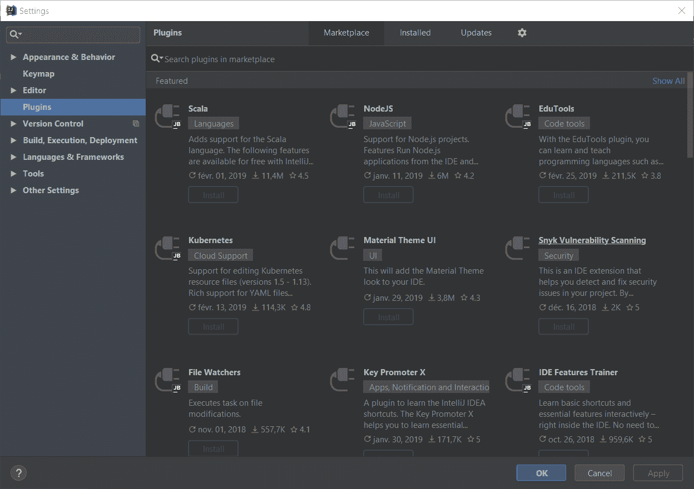

在搜索栏中，输入`OpenShift`并点击*open shift Connector by Red Hat*项:


点击*安装*按钮:


下载完插件后，点击*重启 IDE* 按钮。

IDE 重新启动后，将鼠标悬停在左下方区域的视图图标上:


选择 *OpenShift* 项目:

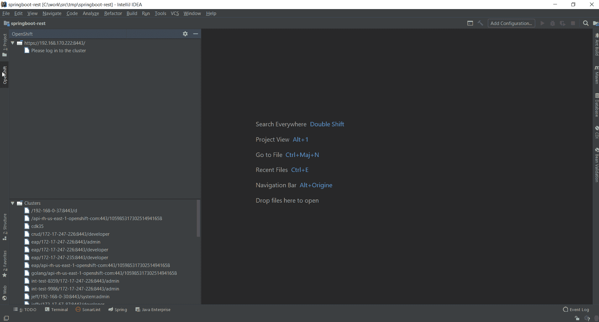

## 运行中的插件

### 连接到 OpenShift 实例

1.  如果您在本地工作，使用 [minishift/Red Hat 容器开发工具包](https://developers.redhat.com/products/cdk/overview/)启动本地 OpenShift 实例
2.  然后您需要登录到正在运行的 OpenShift 集群:右键单击集群 URL 树节点并选择*登录到集群*。

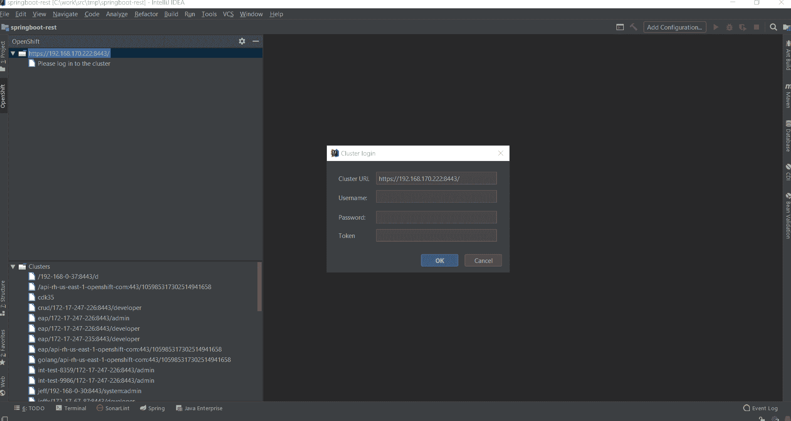

在`Username`字段中输入`developer`以及在`Password`字段中输入任意值，并按下 *OK* 按钮:

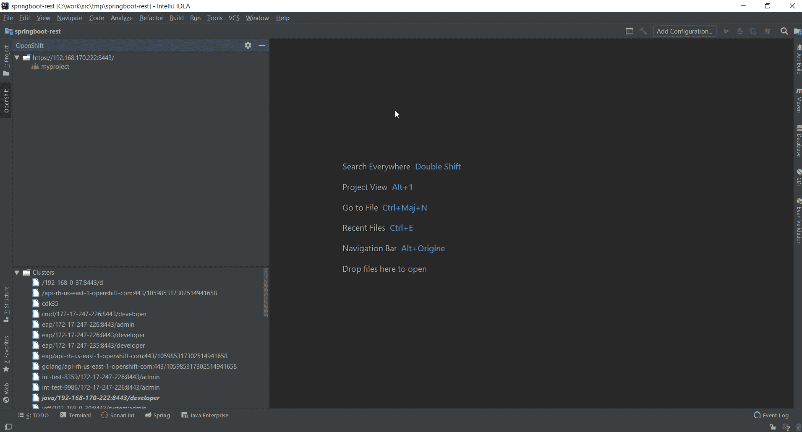

### 导入要部署的项目

在我们使用本地集群之前，首先导入我们的应用程序源代码。我们将使用一个简单的 Spring Boot 应用程序，其源代码位于`[https://github.com/openshift-evangelists/Wild-West-Backend](https://github.com/openshift-evangelists/Wild-West-Backend)`。

要导入应用程序，请使用`File → New → Project from Version Control → Git`:

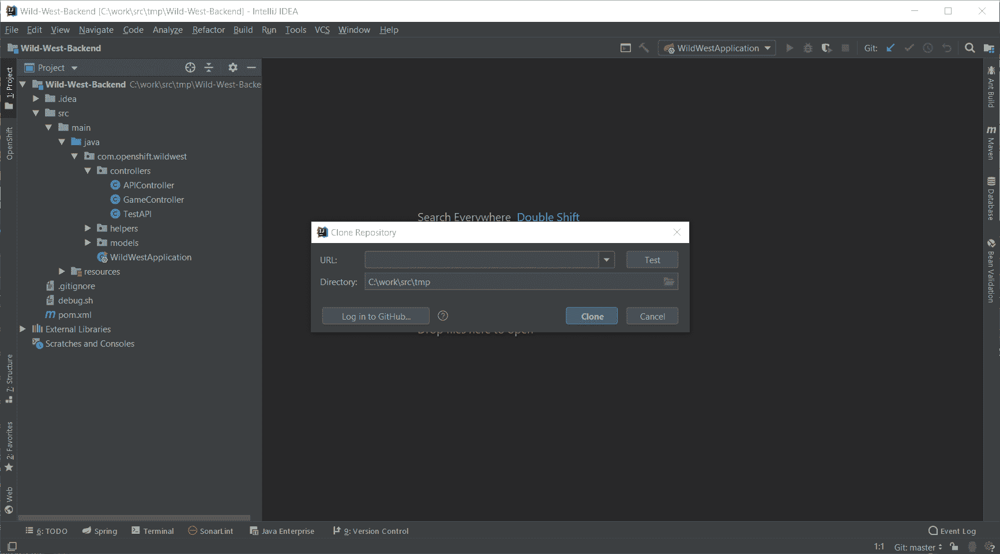

在`URL`字段中输入`[https://github.com/openshift-evangelists/Wild-West-Backend](https://github.com/openshift-evangelists/Wild-West-Backend)`并按下*克隆*按钮。

### 为应用程序创建一个项目

该应用程序将托管在一个 OpenShift 项目中(类似于 Kubernetes 名称空间)。有关 OpenShift 项目的更多信息，请参见[官方文档](https://docs.openshift.com/container-platform/3.11/admin_guide/managing_projects.html)

在`OpenShift`视图中，右键单击集群节点(带有 URL 的节点)并选择*新项目*:

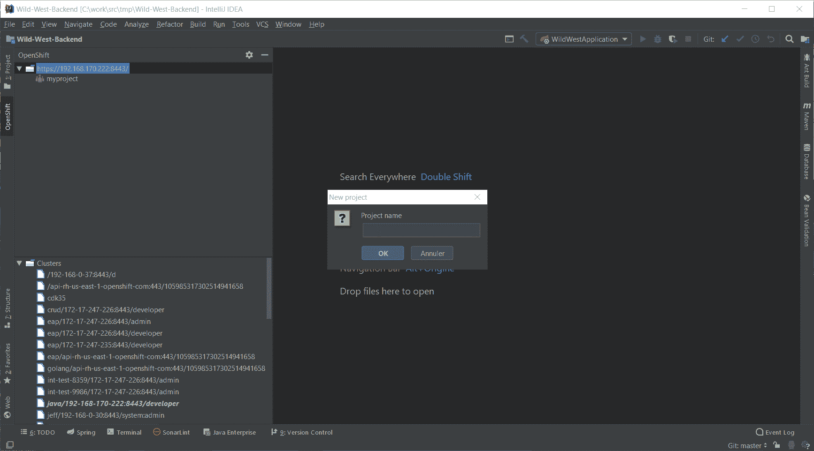

在`Project name`中输入`spring-boot`，按下 *OK* 按钮:

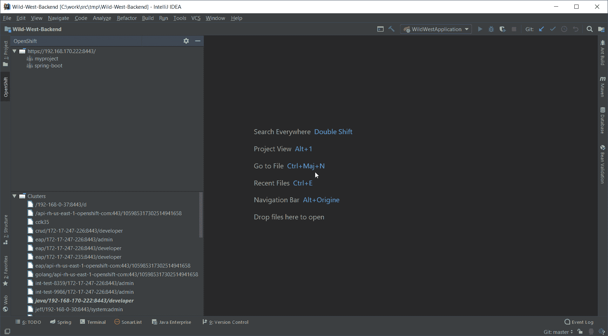

### 创建应用程序

在`spring-boot`节点，右键选择*新建应用*:

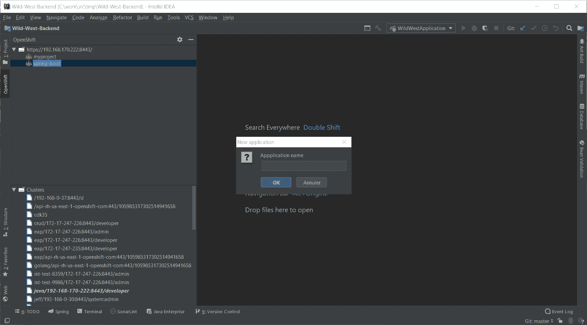

在`Application name`栏中输入`springbootapp`并按下 *OK* 按钮:

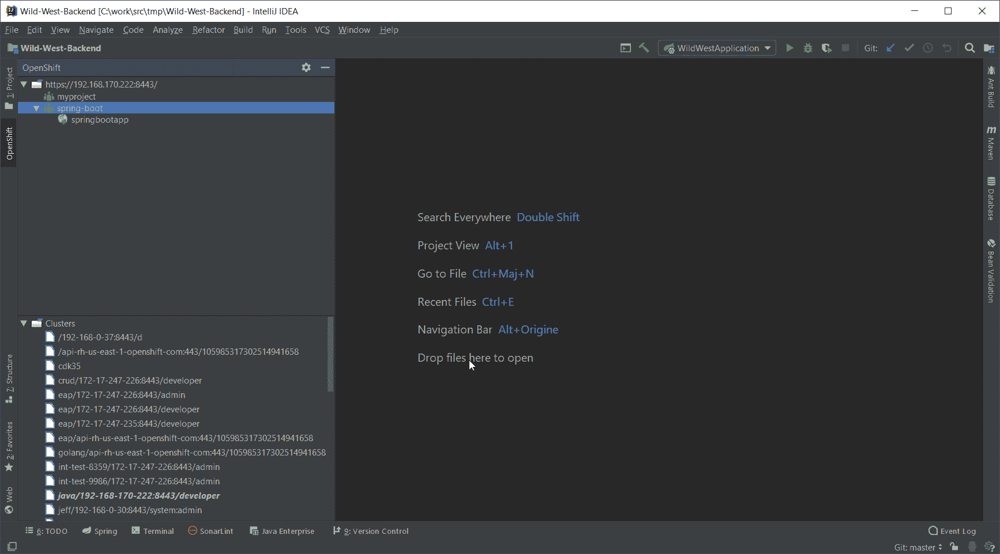

### 部署组件

在`springbootapp`节点，右键选择*新建组件*:


在`Name`字段输入`backend`:

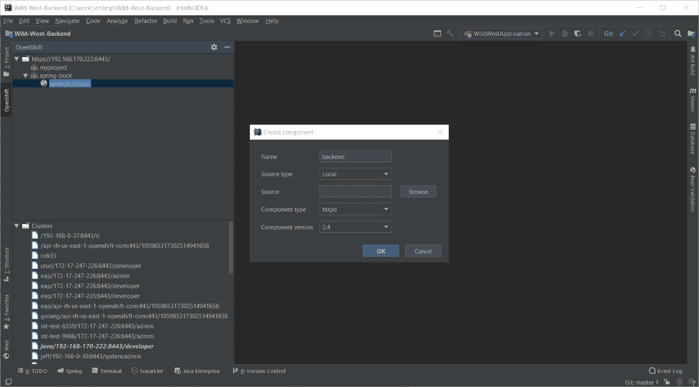

按下*浏览*按钮:

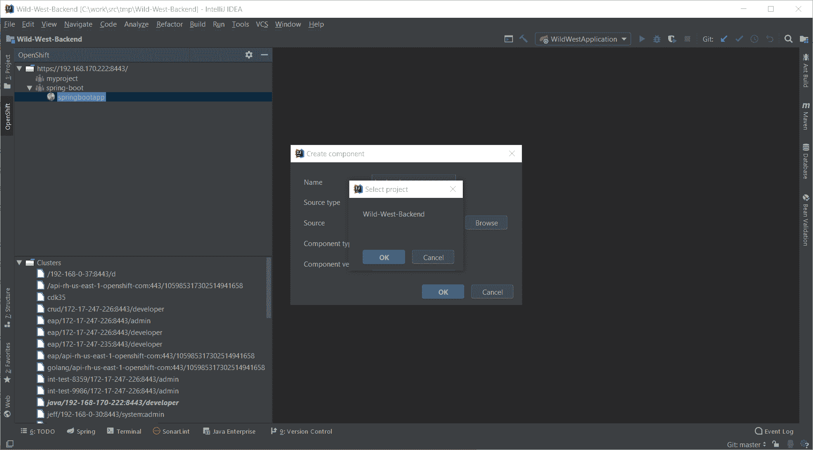

选择*狂野西部后端*项目并按下*确定*按钮:


在`Component type`字段中，选择 *java* 项:


按下 *OK* 按钮。将显示一个新的终端窗口，该组件将被部署到您的本地集群。

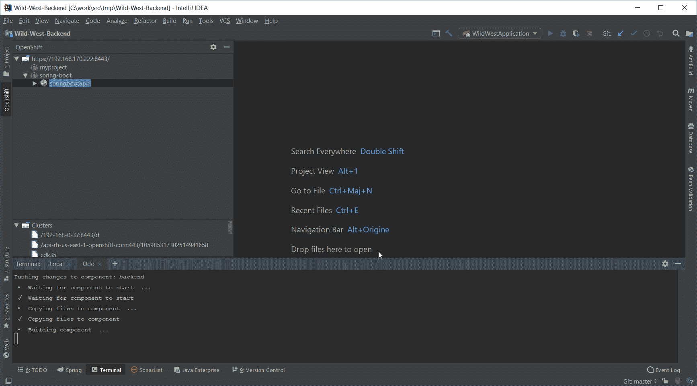

|  | 在基于 IntelliJ IDEA 2018.3 或 2018.3 的 JetBrains 产品上，当底层命令进程终止时，终端窗口将自动关闭。我们正在解决这个问题，但是我们建议在插件更新之前使用以前的版本。更多信息见[期](https://github.com/redhat-developer/intellij-openshift-connector/issues/33)。 |

部署后，组件将出现在`OpenShift`视图中:

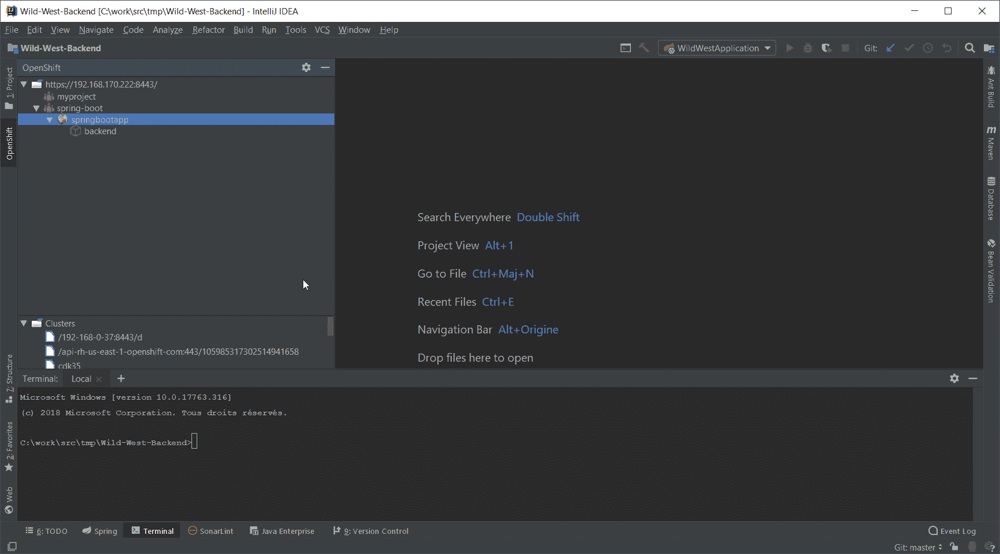

### 测试组件

让我们尝试在浏览器中测试部署的应用程序。在`OpenShift`视图中，右键单击*后端*节点，选择*在浏览器*中打开:

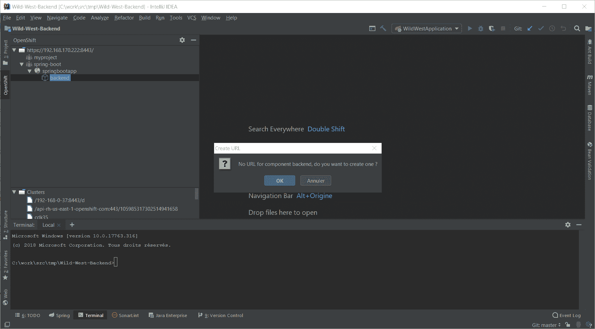

由于没有为我们的组件设置 URL(以允许外部访问我们的应用程序)，请按下 *OK* 按钮:


由于我们的应用程序暴露了几个端口，我们需要选择一个:选择 *8080* 并按下 *OK* 按钮。应该会显示以下浏览器窗口:

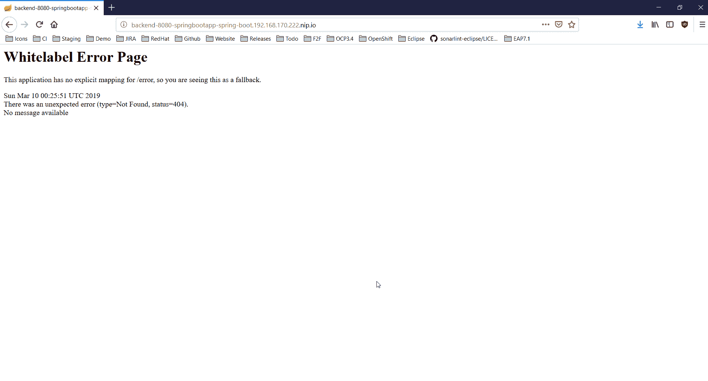

不要担心，显示错误消息是因为我们的应用程序没有根的映射。在浏览器窗口的地址栏追加`/egg`，按*键进入*:

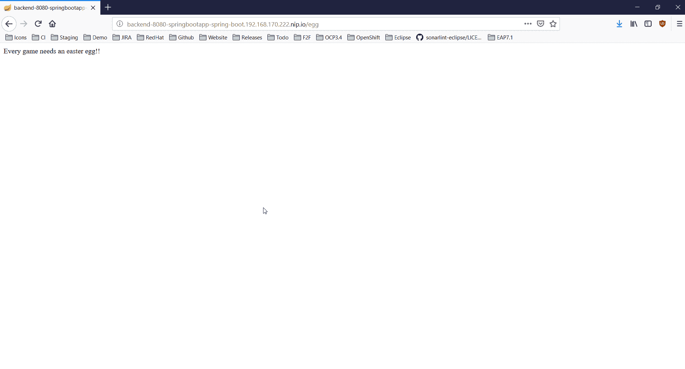

### 内循环

在下面的场景中，我们将在本地修改应用程序源代码，并验证修改是否会立即广播到集群。让我们将应用程序切换到`watch`模式，这样每个本地修改都会发送到集群:

在`OpenShift`视图中，右键单击*后端*节点，选择*观察*:


现在，在`Project`视图中，打开`src/main/java/com/openshift/wildwest/APIController.java`文件:

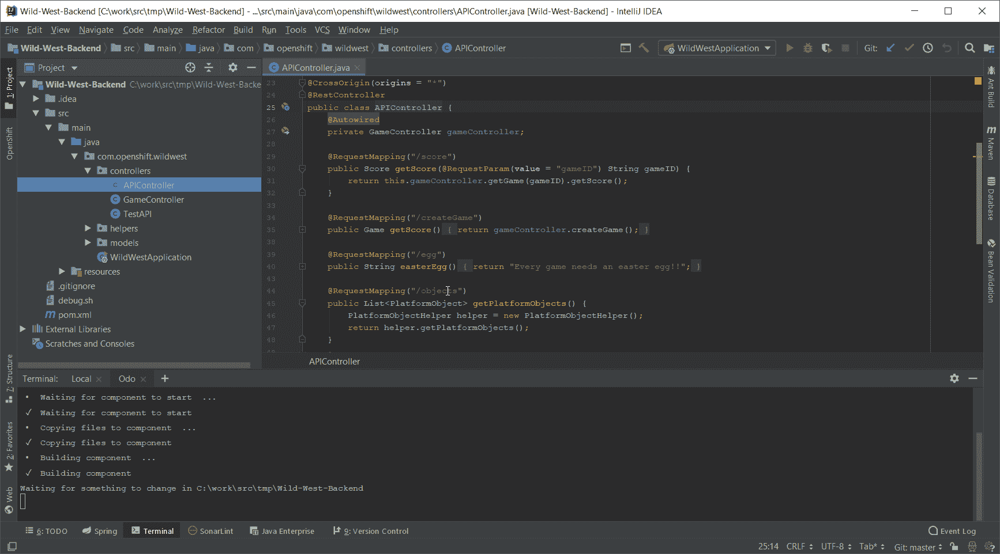

修改`egg`方法:

```
 @RequestMapping("/egg")
	public String easterEgg() {
		return "Every game needs an easter egg!!";
	}
```

包含以下内容:

```
 @RequestMapping("/egg")
	public String easterEgg() {
		return "A change from inside my ide";
	}
```

刷新浏览器窗口，您应该会看到以下输出:

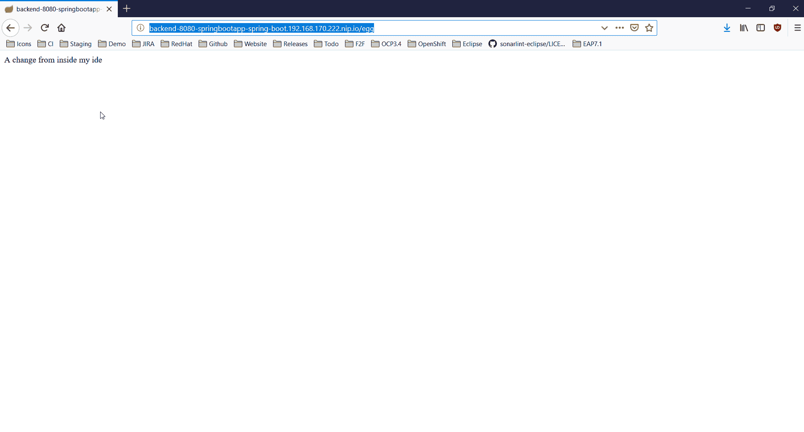

关注[插件网站](https://plugins.jetbrains.com/plugin/12030-openshift-connector-by-red-hat)的更新。

*Last updated: April 8, 2021*