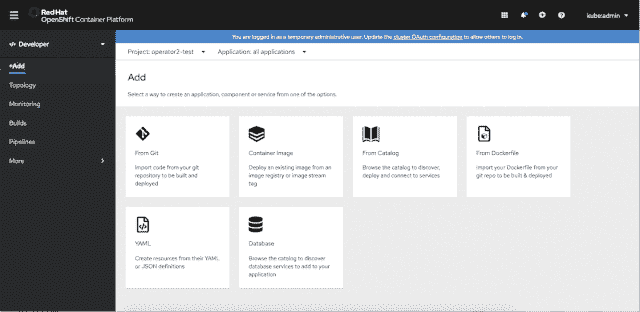
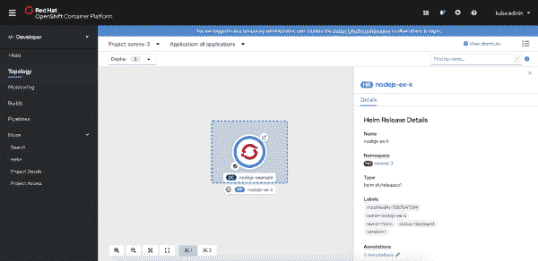
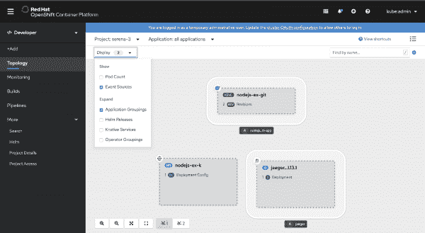
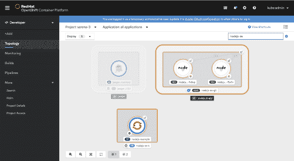
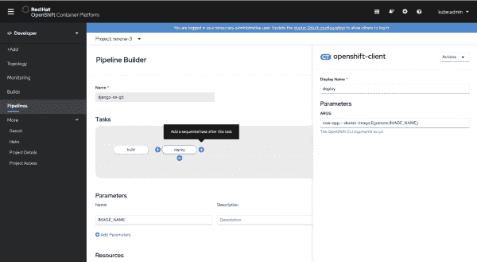
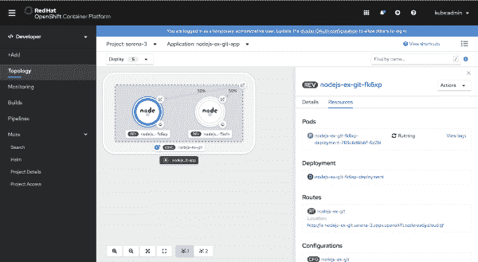

# OpenShift 4.4 web 控制台开发人员体验中的新特性

> 原文：<https://developers.redhat.com/blog/2020/04/30/whats-new-in-the-openshift-4-4-web-console-developer-experience>

开发者在 [Red Hat OpenShift 容器平台](https://developers.redhat.com/products/openshift/overview) web 控制台中的体验越来越好。您可能已经听说过我们构建和部署应用程序的简化用户流程，以及通过拓扑视图了解应用程序结构的能力。每个新发布的 [Red Hat OpenShift](https://developers.redhat.com/openshift/) 都包括可用性改进和新特性，以帮助开发者实现他们的目标。

在 OpenShift 4.4 中，我们专注于通过开发者目录简化应用部署，改善运营商支持的服务体验，并支持舵图。至于功能更新，我们:

*   进行了大量拓扑增强，以帮助简化可发现性和可伸缩性。
*   引入了应用程序监控部分。
*   引进了新的管道建设者。

让我们仔细看看 OpenShift 4.4 对开发者有什么不同。

## 应用程序部署更加容易

应用程序部署应该很容易，对吗？我们也是这样认为的，所以下面是 4.4 中发布的一些改进:

*   Developer Catalog 现在提供了一些选项，允许开发人员更容易地对项目进行过滤和分组，还提供了一些标签，有助于直观地识别目录项目之间的差异，如图 1 所示。

Figure 1: Developer Catalog enhancements
Figure 1: Developer Catalog enhancements.">

*   对从开发者目录创建运营商支持的服务的改进:
    *   开发人员现在可以通过一个表单来执行这项任务，而不是被迫留在 YAML 编辑器中。在未来，表单将是默认的体验。
    *   运营商支持的服务在拓扑中作为一个分组公开。此外，管理作为运营商支持服务一部分的资源的资源现在可以很容易地从侧面板访问，如图 2 所示。

Figure 2: Improvements to Operator backed services
Figure 2: Improvements to Operator-backed services.">

*   舵轮图在这里:
    *   开发者可以通过开发者目录安装舵图。
    *   可以在拓扑页面上看到舵的释放。它们被显示为一个分组，当 Helm 释放被展开时，所有的高级组件都被看到，如图 3 所示。这个特性允许开发者快速理解图表创建的所有资源。

Figure 3: Improvements to Operator backed servicesFigure 3: Improvements to Operator-backed services">

查看 OpenShift 4.4 中[应用部署改进的更多细节。](https://developers.redhat.com/blog/2020/04/30/application-deployment-improvements-in-openshift-4-4/)

## 拓扑增强

拓扑视图具有显著的可用性改进，并且在 4.4 中支持新的流。如果您喜欢拓扑中更简化的布局，可以折叠分组类型。开发者可以从**显示**下拉菜单中折叠所有的应用程序分组、操作者分组、Knative 服务或 Helm 发布，如图 4 和图 5 所示。这个特性有助于开发人员隐藏应用程序的复杂性，将注意力集中在单个部分。

Figure 4: Expanded Groupings in TopologyFigure 4: Expanded groupings in Topology.">Figure 5: Collapsed Groupings in TopologyFigure 5: Collapsed groupings in Topology.">

此外，开发人员可以使用新的 find 特性在繁忙的应用程序结构中轻松定位组件，该特性基于名称上的字符串匹配突出显示组件，如图 6 所示。此功能增加了组件的可发现性。

Figure 6: Find feature in TopologyFigure 6: Find feature in Topology.">

[点击](https://developers.redhat.com/blog/2020/04/30/openshift-4-4-finding-components-in-the-topology-view/)了解更多关于新的查找功能的信息。

## 了解您的应用

开发人员视角有一个新的监控体验，它允许开发人员对他们的应用程序的问题进行故障排除。这些功能是技术预览。

借助新的监控仪表板，您可以深入了解您的应用指标，该仪表板包含 10 个指标图表。这个技术预览特性在 Monitoring 页面的 Dashboard 选项卡上可用，如图 7 所示。

Figure 7: Monitoring DashboardFigure 7: The Monitoring dashboard.">

“监视”部分中的“指标”页面也得到了改进。并不是所有的开发者都知道 PromQL。因此，我们添加了一些现成的查询，同时保留了在您的项目上运行 Prometheus Query Language (PromQL)查询的能力，如图 8 所示。

Figure 8: Out of the box queriesFigure 8: The Monitoring Metrics tab.">

[点击此处](https://developers.redhat.com/blog/2020/04/30/openshift-4-4-getting-insights-into-your-application/)了解更多面向开发人员的全新监控体验。

## OpenShift 管道

在其他管道增强功能中，OpenShift 4.4 为开发者体验引入了管道构建器。它为开发人员构建自己的管道提供了可视化的指导体验，如图 9 所示。

Figure 9: Pipeline BuildersFigure 9: The Pipeline Builder.">

要了解有关管道和管道构建器的更多信息，请查看[使用 OpenShift 4.4 的新管道构建器和 Tekton 管道创建管道](https://developers.redhat.com/blog/2020/04/30/creating-pipelines-with-openshift-4-4s-new-pipeline-builder-and-tekton-pipelines/)。

## OpenShift 无服务器

OpenShift 无服务器现已全面上市。我们还对无服务器体验进行了改进，如图 10 所示，其中一些改进解决了我们从社区和客户那里收到的反馈。

Figure 10: Serverless improvements.">

有关这些改进的更多细节，请查看[使用 OpenShift 无服务器 GA](https://developers.redhat.com/blog/2020/04/30/serverless-applications-made-faster-and-simpler-with-openshift-serverless-ga/) 使无服务器应用变得更快更简单。

## 准备好开始了吗？

[今天试试 OpenShift】。](http://www.openshift.com/try)

## 提供您的反馈

OpenShift 4.4 标志着新的控制台开发者体验的第三次发布。社区和客户协作和反馈是我们流程的重要组成部分。我们希望收到您的来信。考虑参加我们的一个办公时间或[在这里分享您的想法](https://forms.gle/6HArjszuqyE1xr3f8)让我们知道我们做得如何，并在 OpenShift Web 控制台中提供关于开发人员体验的反馈。

此外，加入我们的 [OpenShift 开发者体验 Google 小组](https://groups.google.com/forum/#!forum/openshift-dev-users)参与讨论，了解我们的办公时间会议，您可以与我们合作并提供反馈。

## 了解更多信息

有兴趣了解更多关于 OpenShift 应用程序开发的信息吗？以下是一些可能有用的 Red Hat 资源:

*   [open shift 上的应用开发](https://developers.redhat.com/openshift)
*   [打开移位管道](https://www.openshift.com/learn/topics/pipelines)
*   [OpenShift 无服务器资源](https://www.openshift.com/serverless)
*   [OpenShift 无服务器和 Knative](https://developers.redhat.com/topics/serverless-architecture/)
*   [Knative 教程](https://redhat-developer-demos.github.io/knative-tutorial/knative-tutorial/index.html)

另外，请参阅今天的其他 OpenShift 4.4 文章:

*   【OpenShift 无服务器 GA 使无服务器应用更快更简单
*   [OpenShift 4.4:在拓扑视图中查找组件](https://developers.redhat.com/blog/2020/04/30/openshift-4-4-finding-components-in-the-topology-view/)
*   [OpenShift 4.4:深入了解您的应用](https://developers.redhat.com/blog/2020/04/30/openshift-4-4-getting-insights-into-your-application/)
*   [open shift 4.4 中的应用部署改进](https://developers.redhat.com/blog/2020/04/30/application-deployment-improvements-in-openshift-4-4/)
*   [使用 OpenShift 4.4 的新管道构建器和 Tekton 管道创建管道](https://developers.redhat.com/blog/2020/04/30/creating-pipelines-with-openshift-4-4s-new-pipeline-builder-and-tekton-pipelines/)

*Last updated: June 29, 2020*