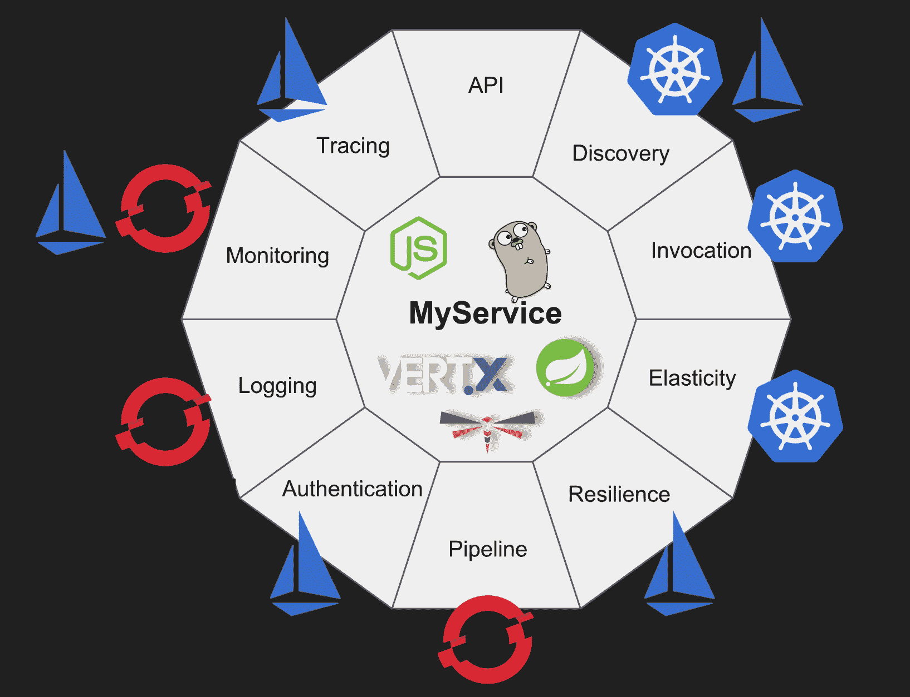

# 为什么 Kubernetes 是新的应用服务器

> 原文：<https://developers.redhat.com/blog/2018/06/28/why-kubernetes-is-the-new-application-server>

您是否想过为什么要使用容器来部署多平台应用程序？仅仅是“跟风炒作”的问题吗？在这篇文章中，我将提出一些挑衅性的问题来说明为什么 Kubernetes 是新的应用服务器。

您可能已经注意到，大多数语言都是解释型的，并且使用“运行时”来执行您的源代码。理论上，大多数 Node.js、Python 和 Ruby 代码可以很容易地从一个平台(Windows、Mac、Linux)迁移到另一个平台。Java 应用程序走得更远，将编译后的 Java 类转换成字节码，能够在任何有 JVM (Java 虚拟机)的地方运行。

Java 生态系统提供了一种标准格式来分发属于同一应用程序的所有 Java 类。您可以将这些类打包成 JAR (Java 归档)、WAR (Web 归档)和 EAR(企业归档)，其中包含前端、后端和嵌入的库。所以我问你:你为什么用容器来分发你的 Java 应用程序？它不是已经可以在不同环境之间轻松移植了吗？

从开发人员的角度回答这个问题并不总是显而易见的。但是，请想一想您的开发环境，以及它和生产环境之间的差异可能导致的一些问题:

*   你用 Mac，Windows，还是 Linux？作为文件路径分隔符，`\`与`/`相比，您是否曾经面临过相关的问题？
*   你用的是什么版本的 JDK？是不是开发用 Java 10，生产用 JRE 8？你面对过 JVM 差异引入的 bug 吗？
*   您使用什么版本的应用服务器？生产环境是否使用相同的配置、安全修补程序和库版本？
*   在生产部署期间，您是否遇到过由于驱动程序或数据库服务器版本不同而在开发环境中没有遇到的 JDBC 驱动程序问题？
*   您是否曾经要求应用服务器管理员创建一个数据源或 JMS 队列，但却出现了打印错误？

上述所有问题都是由应用程序外部的因素引起的，容器最大的优点之一是您可以在一个预构建的容器中部署所有东西(例如，Linux 发行版、JVM、应用服务器、库、配置，最后是您的应用程序)。此外，执行一个内置了所有东西的容器，比将您的代码移动到生产环境中并在它不工作时试图解决差异要容易得多。因为易于执行，所以将同一个容器映像扩展到多个副本也很容易。

## 增强您的应用

在容器变得非常流行之前，一些 [NFR(非功能需求)](https://en.wikipedia.org/wiki/Non-functional_requirement#Examples)如安全性、隔离、容错、配置管理和其他由应用服务器提供。打个比方，应用服务器对于应用程序来说就像 CD(光盘)播放器对于 CD 一样。

作为开发人员，您将负责遵循预定义的标准，并以特定的格式分发应用程序，而另一方面，应用服务器将“执行”您的应用程序，并提供不同“品牌”的附加功能注意:在 Java 世界中，应用服务器提供的企业功能标准最近已经转移到 Eclipse foundation 下。Eclipse Enterprise for Java([EE4J](https://projects.eclipse.org/projects/ee4j))的工作已经产生了 [Jakarta EE](https://jakarta.ee/) 。(更多信息，请阅读文章 [*Jakarta EE 正式发布*](https://developers.redhat.com/blog/2018/04/24/jakarta-ee-is-officially-out/) 或观看 [DevNation 视频:*Jakarta EE:Java EE 的未来*](https://developers.redhat.com/videos/youtube/f2EwhTUmeOI/) )。)

同理，随着容器的升级， [*容器镜像*](https://developers.redhat.com/blog/2018/02/22/container-terminology-practical-introduction/) 成为了新的 CD 格式。事实上，容器映像只不过是分发容器的一种格式。(如果你需要更好地理解什么是容器图像以及它们是如何分布的，参见 *[容器术语实用介绍](https://developers.redhat.com/blog/2018/02/22/container-terminology-practical-introduction/)* )。)

当您需要向您的应用程序添加企业功能时，容器的真正好处就出现了。向容器化应用程序提供这些功能的最佳方式是使用 Kubernetes 作为平台。此外，Kubernetes 平台为其他项目提供了一个很好的基础，如 [Red Hat OpenShift](https://www.openshift.com/) 、 [Istio](https://istio.io/) 和[Apache open whish](https://openwhisk.apache.org/)等，使构建和部署健壮的生产质量应用程序变得更加容易。

让我们来探索其中的九项功能:

### 1–服务发现

服务发现是计算如何连接到服务的过程。为了获得容器和云原生应用程序的许多好处，您需要从容器映像中删除配置，以便可以在所有环境中使用相同的容器映像。从应用中外部化配置是 [12 因素应用](https://developers.redhat.com/blog/2017/06/22/12-factors-to-cloud-success/)的关键原则之一。服务发现是从运行时环境获取配置信息的方法之一，而不是将其硬编码在应用程序中。Kubernetes 提供开箱即用的[服务发现](https://kubernetes.io/docs/concepts/services-networking/service/#discovering-services)。Kubernetes 还提供了[配置映射](https://kubernetes-v1-4.github.io/docs/user-guide/configmap/)和[秘密](https://kubernetes.io/docs/concepts/configuration/secret/)，用于从应用程序容器中移除配置。当您需要存储连接到运行时环境中的数据库等服务的凭证时，秘密解决了一些挑战。

有了 Kubernetes，就不需要使用外部服务器或框架。虽然您可以通过 Kubernetes YAML 文件管理每个运行时环境的环境设置，但 Red Hat OpenShift 提供了一个 GUI 和 CLI，可以使开发运维团队更容易管理。

### 2–基本调用

运行在容器内部的应用程序可以通过[入口](https://kubernetes.io/docs/concepts/services-networking/ingress/)访问——换句话说，就是从外部世界到您所公开的服务的路径。OpenShift 使用 HAProxy 提供了[路由对象](https://docs.openshift.com/container-platform/3.9/architecture/networking/routes.html#overview)，ha proxy 具有多种功能和负载平衡策略。您可以使用路由功能进行滚动部署。这可能是一些非常复杂的 CI/CD 策略的基础。参见下面的“6–构建和部署管道”。

如果您需要运行一次性作业，比如批处理，或者只是利用集群来计算结果(比如计算圆周率的位数)，该怎么办？Kubernetes 为这个用例提供了[作业对象](https://kubernetes.io/docs/concepts/workloads/controllers/jobs-run-to-completion/)。还有一个 [cron job](https://kubernetes.io/docs/concepts/workloads/controllers/cron-jobs/) 管理基于时间的作业。

### 3–弹性

在 Kubernetes 中，弹性是通过使用[复制集](https://kubernetes.io/docs/concepts/workloads/controllers/replicaset/)(过去称为复制控制器)来解决的。就像 Kubernetes 的大多数配置一样，复制集是协调所需状态的一种方式:您告诉 Kubernetes 系统应该处于什么状态，Kubernetes 会想出如何实现它。副本集控制应随时运行的应用程序的副本或精确副本的数量。

但是，如果您构建了一个比您计划的更受欢迎的服务，而您用完了计算能力，会发生什么呢？您可以使用 Kubernetes[Horizontal Pod auto scaler](https://kubernetes.io/docs/tasks/run-application/horizontal-pod-autoscale/#what-is-the-horizontal-pod-autoscaler)，它根据观察到的 CPU 利用率(或者，在[自定义指标](https://github.com/kubernetes/community/blob/master/contributors/design-proposals/instrumentation/custom-metrics-api.md)的支持下，根据应用程序提供的其他指标)来扩展 Pod 的数量。

### 4–记录

由于您的 Kubernetes 集群可以并且将会运行您的容器化应用程序的多个副本，因此将这些日志聚集起来以便可以在一个地方查看是很重要的。此外，为了利用自动伸缩(和其他云原生功能)等优势，您的容器需要是不可变的。因此，您需要将日志存储在容器之外，这样它们就可以在运行期间保持持久性。OpenShift 允许您部署 EFK 堆栈来聚合来自主机和应用程序的日志，无论它们来自多个容器还是来自已删除的 pod。

EFK 烟囱由以下部分组成:

*   [Elasticsearch](https://www.elastic.co/products/elasticsearch) (ES)，存储所有日志的对象存储
*   [Fluentd](https://www.fluentd.org/architecture) ，它从节点收集日志，并将其提供给 Elasticsearch
*   Kibana，一个用于弹性搜索的网络用户界面

### 5–监控

虽然日志记录和监控似乎解决了同一个问题，但它们是不同的。监控是观察、检查、通常是警告以及记录。日志记录只是记录。

Prometheus 是一个开源的监控系统，包括时间序列数据库。它可用于存储和查询指标、发出警报，以及使用可视化工具来深入了解您的系统。普罗米修斯可能是最受欢迎的选择来监测 Kubernetes 集群。在[红帽开发者博客](https://developers.redhat.com/blog/)上，有几篇文章涉及使用 Prometheus 进行监控。你也可以在 [OpenShift 博客](https://blog.openshift.com/tag/prometheus/)上找到普罗米修斯的文章。

还可以在[https://learn . open shift . com/service mesh/3-monitoring-tracing](https://learn.openshift.com/servicemesh/3-monitoring-tracing)看到普罗米修斯与 Istio 一起行动。

### 6–构建和部署管道

CI/CD(持续集成/持续交付)管道对于您的应用程序来说并不是一个严格的“必须具备”的要求。然而，CI/CD 经常被引用为成功软件开发和 [DevOps](https://devops.com/optimizing-effective-cicd-pipeline/) 实践的支柱。没有 CI/CD 管道，任何软件都不应该部署到生产环境中。由 Jez Humble 和 David Farley 所著的《持续交付:通过构建、测试和部署自动化的可靠软件发布》 ,是这样描述 CD 的:“持续交付是以可持续的方式安全、快速地将所有类型的变更——包括新特性、配置变更、错误修复和实验——投入生产或用户手中的能力。”

OpenShift 提供开箱即用的 CI/CD 管道作为“[构建策略](https://docs.openshift.com/container-platform/3.7/dev_guide/builds/build_strategies.html#pipeline-strategy-options)”请看[我两年前录制的这个视频](https://www.youtube.com/watch?v=N8R3-eNVoEc)，其中有一个 Jenkins CI/CD 管道部署新微服务的例子。

### 7–弹性

虽然 Kubernetes 为[集群本身](https://docs.openshift.com/container-platform/3.9/admin_guide/high_availability.html)提供了弹性选项，但它也可以通过提供支持复制卷的[持久卷](https://kubernetes.io/docs/concepts/storage/persistent-volumes/)来帮助应用程序保持弹性。Kubernetes 的[复制控制器](https://kubernetes.io/docs/concepts/workloads/controllers/replicationcontroller/)/部署确保指定数量的 pod 副本一致地部署在整个集群中，这将自动处理任何可能的[节点](https://kubernetes.io/docs/concepts/architecture/nodes/#what-is-a-node)故障。

与弹性一起，容错是解决用户可靠性和可用性问题的有效手段。通过重试规则、断路器和池退出，还可以通过 [Istio](https://istio.io/) 为 Kubernetes 上运行的应用程序提供容错。你想亲眼看看吗？在 https://learn.openshift.com/servicemesh/7-circuit-breaker 的[试试 Istio 断路器教程。](https://learn.openshift.com/servicemesh/7-circuit-breaker)

### 8–认证

Kubernetes 中的认证也可以由 Istio 通过其 [mutual TLS authentication](https://istio.io/docs/concepts/security/mutual-tls.html) 提供，该认证旨在增强微服务及其通信的安全性，而无需更改服务代码。它负责:

*   为每个服务提供一个强身份，代表其角色，以实现跨集群和云的互操作性
*   保护服务到服务的通信和最终用户到服务的通信
*   提供一个密钥管理系统来自动生成、分发、轮换和撤销密钥和证书

此外，值得一提的是，您还可以在 Kubernetes/OpenShift 集群中运行 [Keycloak](https://www.keycloak.org/) 来提供身份验证和授权。Keycloak 是红帽单点登录的上游产品。有关详细信息，请阅读使用 Keycloak 简化单点登录。如果你正在使用 Spring Boot，观看开发视频:[用 Keycloak](https://developers.redhat.com/videos/youtube/Bdg_DjuoX0A/) 保护 Spring Boot 微服务或者阅读博客文章。

### 9–跟踪

支持 Istio 的应用程序可以配置为使用 [Zipkin](https://zipkin.io/) 或 [Jaeger](https://www.jaegertracing.io/docs/) 收集轨迹跨度。无论您使用什么语言、框架或平台来构建应用程序，Istio 都可以支持分布式跟踪。在[https://learn . open shift . com/service mesh/3-monitoring-tracing](https://learn.openshift.com/servicemesh/3-monitoring-tracing)查看。另请参见[在笔记本电脑上开始使用 Istio 和 Jaeger](https://developers.redhat.com/blog/2018/05/08/getting-started-with-istio-and-jaeger-on-your-laptop/)以及最近的开发视频:[使用 Jaeger 进行高级微服务跟踪](https://developers.redhat.com/blog/2018/06/20/next-devnation-live-advanced-microservices-tracing-with-jaeger-june-21st-12pm-edt/)。

## 应用服务器死了吗？

通过这些功能，您可以了解 Kubernetes + OpenShift + Istio 如何真正增强您的应用，并提供过去由应用服务器或软件框架(如[网飞 OSS](https://netflix.github.io/) )负责的功能。这是否意味着应用服务器已经死亡？

在这个新的容器化世界中，应用服务器正在变得更像框架。很自然，软件开发的发展导致了应用服务器的发展。这种演变的一个很好的例子是将 [WildFly Swarm](http://wildfly-swarm.io) 作为应用服务器的 [Eclipse MicroProfile](http://microprofile.io/) 规范，它为开发人员提供了诸如容错、配置、跟踪、REST(客户端和服务器)等特性。然而，WildFly Swarm 和 MicroProfile 规范被设计成非常轻量级的。WildFly Swarm 没有完整的 Java 企业应用服务器所需的大量组件。相反，它侧重于微服务，并拥有足够的应用服务器来构建和运行作为简单可执行文件的应用程序。jar 文件。你可以在这个博客上阅读更多关于 MicroProfile 的内容。

此外，Java 应用程序可以具有 Servlet 引擎、数据源池、依赖注入、事务、消息传递等特性。当然，框架可以提供这些特性，但是应用服务器还必须具备在任何环境中构建、运行、部署和管理企业应用程序所需的一切，不管它们是否在容器中。事实上，应用服务器可以在任何地方执行，例如，在裸机上，在虚拟化平台如 [Red Hat Virtualization](https://www.redhat.com/en/technologies/virtualization/enterprise-virtualization) 上，在私有云环境如 [Red Hat OpenStack Platform](https://www.openstack.org/) 上，以及在公共云环境如 [Microsoft Azure](https://azure.microsoft.com/en-us/) 或 [Amazon Web Services](https://aws.amazon.com/) 上。

一个好的应用服务器可以确保所提供的 API 和它们的实现之间的一致性。开发人员可以确信，部署他们的业务逻辑(需要某些功能)将会起作用，因为应用服务器开发人员(和定义的标准)已经确保这些组件一起工作并一起发展。此外，好的应用服务器还负责最大化吞吐量和可伸缩性，因为它将处理来自用户的所有请求；减少了延迟和加载时间，因为这将有助于您的应用程序的可处置性；重量轻，占地面积小，使硬件资源和成本最小化；最后，要足够安全，以避免任何安全漏洞。对于 Java 开发者，Red Hat 提供了[Red Hat JBoss Enterprise Application Platform](https://www.redhat.com/en/technologies/jboss-middleware/application-platform)，它满足了现代模块化应用服务器的所有要求。

## 结论

容器映像已经成为分发云原生应用程序的标准打包格式。虽然容器“本身”并没有为应用程序提供真正的业务优势，但 Kubernetes 及其相关项目，如 OpenShift 和 Istio，提供了曾经是应用服务器一部分的非功能性需求。

开发人员过去从应用服务器或库(如[网飞操作系统](https://netflix.github.io/))获得的大多数非功能性需求都被绑定到特定的语言，如 Java。另一方面，当开发人员选择使用 Kubernetes + OpenShift + Istio 来满足这些需求时，他们不依附于任何特定的语言，这可以鼓励为每个用例使用最佳的技术/语言。

最后，应用服务器仍然在软件开发中占有一席之地。然而，它们正在变得越来越像语言特定的框架，这是开发应用程序时的一个很好的捷径，因为它们包含了许多已经编写和测试过的功能。

迁移到容器、Kubernetes 和微服务的最大好处之一是，您不必为您的应用程序选择单一的应用服务器、框架、架构风格甚至语言。您可以轻松地部署一个带有 JBoss EAP 的容器，运行您现有的 Java EE 应用程序，以及其他具有使用 Wildfly Swarm 或 Eclipse Vert.x 进行反应式编程的新微服务的容器。这些容器都可以通过 Kubernetes 进行管理。要了解这一概念的实际应用，请看一下 [Red Hat OpenShift 应用程序运行时](https://developers.redhat.com/products/rhoar/overview/)。使用[启动服务](https://developers.redhat.com/launch/)使用 WildFly Swarm、Vert.x、Spring Boot 或 Node.js 在线构建和部署示例应用。选择外部化配置任务以了解如何使用 Kubernetes 配置图。这将帮助您踏上云原生应用之路。

你可以说 [Kubernetes/OpenShift 是新的 Linux](https://www.linkedin.com/pulse/openshift-new-enterprise-linux-daniel-riek/) 或者甚至说“Kubernetes 是新的应用服务器”但事实是，一个应用服务器/运行时+ OpenShift/Kubernetes + Istio 已经成为“事实上的”云原生应用平台！

* * *

如果您最近没有访问过 Red Hat Developer 网站，您应该查看以下页面:

*   [Kubernetes 和容器管理](https://developers.redhat.com/topics/kubernetes/)
*   [微服务](https://developers.redhat.com/topics/microservices/)
*   [服务网格和 Istio](https://developers.redhat.com/topics/service-mesh/)

### 关于作者:

Rafael Benevides 是红帽公司的开发者体验总监。凭借在 IT 行业多个领域的多年经验，他帮助全世界的开发人员和公司更有效地进行软件开发。拉斐尔认为自己是一个热爱分享的问题解决者。他是 Apache delta spike PMC(Duke ' s Choice Award winner project)的成员，也是 JavaOne、Devoxx、TDC、DevNexus 等会议的发言人。| [领英](https://www.linkedin.com/in/rafaelbenevides)|【rafabene.com】T4

*Last updated: January 5, 2022*