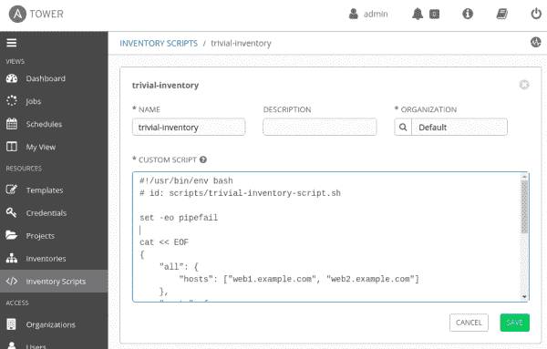
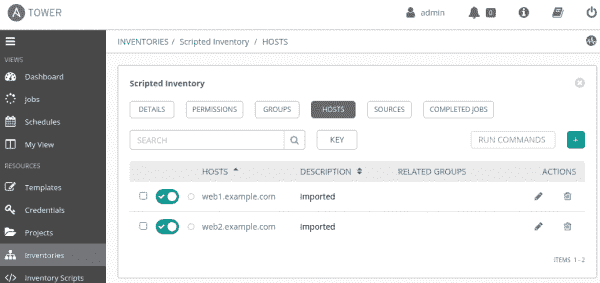
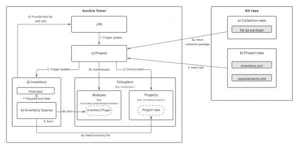
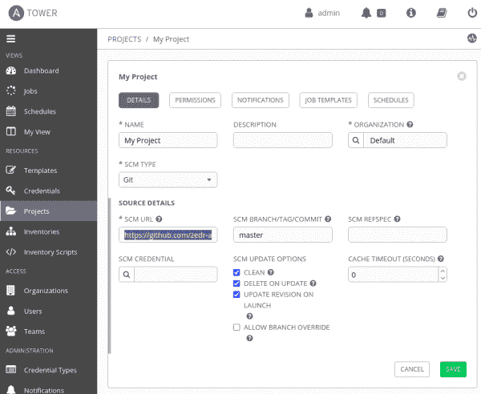
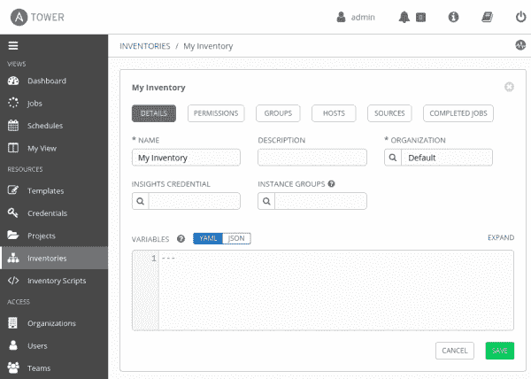

# 编写你自己的 Red Hat Ansible 塔库存插件

> 原文：<https://developers.redhat.com/blog/2021/03/10/write-your-own-red-hat-ansible-tower-inventory-plugin>

Ansible 是一种引擎和语言，用于自动化许多不同的 IT 任务，如配置物理设备、创建虚拟机或配置应用程序及其依赖项。Ansible 将这些任务组织在*剧本*文件中，这些文件运行在一个或多个远程目标主机上。*清单*文件维护这些主机的列表，并被格式化为 YAML 或 INI 文档。例如，INI 格式的简单清单文件如下:

```
[web]
web1.example.com
web2.example.com

```

可变清单可以是静态的(存储在文件中并在源代码库中管理)或动态的(从外部网络资源中获取，比如通过 RESTful API)。使用*清单脚本*或*清单插件*按需生成动态清单，清单插件由 Ansible 运行的代码组成，以在执行行动手册时获得目标主机列表。

[Red Hat Ansible Tower](https://docs.ansible.com/ansible/latest/reference_appendices/tower.html) ，也被称为 [AWX](https://github.com/ansible/awx) (其上游社区项目的名称)，是 [Red Hat Ansible Engine](https://access.redhat.com/products/red-hat-ansible-engine/) 的前端，它简化了大型 IT 基础设施上的操作。操作员可以登录 Ansible Tower web 界面，使用 Ansible Engine 构建模块(如任务、角色和行动手册)创建单个作业或复杂的工作流。企业通常在配置管理数据库(CMDB)中管理资产，如 [NetBox](https://netbox.readthedocs.io/en/stable/) ，Ansible Tower 使用专门编写的脚本或插件连接到该数据库。

本文向您展示了如何使用 Ansible Tower 来创建动态清单。我们将从一个样例清单脚本开始，然后将该脚本转换成一个插件。正如您将看到的，库存插件可以接受参数，这使它们比普通脚本有优势。

**注意**:清单脚本[在 Ansible Tower](https://docs.ansible.com/ansible-tower/latest/html/administration/custom_inventory_script.html#) 中已被弃用，因此在未来版本中将被删除。有一个很好的理由:源代码在版本控制系统中得到适当的管理，开发人员和操作人员可以跟踪和审查其语料库的变化。

## 清单脚本示例

清单脚本组织在一个可执行文件中，用 Python 或 Bash 等脚本语言编写。脚本必须以 JSON 格式返回数据。例如，以下输出为 Ansible playbook 提供了主机和相关数据的列表:

```
{
    "all": {
        "hosts": ["web1.example.com", "web2.example.com"]
    },
    "_meta": {
        "hostvars": {
            "web1.example.com": {
                "ansible_user": "root"
            },
            "web2.example.com": {
                "ansible_user": "root"
            }
        }
    }
}

```

下面的 Bash 代码是一个清单脚本，它生成了刚才显示的输出:

```
#!/usr/bin/env bash
# id: scripts/trivial-inventory-script.sh

cat << EOF
{
    "all": {
        "hosts": ["web1.example.com", "web2.example.com"]
    },
    "_meta": {
        "hostvars": {
            "web1.example.com": {
                "ansible_user": "rdiscala"
            },
            "web2.example.com": {
                "ansible_user": "rdiscala"
            }
        }
    }
}
EOF

```

这里，Ansible 命令运行清单脚本，并将实际输出与预期输出进行比较:

```
$ ansible -m ping -i scripts/trivial-inventory-script.sh all
web1.example.com | SUCCESS => {
    "ansible_facts": {
        "discovered_interpreter_python": "/usr/bin/python"
    },
    "changed": false,
    "ping": "pong"
}
web2.example.com | SUCCESS => {
    "ansible_facts": {
        "discovered_interpreter_python": "/usr/bin/python"
    },
    "changed": false,
    "ping": "pong"
}

```

输出显示 Ansible 正确地解释了在`hostvars`部分给出的信息，并使用我的用户名`rdiscala`通过 SSH 连接到服务器主机。

**注意**:这个示例脚本故意很简短，省略了一个细节:如果需要生成主机列表，Ansible 会使用`--list`选项调用这些脚本，就像我们的例子一样。或者，Ansible 在需要由它的`NAME`标识的特定主机的变量时提供`--host=NAME`选项。为了使脚本完全兼容，您需要实现逻辑来处理这些选项。

## 让脚本在 Ansible Tower 中工作

脚本是在 Ansible Tower 的 web 界面的库存脚本部分定义的。或者，您可以用 Ansible Tower 主机上支持的任何脚本语言编写脚本。如图 1 所示，您可以将我们刚刚编写的脚本直接粘贴到**自定义脚本**字段中，并使用它来同步 Ansible Tower 中的清单。

[](/sites/default/files/blog/2020/09/tower-inventory-script.png)

Figure 1: You can plug a pre-written script into Ansible Tower's Inventory Scripts section.

现在，我们可以使用这个新脚本作为任何可解析的塔库存中的*库存源*。库存源根据需要向 Ansible Tower 提供有关主机的信息。当源同步时，脚本将运行，获取数据，并按照前面所示的方式格式化数据，以便 Ansible Tower 可以将其导入到自己的主机数据库中。完整的主机列表将显示在**主机**表中，如图 2 所示。

[](/sites/default/files/blog/2020/09/tower-inventory-script-hosts.png)

Figure 2: Find the complete list of hosts in the HOSTS table.

## 用 Ansible Galaxy 创建一个库存插件

发布和消费 Ansible 内容的最新推荐方式是创建一个清单插件，并将其打包成一个 [Ansible 集合](https://www.ansible.com/blog/getting-started-with-ansible-collections)。库存插件在打包到集合中时被认为是一个模块。

您可以使用 [Ansible Galaxy 命令行程序](https://docs.ansible.com/ansible/latest/cli/ansible-galaxy.html)来创建一个系列的基本结构:

```
$ ansible-galaxy collection init zedr.blog_examples
- Collection zedr.blog_examples was created successfully
$ tree .
.
└── zedr
    └── blog_examples
        ├── docs
        ├── galaxy.yml
        ├── plugins
        │   └── README.md
        ├── README.md
        └── roles

```

让我们从`galaxy.yml`开始，清单文件描述了这个集合:

```
namespace: zedr
name: blog_examples
version: 1.0.0
readme: README.md
authors:
  - Rigel Di Scala <rigel@redhat.com>

```

我们将在`plugins/inventory`文件夹中创建一个名为`example_hosts.py`的 Python 脚本插件。将脚本放在这个位置让 Ansible 检测到它是一个清单插件。我们可以删除`docs`和`roles`文件夹，以关注实现我们的集合所需的最小可行文件集。我们应该以这样的文件夹结构结束:

```
$ tree .
.
└── zedr
    └── blog_examples
        ├── galaxy.yml
        ├── plugins
        │   └── inventory
        │       └── example_hosts.py
        └── README.md

```

**重要的**:当引用集合中包含的资产，比如角色和插件时，总是指定集合的完整名称空间(例如，`zedr.blog_examples`)。

我们现在可以复制、清理并填充库存插件的基本样板代码:

```
from ansible.plugins.inventory import BaseInventoryPlugin

ANSIBLE_METADATA = {
    'metadata_version': '',
    'status': [],
    'supported_by': ''
}

DOCUMENTATION = '''
---
module:
plugin_type:
short_description:
version_added: ""
description:
options:
author:
'''

class InventoryModule(BaseInventoryPlugin):
    """An example inventory plugin."""

    NAME = 'FQDN_OF_THE_PLUGIN_GOES_HERE'

    def verify_file(self, path):
        """Verify that the source file can be processed correctly.

        Parameters:
            path:AnyStr The path to the file that needs to be verified

        Returns:
            bool True if the file is valid, else False
        """

    def parse(self, inventory, loader, path, cache=True):
        """Parse and populate the inventory with data about hosts.

        Parameters:
            inventory The inventory to populate
        """
        # The following invocation supports Python 2 in case we are
        # still relying on it. Use the more convenient, pure Python 3 syntax
        # if you don't need it.
        super(InventoryModule, self).parse(inventory, loader, path, cache)

```

### 关于代码

您会注意到这个样板文件定义了两个方法: [`verify_file()`](https://docs.ansible.com/ansible/latest/dev_guide/developing_inventory.html#verify-file) 和`parse()`。当您想要处理的主机列表来自文件系统中给定路径下的一个文件(如 CSV 文档)时，请使用 [`verify_file()`](https://docs.ansible.com/ansible/latest/dev_guide/developing_inventory.html#verify-file) 。该方法用于在将文件传递给更昂贵的`parse()`方法之前快速验证文件。通常， [`verify_file()`](https://docs.ansible.com/ansible/latest/dev_guide/developing_inventory.html#verify-file) 确保文件是有效的传入 JSON，并且匹配预定义的模式。(注意`verify_file()`方法目前为空，必须填写。)

**注意**:当输入来自文件以外的来源时，比如调用远程 HTTP API 时，`verify_file()`方法可以返回`True`。但是它也可以验证传入的 JSON。

[`parse()`](https://docs.ansible.com/ansible/latest/dev_guide/developing_inventory.html#parse) 方法完成了处理源数据的大部分工作，以正确地过滤和格式化它。然而，我们将依赖于*实例属性*、`self.inventory`，这是一个具有自己方法的特殊对象，而不是像我们在清单脚本中那样直接构建有效负载的`dict`名称空间。该属性提供了`add_host()`和`set_variable()`方法来构造一个适合 Ansible 使用的数据对象。(`parse()`方法目前为空，除了调用超类的函数。)

另外，请注意模块级属性`ANSIBLE_METADATA`和`DOCUMENTATION`是必需的，并且`NAME`属性必须具有插件的完全限定域名，包括名称空间。

### 调用插件

当从命令行调用 Ansible 中的插件时，会发生以下一连串事件:

1.  常规名称`InventoryModule`是从选择的库存模块(`zedr.blog_example.example_hosts.py`)中导入的。
2.  创建了一个`InventoryModule`的实例。
3.  实例方法`InventoryModule.verify_file()`被调用来执行文件的初始验证(当适用时),并被期望返回一个真值来继续。
4.  调用实例方法`InventoryModule.parse()`来填充`InventoryModule.inventory`对象。
5.  对`InventoryModule.inventory`对象进行自省，以检索 Ansible 将使用的主机数据。

我们现在可以将脚本逻辑重写如下:

```
from ansible.plugins.inventory import BaseInventoryPlugin

ANSIBLE_METADATA = {
    'metadata_version': '1.0.0',
    'status': ['preview'],
    'supported_by': 'community'
}

DOCUMENTATION = '''
---
module: example_hosts
plugin_type: inventory
short_description: An example Ansible Inventory Plugin
version_added: "2.9.13"
description:
    - "A very simple Inventory Plugin created for demonstration purposes only."
options:
author:
    - Rigel Di Scala
'''

class InventoryModule(BaseInventoryPlugin):
    """An example inventory plugin."""

    NAME = 'zedr.blog_examples.example_hosts'

    def verify_file(self, path):
        """Verify that the source file can be processed correctly.

        Parameters:
            path:AnyStr The path to the file that needs to be verified

        Returns:
            bool True if the file is valid, else False
        """
        # Unused, always return True
        return True

    def _get_raw_host_data(self):
        """Get the raw static data for the inventory hosts

        Returns:
            dict The host data formatted as expected for an Inventory Script
        """
        return {
            "all": {
                "hosts": ["web1.example.com", "web2.example.com"]
            },
            "_meta": {
                "hostvars": {
                    "web1.example.com": {
                        "ansible_user": "rdiscala"
                    },
                    "web2.example.com": {
                        "ansible_user": "rdiscala"
                    }
                }
            }
        }

    def parse(self, inventory, *args, **kwargs):
        """Parse and populate the inventory with data about hosts.

        Parameters:
            inventory The inventory to populate

        We ignore the other parameters in the future signature, as we will
        not use them.

        Returns:
            None
        """
        # The following invocation supports Python 2 in case we are
        # still relying on it. Use the more convenient, pure Python 3 syntax
        # if you don't need it.
        super(InventoryModule, self).parse(inventory, *args, **kwargs)

        raw_data = self._get_raw_host_data()
        _meta = raw_data.pop('_meta')
        for group_name, group_data in raw_data.items():
            for host_name in group_data['hosts']:
                self.inventory.add_host(host_name)
                for var_key, var_val in _meta['hostvars'][host_name].items():
                    self.inventory.set_variable(host_name, var_key, var_val)

```

注意，为了简单起见，我们忽略了与分组和[缓存](https://docs.ansible.com/ansible/latest/dev_guide/developing_inventory.html#inventory-cache)相关的设施。为了更好地组织主机列表和优化同步过程的性能，这些工具值得研究。

### 构建、安装和测试插件

下一步是构建 Ansible 集合包，在本地安装它，并测试插件:

```
$ cd zedr/blog_examples
$ mkdir build
$ ansible-galaxy collection build -f --output-path build
Created collection for zedr.blog_examples at /home/rdiscala/blog/ansible-tower-inventory-plugin/collections/zedr/blog_examples/build/zedr-blog_examples-1.0.0.tar.gz
$ ansible-galaxy collection install build/zedr-blog_examples-1.0.0.tar.gz
Process install dependency map
Starting collection install process
Installing 'zedr.blog_examples:1.0.0' to '/home/rdiscala/.ansible/collections/ansible_collections/zedr/blog_examples'

```

接下来，我们需要通过在当前工作目录中添加一个本地`galaxy.cfg`文件来启用我们的插件。内容是:

```
[inventory]
enable_plugins = zedr.blog_examples.example_hosts

```

要检查本地安装是否成功，我们可以尝试使用完全限定的域名显示清单插件的文档:

```
$ ansible-doc -t inventory zedr.blog_examples.example_hosts
> INVENTORY    (/home/rdiscala/.ansible/collections/ansible_collections/zedr/blog_examples/plugins/inventory/example_hosts.py)

        An example Inventory Plugin created for demonstration purposes only.

  * This module is maintained by The Ansible Community
AUTHOR: Rigel Di Scala <rigel@redhat.com>
        METADATA:
          status:
          - preview
          supported_by: community

PLUGIN_TYPE: inventory

```

我们还可以列出可用的插件来验证我们的插件是否被正确检测到。注意，为了使用 Ansible 集合，您将需要[ansi ble 3.0 或更高版本](https://pypi.org/project/ansible/#history2.10):

```
$ ansible-doc -t inventory -l
advanced_host_list                                 Parses a 'host list' with ranges
amazon.aws.aws_ec2                                 EC2 inventory source
amazon.aws.aws_rds                                 rds instance source
auto                                               Loads and executes an inventory plugin specified in a YAML config

(...)

zedr.blog_examples.example_hosts                   A trivial example of an Ansible Inventory Plugin

```

最后，我们可以通过使用库存配置文件运行插件来本地测试它。用以下内容创建一个名为`inventory.yml`的文件:

```
plugin: "zedr.blog_examples.example_hosts"

```

下面是调用插件并生成清单数据的命令:

```
$ ansible-inventory --list -i inventory.yml
{
    "_meta": {
        "hostvars": {
            "web1.example.com": {
                "ansible_user": "rdiscala"
            },
            "web2.example.com": {
                "ansible_user": "rdiscala"
            }
        }
    },
    "all": {
        "children": [
            "ungrouped"
        ]
    },
    "ungrouped": {
        "hosts": [
            "web1.example.com",
            "web2.example.com"
        ]
    }
}

```

Ansible 已经生成了两个“虚拟”组:`ungrouped`，包含我们的主机列表，以及`all`，包含`ungrouped`。我们已经验证了插件工作正常。

## 让插件在 Ansible Tower 中工作

Ansible Tower 可以自动化集合的安装，使其角色和插件可用于项目和作业模板。为了使其工作，我们需要以下内容:

*   一个提供我们为集合构建的包文件的地方。我们将使用 GitHub 上托管的 Git repo，但它也可以发布在 [Ansible Galaxy](https://galaxy.ansible.com/) 上。
*   包含引用我们的集合的`requirements.yml`文件和我们之前使用的`inventory.yml`配置文件的项目文件的 repo。
*   指向项目文件 repo 的 Ansible Tower 项目。
*   可分析的塔库存。
*   为我们的库存提供一个可行的塔式库存来源。

当 Ansible Tower 执行使用此清单的作业时，将触发以下事件:

1.  该作业触发项目更新(内部`project_update.yml`行动手册)。
2.  该项目与其关联的 Git repo 同步。
3.  如果需要，项目会安装任何需要的依赖项，这些依赖项应该列在`collection/requirements.yml`文件中。
4.  项目更新触发库存更新。
5.  库存更新会触发库存源同步。
6.  清单源同步读取清单文件`inventory.yml`并运行我们的插件来获取主机数据。
7.  主机数据填充清单。
8.  该作业使用提供的主机名和变量在清单主机列表上运行关联的行动手册。

图 3 显示了这个工作流程。

[](/sites/default/files/blog/2020/09/ansible-plugin-workflow.png)

Figure 3: The workflow for populating a host list using an inventory plugin.

现在，让我们创建插件工作所需的组件。

**注**:下面的例子是在 Ansible Tower 3.7.1 上测试的。

### 为集合创建一个 Git repo

首先，我们将在 Github 上创建一个新的 repo，并推送我们之前创建的集合文件。GitHub 上有一个[示例报告](https://github.com/zedr/blog_examples)。

Ansible 不能克隆一个存储库并自己构建集合，所以我们需要构建这个包并使它作为一个可下载的`tar.gz`文件。举个例子，从[发布页面](https://github.com/zedr/blog_examples/releases/)。

**注意**:在撰写本文时，Ansible Tower 不能以认证用户的身份获取包，因此您需要允许匿名客户端。

如果您正在使用 GitHub，您可以设置一个 GitHub Actions 工作流来完全自动化这个过程:

```
# id: .github/workflows/main.yml

name: CI

# Only build releases when a new tag is pushed.
on:
  push:
    tags:
      - '*'

jobs:
  build:
    runs-on: ubuntu-latest

    steps:
      # Checks-out your repository under $GITHUB_WORKSPACE, so your job can access it
      - uses: actions/checkout@v2

      # Extract the version from the tag name so it can be used later.
      - name: Get the version
        id: get_version
        run: echo ::set-output name=VERSION::${GITHUB_REF#refs/tags/}

      # Install a recent version of Python 3
      - name: Setup Python
        uses: actions/setup-python@v2
        with:
          python-version: 3.7

      # Install our dependencies, e.g. Ansible
      - name: Install Python 3.7
        run: python3.7 -m pip install -r requirements.txt

      - name: Build the Ansible collection
        run: |
          mkdir -p build
          ansible-galaxy collection build -f --output-path build

      - name: Create a Release
        id: create_a_release
        uses: actions/create-release@v1
        env:
          GITHUB_TOKEN: ${{ secrets.GITHUB_TOKEN }}
        with:
          tag_name: ${{ steps.get_version.outputs.VERSION }}
          release_name: Release ${{ steps.get_version.outputs.VERSION }}
          draft: false

      - name: Upload a Release Asset
        uses: actions/upload-release-asset@v1.0.2
        env:
          GITHUB_TOKEN: ${{ secrets.GITHUB_TOKEN }}
        with:
          upload_url: ${{ steps.create_a_release.outputs.upload_url }}
          asset_path: build/zedr-blog_examples-${{ steps.get_version.outputs.VERSION }}.tar.gz
          asset_name: "zedr-blog_examples-${{ steps.get_version.outputs.VERSION }}.tar.gz"
          asset_content_type: "application/gzip"

```

### 为项目文件创建 Git repo

接下来，我们需要另一个 Git repo 来存储 Ansible Tower 项目将要获取的文件。以下是文件夹结构:

```
$ tree .
.
├── collections
│   └── requirements.yml
└── inventory.yml

```

请注意，`collections/requirements.yml`将包含对我们的 Ansible collection 包的引用，以便 Ansible Tower 可以在同步清单时下载、安装和使用它。另外，`inventory.yml`是我们之前创建的同一个文件，包含插件的完全限定域名。详见[回购示例](https://github.com/zedr-automation/example_project)。

### 创建新的 Ansible 塔项目

接下来，登录到 Ansible Tower 实例，创建一个新项目，并填写以下字段和复选框:

*   **姓名** : `My Project`。
*   **组织** : `Default`(或者随便你喜欢的)。
*   **单片机类型** : `Git`。
*   **SCM URL** : `https://github.com/zedr-automation/example_project.git`(或者你的项目的 Git repo URL)。
*   **SCM 分支/标记/提交** : `master`。
*   **SCM 更新选项**:选择**清理**、**更新时删除**、**启动时更新版本**。

图 4 显示了生成的表单。

[](/sites/default/files/blog/2020/09/ansible-tower-project.png)

Figure 4: Creating the Ansible Tower project.

### 创建新的易安装的塔设备清单

在 Tower 中创建一个新的库存只有两个字段:对于**名称**字段，输入`My Inventory`。对于**组织**，您可以选择默认值或您之前输入的任何值。图 5 显示了生成的表单。

[](/sites/default/files/blog/2020/09/ansible-tower-inventory.png)

Figure 5: Creating the Ansible Tower inventory.

### 为库存创建新的库存来源

最后，为库存创建一个新的库存来源。按如下方式填写字段和复选框:

*   **姓名** : `My inventory source`。
*   **来源** : `Sourced from a project`。
*   **项目** : `My project`。
*   **库存档案** : `inventory.yml`。
*   **更新选项**:选择**覆盖**、**覆盖变量**，项目更新更新**。**

保存表单，然后为您刚刚创建的新库存源单击**开始同步过程**按钮。如果该过程正确完成，您的清单的主机页面将显示两个示例主机，如图 6 所示。

[](/sites/default/files/blog/2020/09/ansible-tower-hosts.png)

Figure 6: Viewing the HOSTS list in the Ansible Tower inventory.

## 最后的想法

我们创建的库存插件是基本的，但它是实现更复杂的插件的良好基础，这些插件可以查询外部数据源，可能使用第三方库。作为模块，库存插件也可以接受参数，这使它们比普通脚本更有优势。有关更多信息，请参见关于[插件配置](https://docs.ansible.com/ansible/latest/dev_guide/developing_plugins.html#plugin-configuration-documentation-standards)的官方 Ansible 文档。另外，请注意，如果您决定使用 Python 标准库中不存在的第三方库，比如[请求](https://requests.readthedocs.io/en/master/)，您将需要在 Ansible Tower 内的适当的 [Python 虚拟环境中手动安装它。](https://docs.ansible.com/ansible-tower/3.7.1/html/administration/tipsandtricks.html#using-virtualenv-with-at)

快乐发展！

*Last updated: October 7, 2022*